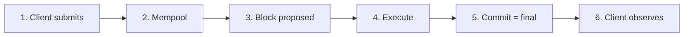

import { Aside, CardGrid, LinkCard } from "@astrojs/starlight/components";

Aptos is a Layer 1 settlement rail for moving APT, [stablecoins](/build/guides/exchanges#stablecoin-addresses), and other [fungible assets](/build/smart-contracts/fungible-asset). Payments finalize as soon as the transaction commits (BFT consensus, no extra block confirmations). This page states the latency, block-time, and fee numbers you should plan around, then maps those numbers onto ordinary transfers, confidential transfers, and other payment flows.

<Aside type="tip">
  For a first working payment, follow [Your First Transaction](/build/guides/first-transaction). For wallets and existing apps, see [Application Integration](/build/guides/application-integration).
</Aside>

## Latency, block time, and fees

These three numbers answer different questions. Do not treat block time as the time a user waits for a payment.



| Metric                       | What it measures                                              | Typical mainnet value                                                                                                                                                                                    | Where to verify                                                                                                                                |
| ---------------------------- | ------------------------------------------------------------- | -------------------------------------------------------------------------------------------------------------------------------------------------------------------------------------------------------- | ---------------------------------------------------------------------------------------------------------------------------------------------- |
| **Block time**               | Interval between consecutive blocks                           | Tens of milliseconds; often under 50 ms. Aptos does not use a fixed slot clock                                                                                                                           | [Blocks](/network/blockchain/blocks), [Explorer](https://explorer.aptoslabs.com/blocks?network=mainnet)                                        |
| **Finality**                 | When the payment is irreversible                              | Immediate on [commit](/build/guides/exchanges#what-is-the-finality-of-a-transaction). No confirmation depth, no reorg window                                                                             | [Transactions and States](/network/blockchain/txns-states)                                                                                     |
| **End-to-end (E2E) latency** | Client submit → committed and visible to `waitForTransaction` | Typically **sub-second** under normal load. Includes client RTT to a fullnode, mempool, consensus, execution, and polling                                                                                | Always call `waitForTransaction` after submit                                                                                                  |
| **Transaction fee**          | APT charged to the fee payer                                  | `gas_used × gas_unit_price` in [octas](/network/glossary#octa), plus [storage fees](/network/blockchain/gas-txn-fee) when the transaction allocates new state. **Independent of the amount transferred** | [Gas and Storage Fees](/network/blockchain/gas-txn-fee), [simulate](/network/blockchain/gas-txn-fee#estimating-gas-consumption-via-simulation) |

<Aside type="note">
  Block time, load, and USD-denominated fees move with the network and the APT price. Quote octas (or simulated `gas_used`) in product SLAs; treat USD figures as order-of-magnitude only. Live gas unit prices are available from [`/v1/estimate_gas_price`](https://api.mainnet.aptoslabs.com/v1/estimate_gas_price). Governance sets the floor (`txn.min_price_per_gas_unit`, currently 100 octas for ordinary transactions).
</Aside>

### Block time

Validators propose the next block as soon as network delay allows. Mainnet block times are typically tens of milliseconds. That is how fast the chain packages transactions, not how long a wallet should wait before showing “paid.”

See [Blocks](/network/blockchain/blocks) and [Execution](/network/blockchain/execution) (Block-STM).

### End-to-end latency

E2E latency is the user-visible path:

1. Build, (optionally) simulate, and sign.
2. Submit to a fullnode REST API. A 202 and a hash mean the node **accepted** the transaction, not that it committed.
3. Wait until the transaction is committed. SDKs expose this as `waitForTransaction`.

On Aptos, that wait is typically under a second for a simple payment. Extra work **before** submit (confidential-asset proof generation, collecting multisig signatures, encrypting a pending payload) sits outside consensus time and can dominate the user’s clock.

Submission is not settlement. Poll until commit, then treat the payment as final.

### Finality

Aptos uses BFT consensus. A committed transaction is final. You do not wait for additional blocks the way you would on a probabilistic-finality chain. See the [exchange FAQ on finality](/build/guides/exchanges#what-is-the-finality-of-a-transaction) and the [transaction lifecycle](/network/blockchain/blockchain-deep-dive).

### Transaction fees

Fees have two parts, both documented in [Gas and Storage Fees](/network/blockchain/gas-txn-fee):

1. **Execution and IO** — gas units × `gas_unit_price` (octas). The unit price can rise under load; a higher price only helps the transaction **enter** the next block, not its order inside the block.
2. **Storage** — fixed APT for new or grown state slots (for example, the first time a recipient holds a given fungible asset). Storage can dominate when a payment creates stores rather than updating existing ones.

A 1 APT transfer and a 1,000,000 APT transfer with the same payload cost about the same in gas. Average mainnet fees sit at a **fraction of a US cent** (on the order of 0.0005 USD in public network figures). Simple APT and fungible-asset transfers are among the cheapest transactions. Always [simulate](/network/blockchain/gas-txn-fee#estimating-gas-consumption-via-simulation) for the exact payload you will submit.

To hide APT from end users, use a [sponsored transaction](/build/guides/sponsored-transactions) or a [Geomi Gas Station](https://geomi.dev/docs/gas-stations).

## Payments by usage

Use this table to pick an API and to see how latency and fees change. Confidential transfers are summarized here only; the protocol details live on the Confidential Asset pages.

| Usage                                    | Typical on-chain E2E                                  | Extra client work                    | Fee profile                                                       | Implement                                                                                                                      |
| ---------------------------------------- | ----------------------------------------------------- | ------------------------------------ | ----------------------------------------------------------------- | ------------------------------------------------------------------------------------------------------------------------------ |
| **APT transfer**                         | Sub-second after submit                               | Sign, submit, wait                   | Lowest. Amount-independent                                        | [`0x1::aptos_account::transfer`](#apt-transfers)                                                                               |
| **Fungible asset / stablecoin transfer** | Same as APT                                           | Sign, submit, wait                   | Similar to APT. Storage if the recipient has no primary store yet | [`0x1::primary_fungible_store::transfer`](#fungible-asset-and-stablecoin-transfers)                                            |
| **Confidential transfer**                | Same commit path; more execution and a larger payload | Generate ZK proofs **before** submit | Higher than a plaintext transfer                                  | [Confidential Asset](/build/smart-contracts/confidential-asset) (do not implement from this page)                              |
| **Sponsored (gasless UX)**               | Same as the inner transfer                            | Extra fee-payer signature            | Same on-chain cost, paid by the app                               | [Sponsored Transactions](/build/guides/sponsored-transactions)                                                                 |
| **High-volume / parallel submit**        | Same per transaction                                  | Unique replay-protection nonce       | Same as the inner transfer                                        | [Orderless Transactions](/build/guides/orderless-transactions), [Transaction Management](/build/guides/transaction-management) |
| **Encrypted pending payload**            | Same once committed                                   | Encrypt at build time                | Minimum `gas_unit_price` of **200** octas (twice the usual floor) | [Encrypted Pending Transactions](/build/guides/encrypted-pending-transactions)                                                 |
| **Treasury / policy**                    | Extra round-trips for approvals                       | Collect N-of-M signatures            | One execution fee after approval                                  | [Your First Multisig](/build/guides/first-multisig)                                                                            |
| **Passwordless onboarding**              | Same as the inner transfer                            | OIDC / Keyless flow                  | Same as the inner transfer                                        | [Aptos Keyless](/build/guides/aptos-keyless)                                                                                   |

Batch payouts (payroll, disbursements) can use `0x1::aptos_account::batch_transfer` / `batch_transfer_coins` so one transaction pays many recipients. That raises gas with the number of outputs but still keeps a single E2E wait.

## APT transfers

Transfer native APT with `0x1::aptos_account::transfer`. The function creates the recipient account resource when needed.

```typescript filename="apt-transfer.ts"
const transaction = await aptos.transaction.build.simple({
  sender: sender.accountAddress,
  data: {
    function: "0x1::aptos_account::transfer",
    functionArguments: [recipientAddress, amountInOctas],
  },
});

const committed = await aptos.signAndSubmitTransaction({ signer: sender, transaction });
const executed = await aptos.waitForTransaction({ transactionHash: committed.hash });
```

Walk through the full flow (fund, simulate, sign, wait) in [Your First Transaction](/build/guides/first-transaction). SDK quickstarts repeat the same pattern: [TypeScript](/build/sdks/ts-sdk/quickstart), [Python](/build/sdks/python-sdk/quickstart), [Go](/build/sdks/go-sdk/quickstart), [Rust](/build/sdks/rust-sdk/quickstart).

For Coin-typed assets (including migrated coins), prefer `0x1::aptos_account::transfer_coins` over `0x1::coin::transfer` so the recipient store is registered automatically. See [Transferring Assets](/build/guides/exchanges#transferring-assets) on the exchange guide.

## Fungible asset and stablecoin transfers

USDC, USDT, and other current tokens use the [Fungible Asset](/build/smart-contracts/fungible-asset) standard. Transfer with `0x1::primary_fungible_store::transfer`. It creates the recipient’s primary store when missing.

```typescript filename="fa-transfer.ts"
const transaction = await aptos.transaction.build.simple({
  sender: sender.accountAddress,
  data: {
    function: "0x1::primary_fungible_store::transfer",
    typeArguments: ["0x1::object::ObjectCore"],
    functionArguments: [metadataAddress, recipientAddress, amount],
  },
});
```

Mainnet stablecoin metadata addresses are listed under [Stablecoin Addresses](/build/guides/exchanges#stablecoin-addresses). For a broader token registry, see the [Panora Token List](https://github.com/PanoraExchange/Aptos-Tokens). To issue your own asset, start with [Your First Fungible Asset](/build/guides/first-fungible-asset).

<Aside type="caution">
  A first-time FA credit can allocate a storage slot and therefore pay a [storage fee](/network/blockchain/gas-txn-fee#calculating-storage-fees) on top of execution gas. Simulate the exact sender/recipient pair rather than assuming a repeat-transfer cost.
</Aside>

Read balances with `aptos.getBalance` (APT) or the `0x1::primary_fungible_store::balance` view function. Indexing and product tables are covered in the [Indexer](/build/indexer) and [fungible asset balance queries](/build/indexer/indexer-api/fungible-asset-balances).

## Confidential transfers

[Confidential Asset (CA)](/build/smart-contracts/confidential-asset) wraps a fungible asset so **amounts and confidential balances stay hidden**, including from validators, using zero-knowledge proofs. Sender and recipient **addresses remain visible**. Incoming funds land in a pending confidential balance and must be rolled over before they are spendable.

Do not hand-build CA transactions. Use the TypeScript client documented in [Confidential Assets (SDK)](/build/sdks/ts-sdk/confidential-asset). That package generates proofs, decrypts balances, and constructs entry-function payloads.

Relative to a plaintext FA transfer:

- **E2E latency:** consensus is still typically sub-second after submit. Proof generation on the client happens _before_ submit and is the usual extra delay.
- **Fees:** higher execution and IO because of proof verification and a larger payload. Simulate. There is no separate “confidential gas schedule” beyond ordinary metering.
- **Not the same as encrypted pending transactions.** CA hides committed amounts. [Encrypted pending transactions](/build/guides/encrypted-pending-transactions) hide the Move payload only while the transaction is in mempool.

## Other payment usages

- **Gasless checkout** — the application signs as fee payer so the user never holds APT. [Sponsored Transactions](/build/guides/sponsored-transactions), [Geomi Gas Station](https://geomi.dev/docs/gas-stations).
- **Parallel hot wallets** — drop sequence-number bottlenecks with [orderless transactions](/build/guides/orderless-transactions) (AIP-123, 60-second expiry). For sequenced workers, see [Transaction Management](/build/guides/transaction-management).
- **Hide the pending payload** — encrypt arguments until execution ([Encrypted Pending Transactions](/build/guides/encrypted-pending-transactions), AIP-144). Currently on devnet and testnet; minimum gas unit price 200 octas.
- **Treasury** — N-of-M controls for mint, freeze, or large payouts: [Your First Multisig](/build/guides/first-multisig), [Multisig Managed Assets](/build/guides/multisig-managed-fungible-asset).
- **Onboarding without seed phrases** — [Aptos Keyless](/build/guides/aptos-keyless).
- **NFT or object checkout** — [Digital Asset](/build/smart-contracts/digital-asset) and [Your First NFT](/build/guides/your-first-nft). Settlement still uses the same block time, finality, and fee model; the payload is an object transfer rather than an FA transfer.
- **Exchanges and custody** — deposits, withdrawals, and finality rules: [Exchange Integration](/build/guides/exchanges).

## Next steps

<CardGrid>
  <LinkCard href="/build/guides/first-transaction" title="Your First Transaction" description="Fund accounts and send a verified APT transfer." />

  <LinkCard href="/build/smart-contracts/fungible-asset" title="Fungible Asset" description="The token standard used by USDC, USDT, and new payment assets." />

  <LinkCard href="/build/smart-contracts/confidential-asset" title="Confidential Asset" description="Hide transfer amounts and confidential balances with ZK proofs." />

  <LinkCard href="/network/blockchain/gas-txn-fee" title="Gas and Storage Fees" description="How execution, IO, and storage fees are charged and refunded." />

  <LinkCard href="/build/guides/sponsored-transactions" title="Sponsored Transactions" description="Let the application pay gas so users transact without APT." />

  <LinkCard href="/build/guides/application-integration" title="Application Integration" description="Accounts, signing, balances, and the submit-then-wait lifecycle." />
</CardGrid>
