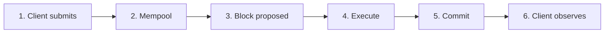
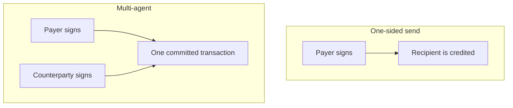

import { Aside, CardGrid, LinkCard } from "@astrojs/starlight/components";

Aptos is a Layer 1 settlement rail for moving APT, [stablecoins](/build/guides/exchanges#stablecoin-addresses), and other [fungible assets](/build/smart-contracts/fungible-asset). A successful payment is **final as soon as the transaction commits** (BFT consensus, no extra block confirmations). This page separates block time, end-to-end latency, finality, and fees, then maps those onto ordinary transfers, confidential transfers, and other payment flows.

A payment can be a **one-sided send** (the payer signs; the recipient does not) or a **[multi-agent](#two-party-agreement-multi-agent) transaction** that both parties sign so they agree in one atomic commit. [Sponsored](/build/guides/sponsored-transactions) (another account pays gas) and [orderless](/build/guides/orderless-transactions) (nonce instead of a sequence number, parallel submit) options compose with either shape.

<Aside type="tip">
  For a first working payment, follow [Your First Transaction](/build/guides/first-transaction). For wallets and existing apps, see [Application Integration](/build/guides/application-integration).
</Aside>

## Latency, block time, and fees

These four numbers answer different questions. Do not treat block time as the time a user waits for a payment.



| Metric                       | What it measures                                                   | Typical mainnet value                                                                                                                                                                                            | Where to verify                                                                                                                                |
| ---------------------------- | ------------------------------------------------------------------ | ---------------------------------------------------------------------------------------------------------------------------------------------------------------------------------------------------------------- | ---------------------------------------------------------------------------------------------------------------------------------------------- |
| **Block time**               | Interval between consecutive blocks                                | Tens of milliseconds. Aptos does not use a fixed slot clock; live timestamps are often under 50 ms                                                                                                               | [Blocks](/network/blockchain/blocks), [Explorer](https://explorer.aptoslabs.com/blocks?network=mainnet)                                        |
| **Finality**                 | When a committed result cannot be reversed                         | Immediate on [commit](/build/guides/exchanges#what-is-the-finality-of-a-transaction). No confirmation depth, no reorg window. A failed transaction is still final; it did not move funds                         | [Transactions and States](/network/blockchain/txns-states)                                                                                     |
| **End-to-end (E2E) latency** | Client **submit** → committed and returned by `waitForTransaction` | Typically **sub-second** under normal load. Includes client RTT to a fullnode, mempool, consensus, execution, and polling. Build, sign, and proof generation happen **before** submit and are not in this number | Always call `waitForTransaction` after submit                                                                                                  |
| **Transaction fee**          | APT charged to the fee payer                                       | Net charge is `gas_used × gas_unit_price − storage_refund` in [octas](/network/glossary#octa). Storage is already folded into `gas_used`. **Independent of the amount transferred**                              | [Gas and Storage Fees](/network/blockchain/gas-txn-fee), [simulate](/network/blockchain/gas-txn-fee#estimating-gas-consumption-via-simulation) |

<Aside type="note">
  Block time, load, and USD-denominated fees move with the network and the APT price. Quote octas (or simulated `gas_used`) in product SLAs; treat USD figures as order-of-magnitude only. Live gas unit prices are available from [`/v1/estimate_gas_price`](https://api.mainnet.aptoslabs.com/v1/estimate_gas_price). Governance sets the floor (`txn.min_price_per_gas_unit`, currently 100 octas for ordinary transactions).
</Aside>

### Block time

Validators propose the next block as soon as network delay allows. Mainnet block times are typically tens of milliseconds. That is how fast the chain packages transactions, not how long a wallet should wait before showing “paid.”

See [Blocks](/network/blockchain/blocks) and [Execution](/network/blockchain/execution) (Block-STM).

### End-to-end latency

On this page, **E2E latency** is the clock from **submit** to `waitForTransaction` returning a committed transaction. That wait is typically under a second for a simple payment.

Work that happens **before** submit is separate and can dominate the user’s clock:

- Build, optional simulation, and sign.
- Confidential-asset proof generation, collecting multisig signatures, or encrypting a pending payload.

Submit is not settlement. A 202 and a hash mean the node **accepted** the transaction. Poll with `waitForTransaction`, then check `success === true` before treating the payment as completed. A committed failed transaction is still [final](#finality) (it will not reverse), but the transfer did not happen.

### Finality

Aptos uses BFT consensus. A committed transaction is final, whether it succeeded or aborted. You do not wait for additional blocks the way you would on a probabilistic-finality chain. See the [exchange FAQ on finality](/build/guides/exchanges#what-is-the-finality-of-a-transaction) and the [transaction lifecycle](/network/blockchain/blockchain-deep-dive).

### Transaction fees

Fees have two parts, both documented in [Gas and Storage Fees](/network/blockchain/gas-txn-fee). Today the client still sees them combined in `gas_used`:

1. **Execution and IO** — gas units × `gas_unit_price` (octas). The unit price can rise under load; a higher price only helps the transaction **enter** the next block, not its order inside the block.
2. **Storage** — fixed APT for new or grown state slots (for example, the first time a recipient holds a given fungible asset). That amount is converted into gas units at the transaction’s `gas_unit_price` and included in `gas_used`. A deletion can later credit a `storage_refund` that is **not** inside `gas_used`.

Net APT moved from the payer is `gas_used × gas_unit_price − storage_refund`. A 1 APT transfer and a 1,000,000 APT transfer with the same payload cost about the same in gas. Average mainnet fees sit at a **fraction of a US cent** (on the order of 0.0005 USD in public network figures; treat USD as order-of-magnitude only). Simple APT and fungible-asset transfers are among the cheapest transactions. Always [simulate](/network/blockchain/gas-txn-fee#estimating-gas-consumption-via-simulation) for the exact payload you will submit.

To hide APT from end users, use a [sponsored transaction](/build/guides/sponsored-transactions) or a [Geomi Gas Station](https://geomi.dev/docs/gas-stations).

## Payments by usage

Use this table to pick an API and to see how latency and fees change. Confidential transfers are summarized here only; the protocol details live on the Confidential Asset pages. Sponsored, orderless, and multi-agent are transaction-layer options that compose with every row — see [Compose every payment](#compose-every-payment).

| Usage                                    | Typical on-chain E2E                                  | Extra client work                    | Fee profile                                                       | Implement                                                                                         |
| ---------------------------------------- | ----------------------------------------------------- | ------------------------------------ | ----------------------------------------------------------------- | ------------------------------------------------------------------------------------------------- |
| **APT transfer**                         | Sub-second after submit                               | Sign, submit, wait                   | Lowest. Amount-independent                                        | [`0x1::aptos_account::transfer`](#apt-transfers)                                                  |
| **Fungible asset / stablecoin transfer** | Same as APT                                           | Sign, submit, wait                   | Similar to APT. Storage if the recipient has no primary store yet | [`0x1::primary_fungible_store::transfer`](#fungible-asset-and-stablecoin-transfers)               |
| **Confidential transfer**                | Same commit path; more execution and a larger payload | Generate ZK proofs **before** submit | Higher than a plaintext transfer                                  | [Confidential Asset](/build/smart-contracts/confidential-asset) (do not implement from this page) |
| **Encrypted pending payload**            | Same once committed                                   | Encrypt at build time                | Minimum `gas_unit_price` of **200** octas (twice the usual floor) | [Encrypted Pending Transactions](/build/guides/encrypted-pending-transactions)                    |
| **Treasury / policy**                    | Extra round-trips for approvals                       | Collect N-of-M signatures            | One execution fee after approval                                  | [Your First Multisig](/build/guides/first-multisig)                                               |
| **Passwordless onboarding**              | Same as the inner transfer                            | OIDC / Keyless flow                  | Same as the inner transfer                                        | [Aptos Keyless](/build/guides/aptos-keyless)                                                      |
| **Two-party agreement**                  | Same as the inner transfer after all signatures       | Collect a signature from each agent  | Same on-chain cost as the inner call                              | [Multi-agent transactions](#two-party-agreement-multi-agent)                                      |

Batch payouts (payroll, disbursements) can use `0x1::aptos_account::batch_transfer` / `batch_transfer_coins` so one transaction pays many recipients. That raises gas with the number of outputs but still keeps a single E2E wait.

## Compose every payment

A payment is the Move call (APT, FA, confidential, NFT, …). These three options attach at the transaction layer and can be combined with each other:

1. **[Sponsored](/build/guides/sponsored-transactions)** — another account pays gas. Build with `withFeePayer: true`; the sender calls `.sign` and the sponsor calls `.signAsFeePayer`. Same on-chain cost; the fee payer is charged instead of the sender. [Geomi Gas Station](https://geomi.dev/docs/gas-stations) is a hosted fee payer.
2. **[Orderless](/build/guides/orderless-transactions)** (AIP-123) — pass a unique `replayProtectionNonce` instead of a sequence number so one account can submit many payments in parallel (payroll, hot wallets). Orderless transactions expire after at most 60 seconds. Sequence-number workers remain the default; see [Transaction Management](/build/guides/transaction-management).
3. **[Multi-agent](#two-party-agreement-multi-agent)** — every listed account signs **one** transaction so both parties agree, rather than one side sending to the other. Requires a Move entry function with multiple `&signer` arguments. Distinct from **multisig** (N-of-M control of a single account).

| Payment                 | Sponsored                                                                             | Orderless                                                                                                                        | Multi-agent (both parties agree)                                                                                 |
| ----------------------- | ------------------------------------------------------------------------------------- | -------------------------------------------------------------------------------------------------------------------------------- | ---------------------------------------------------------------------------------------------------------------- |
| **APT**                 | Fee payer covers gas so the sender’s transferred APT is not reduced by the fee        | Parallel sends from one hot wallet or payroll account                                                                            | Custom two-signer module. Do not add a secondary signer to `0x1::aptos_account::transfer`                        |
| **FA / stablecoin**     | Classic gasless UX: the user holds only the FA; the app pays APT gas                  | Same parallel submit                                                                                                             | Custom two-signer settlement, swap, or delivery-versus-payment                                                   |
| **Confidential**        | First-class on the CA client: `ConfidentialAsset({ withFeePayer: true })` or per call | Transaction-layer nonce if you build the CA entry function yourself. The high-level CA client documents fee payer, not orderless | Standard CA transfer is one-sided. Two-party confidential settlement needs a custom contract both sign           |
| **Encrypted pending**   | Combinable (`withFeePayer: true`)                                                     | Combinable (`replayProtectionNonce`)                                                                                             | Combinable (`build.multiAgent`)                                                                                  |
| **NFT / object**        | Same fee-payer pattern as APT or FA                                                   | Same parallel submit                                                                                                             | Object-for-token or two-way object transfer that both parties sign                                               |
| **Treasury / multisig** | Sponsor can pay gas after the N-of-M approval                                         | Orderless for parallel treasury operations                                                                                       | Different tool: use multi-agent when **two accounts** must both authorize, not when one account has several keys |
| **Keyless**             | Sponsor gas so a new user never holds APT                                             | Same nonce option as any other sender                                                                                            | The Keyless account can be sender or secondary signer in a two-party deal                                        |

Sponsored and orderless flags on a one-sided APT (or FA) transfer:

```typescript filename="sponsored-orderless-apt.ts"
const transaction = await aptos.transaction.build.simple({
  sender: sender.accountAddress,
  withFeePayer: true,
  data: {
    function: "0x1::aptos_account::transfer",
    functionArguments: [recipientAddress, amountInOctas],
  },
  options: {
    replayProtectionNonce: nonce, // unique u64; omit this field to use a sequence number
  },
});

const senderAuthenticator = aptos.transaction.sign({ signer: sender, transaction });
const feePayerAuthenticator = aptos.transaction.signAsFeePayer({ signer: feePayer, transaction });
const committed = await aptos.transaction.submit.simple({
  transaction,
  senderAuthenticator,
  feePayerAuthenticator,
});
```

Swap the `function` (and arguments) for an FA transfer. For a two-party payment, use `build.multiAgent` / `submit.multiAgent` and keep `withFeePayer` and `replayProtectionNonce` as above. Full walkthroughs: [sponsoring](/build/sdks/ts-sdk/building-transactions/sponsoring-transactions), [orderless](/build/sdks/ts-sdk/building-transactions/orderless-transactions), [multi-agent](/build/sdks/ts-sdk/building-transactions/multi-agent-transactions).

## APT transfers

Transfer native APT with `0x1::aptos_account::transfer`. The function creates the recipient account resource when needed.

```typescript filename="apt-transfer.ts"
const transaction = await aptos.transaction.build.simple({
  sender: sender.accountAddress,
  data: {
    function: "0x1::aptos_account::transfer",
    functionArguments: [recipientAddress, amountInOctas],
  },
});

const committed = await aptos.signAndSubmitTransaction({ signer: sender, transaction });
const executed = await aptos.waitForTransaction({ transactionHash: committed.hash });
if (!executed.success) {
  throw new Error(executed.vm_status);
}
```

Walk through the full flow (fund, simulate, sign, wait) in [Your First Transaction](/build/guides/first-transaction). SDK quickstarts repeat the same pattern: [TypeScript](/build/sdks/ts-sdk/quickstart), [Python](/build/sdks/python-sdk/quickstart), [Go](/build/sdks/go-sdk/quickstart), [Rust](/build/sdks/rust-sdk/quickstart).

For Coin-typed assets (including migrated coins), prefer `0x1::aptos_account::transfer_coins` over `0x1::coin::transfer` so the recipient store is registered automatically. See [Transferring Assets](/build/guides/exchanges#transferring-assets) on the exchange guide.

How the compose options apply to APT:

- **Sponsored.** The fee payer pays gas, so the sender’s transferred APT is not reduced by the fee. Use this when a treasury or app should absorb gas, or when you want the recipient to receive an exact octa amount while the sender spends only that amount.
- **Orderless.** Give each payout a unique `replayProtectionNonce` so one hot wallet can submit many APT transfers at once (payroll, disbursements). Expiry is at most 60 seconds.
- **Multi-agent.** A one-sided `aptos_account::transfer` only needs the sender. If both parties must agree (atomic swap, escrow release, “I pay you only if you also sign”), use a custom entry function with two `&signer` arguments. Adding a secondary signer to `0x1::aptos_account::transfer` fails (`NUMBER_OF_SIGNER_ARGUMENTS_MISMATCH`). See [Two-party agreement](#two-party-agreement-multi-agent).

## Fungible asset and stablecoin transfers

USDC, USDT, and other current tokens use the [Fungible Asset](/build/smart-contracts/fungible-asset) standard. Transfer with `0x1::primary_fungible_store::transfer`. It creates the recipient’s primary store when missing.

```typescript filename="fa-transfer.ts"
const transaction = await aptos.transaction.build.simple({
  sender: sender.accountAddress,
  data: {
    function: "0x1::primary_fungible_store::transfer",
    typeArguments: ["0x1::object::ObjectCore"],
    functionArguments: [metadataAddress, recipientAddress, amount],
  },
});

const committed = await aptos.signAndSubmitTransaction({ signer: sender, transaction });
const executed = await aptos.waitForTransaction({ transactionHash: committed.hash });
if (!executed.success) {
  throw new Error(executed.vm_status);
}
```

Mainnet stablecoin metadata addresses are listed under [Stablecoin Addresses](/build/guides/exchanges#stablecoin-addresses). For a broader token registry, see the [Panora Token List](https://github.com/PanoraExchange/Aptos-Tokens). To issue your own asset, start with [Your First Fungible Asset](/build/guides/first-fungible-asset).

<Aside type="caution">
  A first-time FA credit can allocate a storage slot. That storage fee is converted into gas units and included in `gas_used` (see [Calculating Storage Fees](/network/blockchain/gas-txn-fee#calculating-storage-fees)). Simulate the exact sender/recipient pair rather than assuming a repeat-transfer cost.
</Aside>

Read balances with `aptos.getBalance({ accountAddress, asset })` or the `0x1::primary_fungible_store::balance` view function. Indexing and product tables are covered in the [Indexer](/build/indexer) and [fungible asset balance queries](/build/indexer/indexer-api/fungible-asset-balances).

How the compose options apply to FA and stablecoins:

- **Sponsored.** This is the usual gasless checkout: the user holds USDC (or another FA) and never needs APT. The application or [Geomi Gas Station](https://geomi.dev/docs/gas-stations) pays gas. Same `withFeePayer: true` pattern as APT; only the entry function changes.
- **Orderless.** Same nonce as APT. Use it for parallel stablecoin payouts from one treasury account.
- **Multi-agent.** A one-sided `primary_fungible_store::transfer` is a push from payer to recipient. For delivery-versus-payment (stablecoin vs NFT, USDC vs APT, two FAs swapped atomically), both accounts sign one custom entry function so neither side can claim the other already paid.

## Confidential transfers

[Confidential Asset (CA)](/build/smart-contracts/confidential-asset) wraps a fungible asset so **amounts and confidential balances stay hidden**, including from validators, using zero-knowledge proofs. Sender and recipient **addresses remain visible**. Incoming funds land in a pending confidential balance and must be rolled over before they are spendable.

Do not hand-build CA transactions. Use the TypeScript client documented in [Confidential Assets (SDK)](/build/sdks/ts-sdk/confidential-asset). That package generates proofs, decrypts balances, and constructs entry-function payloads.

Relative to a plaintext FA transfer:

- **E2E latency:** on-chain E2E is still typically sub-second after submit. Proof generation on the client happens before submit and is the usual extra delay.
- **Fees:** higher execution and IO because of proof verification and a larger payload. Simulate. There is no separate “confidential gas schedule” beyond ordinary metering.
- **Not the same as encrypted pending transactions.** CA hides committed amounts. [Encrypted pending transactions](/build/guides/encrypted-pending-transactions) hide the Move payload only while the transaction is in mempool.

How the compose options apply to confidential transfers:

- **Sponsored.** The CA TypeScript client supports fee payer first-class: `new ConfidentialAsset({ config, withFeePayer: true })` or `withFeePayer: true` on a single call (`deposit`, `transfer`, `withdraw`, rollover). See [Fee Payer](/build/sdks/ts-sdk/confidential-asset#fee-payer).
- **Orderless.** Orderless is a transaction-layer nonce, not a CA protocol feature. The high-level CA client documents fee payer, not `replayProtectionNonce`. If you construct the CA entry-function payload yourself (still using the SDK to generate proofs), you can pass `options.replayProtectionNonce` on `build.simple` the same way as any other call. Prefer sequence numbers unless you are submitting many CA operations from one account in parallel.
- **Multi-agent.** `ca.transfer` is a one-sided send: the sender proves and signs; the recipient does not. Incoming funds still land in the recipient’s pending confidential balance and must be rolled over. Two-party confidential settlement (both must agree before amounts move) needs a custom module with two `&signer` arguments that both call into CA — do not treat a standard CA transfer as a jointly signed payment.

## Two-party agreement (multi-agent)

A one-sided payment is: Alice signs, Bob receives. Bob never agreed on-chain. That is the right shape for a checkout, a withdrawal, or a payroll push.

A **[multi-agent transaction](/build/sdks/ts-sdk/building-transactions/multi-agent-transactions)** is the other shape: Alice and Bob both sign **one** transaction. The Move function runs only if every listed account authorizes it, so either both legs happen or neither does. Use this when you need both parties to agree — an atomic swap, an escrow release, a refund that the merchant must accept, or any payment that should not be a unilateral send.



This is **not** multisig. Multisig is N-of-M keys controlling **one** account ([Your First Multisig](/build/guides/first-multisig)). Multi-agent is several **distinct accounts** on one transaction.

There is no built-in `0x1` payment function that already takes two signers. You publish (or reuse) an entry function with multiple `&signer` arguments, then:

```typescript filename="two-party-payment.ts"
const transaction = await aptos.transaction.build.multiAgent({
  sender: alice.accountAddress,
  secondarySignerAddresses: [bob.accountAddress],
  withFeePayer: true, // optional
  data: {
    function: "0xYOUR_MODULE::payments::settle", // must take two signers
    functionArguments: [/* amounts, metadata, … */],
  },
  options: {
    replayProtectionNonce: nonce, // optional; omit for a sequence number
  },
});

const aliceAuth = aptos.transaction.sign({ signer: alice, transaction });
const bobAuth = aptos.transaction.sign({ signer: bob, transaction });
const feePayerAuth = aptos.transaction.signAsFeePayer({ signer: feePayer, transaction });

const committed = await aptos.transaction.submit.multiAgent({
  transaction,
  senderAuthenticator: aliceAuth,
  additionalSignersAuthenticators: [bobAuth],
  feePayerAuthenticator: feePayerAuth,
});
```

A canonical teaching module is [`two_by_two_transfer`](https://github.com/aptos-labs/aptos-ts-sdk/blob/main/tests/move/transfer/sources/script_two_by_two.move#L5): each signer moves coin from their account in the same transaction. Other SDKs follow the same `multiAgent` pattern: [Python](/build/sdks/python-sdk/building-transactions/multi-agent-transactions), [Go](/build/sdks/go-sdk/building-transactions/multi-agent-transactions), [Rust](/build/sdks/rust-sdk/building-transactions/multi-agent-transactions).

## Other payment usages

### Encrypted pending payload

Encrypt the Move arguments until execution ([Encrypted Pending Transactions](/build/guides/encrypted-pending-transactions), AIP-144). Currently on devnet and testnet; minimum gas unit price 200 octas.

- **Sponsored.** Pass `withFeePayer: true` on the encrypted build. The SDK documents `feePayerAuthenticationKey` as optional.
- **Orderless.** Pass `replayProtectionNonce` together with `encrypted: true` so parallel submitters keep the payload hidden.
- **Multi-agent.** `build.multiAgent` accepts `encrypted: true` and optional `secondarySignerAuthenticationKeys`. Use it when both parties must agree **and** the pending payload should stay hidden.

### Treasury and policy (multisig)

N-of-M controls for mint, freeze, or large payouts: [Your First Multisig](/build/guides/first-multisig), [Multisig Managed Assets](/build/guides/multisig-managed-fungible-asset).

- **Sponsored.** After the owners approve, a fee payer can still cover gas for the executing transaction.
- **Orderless.** Use a nonce when the treasury account submits many independent payouts in parallel.
- **Multi-agent.** Do not substitute multi-agent for multisig. If the treasury must settle against another party in one shot, collect the multisig signatures **and** the counterparty’s signature (multi-agent secondary signer), or have the approved multisig account be one agent in a two-signer module.

### NFT or object checkout

[Digital Asset](/build/smart-contracts/digital-asset) and [Your First NFT](/build/guides/your-first-nft). Settlement still uses the same block time, finality, and fee model; the payload is an object transfer rather than an FA transfer.

- **Sponsored.** Same `withFeePayer` pattern so the buyer need not hold APT.
- **Orderless.** Same nonce if a marketplace hot wallet mints or delivers many objects in parallel.
- **Multi-agent.** One-sided object transfer is a push. For NFT-for-stablecoin checkout where neither side should move first, both the buyer and the seller (or the marketplace escrow) sign one entry function.

### Passwordless onboarding (Keyless)

[Aptos Keyless](/build/guides/aptos-keyless) accounts are ordinary senders once created.

- **Sponsored.** Cover gas so a new user can pay in a stablecoin without ever holding APT.
- **Orderless.** Same nonce option as any other account.
- **Multi-agent.** The Keyless account can be the sender or a secondary signer when the user must agree with a merchant or another wallet in one transaction.

### Exchanges and custody

Deposits, withdrawals, and finality rules: [Exchange Integration](/build/guides/exchanges).

- **Sponsored.** Uncommon on a CEX hot wallet (the venue already holds APT). Useful for user-facing deposit helpers or gasless withdrawal claims.
- **Orderless.** The usual tool for parallel withdrawals from one hot wallet; sequence-number workers are the alternative in [Transaction Management](/build/guides/transaction-management).
- **Multi-agent.** CEX deposit and withdrawal are one-sided. OTC or on-chain delivery-versus-payment between the venue and a client can use multi-agent so both sides agree rather than one sending to the other.

## Next steps

<CardGrid>
  <LinkCard href="/build/guides/first-transaction" title="Your First Transaction" description="Fund accounts and send a verified APT transfer." />

  <LinkCard href="/build/smart-contracts/fungible-asset" title="Fungible Asset" description="The token standard used by USDC, USDT, and new payment assets." />

  <LinkCard href="/build/smart-contracts/confidential-asset" title="Confidential Asset" description="Hide transfer amounts and confidential balances with ZK proofs." />

  <LinkCard href="/network/blockchain/gas-txn-fee" title="Gas and Storage Fees" description="How execution, IO, and storage fees are charged and refunded." />

  <LinkCard href="/build/guides/sponsored-transactions" title="Sponsored Transactions" description="Let the application pay gas so users transact without APT." />

  <LinkCard href="/build/guides/orderless-transactions" title="Orderless Transactions" description="Submit many payments in parallel from one account with a replay-protection nonce." />

  <LinkCard href="/build/sdks/ts-sdk/building-transactions/multi-agent-transactions" title="Multi-Agent Transactions" description="Both parties sign one transaction instead of one side sending to the other." />

  <LinkCard href="/build/guides/application-integration" title="Application Integration" description="Accounts, signing, balances, and the submit-then-wait lifecycle." />
</CardGrid>
