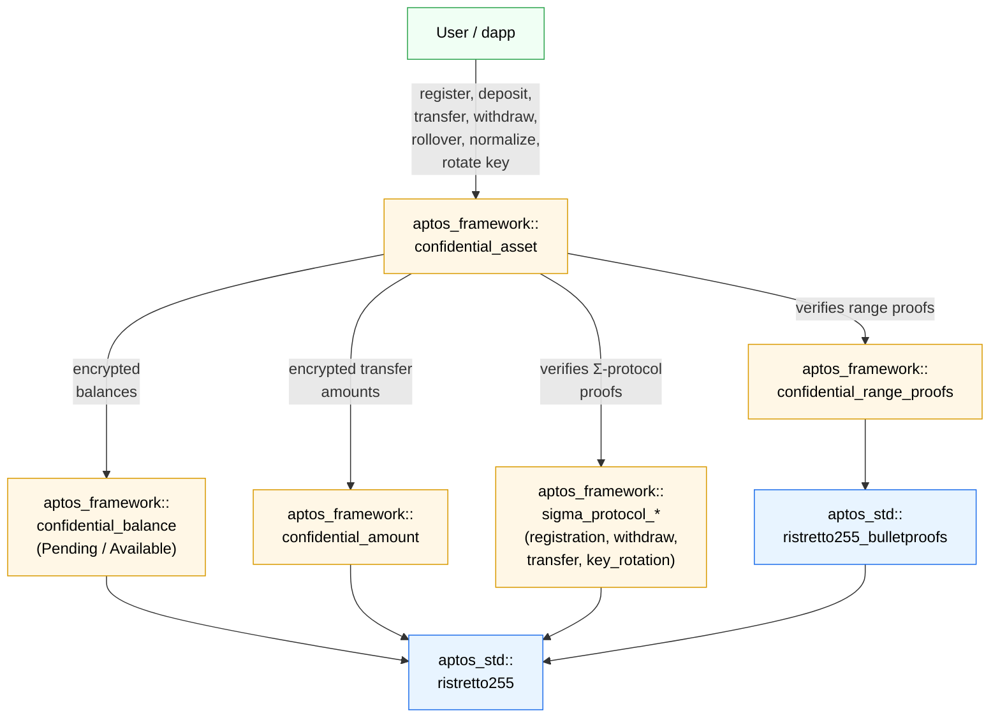

import { Aside } from '@astrojs/starlight/components';

The Confidential Asset Standard (also known as "Confidential Asset" or "CA") is a privacy-focused protocol for managing Fungible Assets (FA).
It allows users to perform transactions with hidden FA amounts while keeping sender and recipient addresses publicly visible.

This standard allows any FA to be wrapped into a corresponding Confidential Asset, ensuring compatibility with existing tokens.
It supports 64-bit transfers, and balances of up to 128 bits.

Operations on Confidential Asset balances (confidential balances), require zero-knowledge proofs (ZKPs) to verify transaction correctness
without revealing hidden amounts and other sensitive data.

<Aside type="note">
  Interacting directly with Confidential Asset's smart contracts is highly complex.
  Developers are encouraged to use the TypeScript SDK, with full documentation available [here](/build/sdks/ts-sdk/confidential-asset).
  The SDK handles ZKP generation, balance decryption, and transaction construction.
</Aside>

<Aside type="note">
  This documentation explains the contract's operations and offers insights into the protocol core processes.
  Cryptographic and mathematical details are explained superficially.
</Aside>

## Confidential Store

For every confidential asset a user registers, they generate a unique keypair:

- An encryption key (EK) stored on-chain.
- A decryption key (DK) kept securely by the user.

These keys are standalone and should not be confused with the user's Aptos account keys.

Each confidential balance is split into two parts:

- `pending_balance` - accumulates all incoming transactions.
- `available_balance` - used exclusively for outgoing transactions.

Both balances are encrypted with the same user's EK, ensuring underlying amounts remain private.

<Aside type="note">
  This separation protects against "front-running" attacks.
  Specifically, if there was a single balance, an attacker could revert a user's transaction by sending a small payment,
  altering the balance and, consequently, invalidating the user's ZKP.
</Aside>

The confidential balance, encryption key, and related state are stored in the `ConfidentialStore` resource.
The `ConfidentialStore` is instantiated for each confidential asset the user has and managed by the `confidential_asset` module:

```move filename="confidential_asset.move"
enum ConfidentialStore has key {
    V1 {
        pause_incoming: bool,
        normalized: bool,
        transfers_received: u64,
        pending_balance: CompressedBalance<Pending>,
        available_balance: CompressedBalance<Available>,
        ek: CompressedRistretto,
        auditor_hint: Option<EffectiveAuditorHint>,
    }
}
```

The `auditor_hint` field tracks which [auditor](#auditors) (global vs. asset-specific, plus its epoch)
the `available_balance`'s auditor R component is currently encrypted under.
Auditors use this to detect when their copy of a balance ciphertext is stale.

## Confidential Balance

Confidential balances handle token amounts by splitting them into smaller units called chunks.
Each chunk represents a portion of the total amount and is encrypted individually using the user's EK.
Each encrypted chunk consists of two curve points `(P, R)` forming a Twisted ElGamal ciphertext.

### Chunks

The pending balance consists of four chunks that hold all incoming transfers.
It can handle up to 2^16 64-bit transfers before requiring a rollover to the available balance.
During this accumulation, the pending balance chunks can grow up to 32 bits each.

The available balance consists of eight chunks, supporting 128-bit values.
After any operation the available balance should be [normalized](#normalization) back to 16-bit chunks to maintain efficient decryption.

Both balance types share a single `CompressedBalance<T>` struct, parameterized by a phantom marker (`Pending` or `Available`):

```move filename="confidential_balance.move"
struct Pending has drop {}
struct Available has drop {}

enum CompressedBalance<phantom T> has store, drop, copy {
    V1 {
        P: vector<CompressedRistretto>,
        R: vector<CompressedRistretto>,
        R_aud: vector<CompressedRistretto>,
    }
}
```

<Aside type="note">
  The `R_aud` field stores the [effective auditor](#auditors)'s R components, enabling the auditor
  (if one is configured) to decrypt the encrypted balance. It is left empty when no effective auditor is set.
  Pending balances do not require auditor access (only the recipient sees incoming transfer ciphertexts), so
  pending `R_aud` is empty.
</Aside>

### Encryption and Decryption

Encryption involves:

- Splitting the total amount into 16-bit chunks.
- Applying the user's EK to encrypt each chunk individually as a Twisted ElGamal ciphertext `(P, R)`.

Decryption involves:

- Applying the user's DK to decrypt each chunk.
- Solving a discrete logarithm (DL) problem for each chunk to recover the original values.
- Combining the recovered values to reconstruct the total amount.

### Normalization

Normalization ensures chunks are always reduced to manageable sizes (16 bits).
Without normalization, chunks can grow too large, making the decryption process (solving DL) significantly slower or even impractical.
This mechanism is automatically applied to the available balance after each transfer or withdrawal,
ensuring that users can always decrypt their balances, even as balances grow through multiple transactions.
Only after a rollover, users are required to normalize the available balance [manually](#normalize).

### Homomorphic Encryption

The protocol utilizes Homomorphic encryption, allowing arithmetic operations on confidential balances without their decryption.
This capability is essential for updating the receiver's pending balance during transfers and for rollovers,
where the user's pending balance is added to the available one.

## Architecture

The diagram below shows the relationship between Confidential Asset modules:



Users interact with the `confidential_asset` module to perform every protocol operation. That module
delegates to:

- `confidential_balance` — a single module that represents both `Pending` and `Available` encrypted
  balances via phantom-typed `CompressedBalance<T>` / `Balance<T>`.
- `confidential_amount` — encrypted transfer-amount ciphertexts (sender, recipient, effective auditor,
  and any voluntary auditors).
- `confidential_range_proofs` — batched Bulletproofs verification for the new-balance and amount
  range proofs.
- `sigma_protocol_*` — a family of $\Sigma$-protocol modules (`sigma_protocol_proof`,
  `sigma_protocol_registration`, `sigma_protocol_withdraw`, `sigma_protocol_transfer`,
  `sigma_protocol_key_rotation`, plus shared helpers in `sigma_protocol_utils`) that verify
  knowledge / consistency proofs accompanying each entry function.

Under the hood, all curve operations route through `aptos_std::ristretto255` (Ristretto255 group ops)
and `aptos_std::ristretto255_bulletproofs` (range-proof verification natives).

## Entry Functions

<Aside type="note">
  Entry functions with the `_raw` suffix accept serialized cryptographic data as `vector<u8>` or `vector<vector<u8>>`.
  ZKP generation and data serialization are handled by the [TypeScript SDK](/build/sdks/ts-sdk/confidential-asset).
</Aside>

### Register

```move filename="confidential_asset.move"
public entry fun register_raw(
    sender: &signer,
    asset_type: Object<Metadata>,
    ek: vector<u8>,
    sigma_proto_comm: vector<vector<u8>>,
    sigma_proto_resp: vector<vector<u8>>
)
```

Users must register a `ConfidentialStore` for each asset type they intend to transact with.
As part of this process, users generate a keypair (EK and DK) on their end and submit
a sigma protocol proof (proving knowledge of the DK corresponding to the given EK).

When a `ConfidentialStore` is first registered, the confidential balance is set to zero,
represented as zero ciphertexts for both the `pending_balance` and `available_balance`.

<Aside type="note">
  Although it is recommended to generate a unique keypair for each asset type to enhance security,
  it's not restricted to reuse the same encryption key across multiple assets if preferred.
</Aside>

<Aside type="caution">
  This operation is expensive as it initializes a new storage and storage fees far exceed execution fees.
  However, users call it only once per asset type.
</Aside>

<Aside type="caution">
  The encryption key may not be the identity (zero) point.
  On mainnet and testnet, the asset type must be [allow-listed](#allow-list--asset-config) for confidential transfers,
  and registration is rejected during an [emergency pause](#emergency-pause).
</Aside>

### Deposit

```move filename="confidential_asset.move"
public entry fun deposit(
    depositor: &signer,
    asset_type: Object<Metadata>,
    amount: u64
)
```

The `deposit` function brings tokens into the protocol, transferring the passed amount
from the primary FA store of the depositor to their own pending balance.

The amount in this function is publicly visible, as adding new tokens to the protocol requires a normal transfer.
However, tokens within the protocol become obfuscated through confidential transfers, ensuring privacy in subsequent transactions.

<Aside type="note">
  If you want to have a hidden amount from the beginning, use the `confidential_transfer_raw` function instead.
</Aside>

<Aside type="caution">
  Zero-value deposits are rejected (they would pointlessly increment the recipient's `transfers_received` counter).
  "Dispatchable" fungible asset types — those with custom `withdraw`/`deposit`/`balance`/`supply` hooks — are also
  rejected, since their dynamic behavior cannot be safely composed with encrypted balances.
</Aside>

### Rollover Pending Balance

```move filename="confidential_asset.move"
public entry fun rollover_pending_balance(
    sender: &signer,
    asset_type: Object<Metadata>
)
```

```move filename="confidential_asset.move"
public entry fun rollover_pending_balance_and_pause(
    sender: &signer,
    asset_type: Object<Metadata>
)
```

The `rollover_pending_balance` function adds the pending balance to the available one, resetting the pending balance to zero.
It works with no additional proofs as this function utilizes properties of the [Homomorphic encryption](#homomorphic-encryption) used in the protocol.

The `rollover_pending_balance_and_pause` variant additionally pauses incoming transfers after the rollover,
which is useful when preparing for a [key rotation](#rotate-encryption-key).

<Aside type="note">
  You cannot spend money from the pending balance directly. It must be rolled over to the available balance first.
</Aside>

<Aside type="caution">
  The available balance must be [normalized](#normalization) before performing a rollover.
  If it is not normalized, you can use the [`normalize_raw`](#normalize) function to do so.
</Aside>

<Aside type="caution">
  Calling the `rollover_pending_balance` function in a separate transaction is crucial for preventing "front-running" attacks.
</Aside>

### Confidential Transfer

```move filename="confidential_asset.move"
public entry fun confidential_transfer_raw(
    sender: &signer,
    asset_type: Object<Metadata>,
    to: address,
    new_balance_P: vector<vector<u8>>,
    new_balance_R: vector<vector<u8>>,
    new_balance_R_eff_aud: vector<vector<u8>>,
    amount_P: vector<vector<u8>>,
    amount_R_sender: vector<vector<u8>>,
    amount_R_recip: vector<vector<u8>>,
    amount_R_eff_aud: vector<vector<u8>>,
    ek_volun_auds: vector<vector<u8>>,
    amount_R_volun_auds: vector<vector<vector<u8>>>,
    zkrp_new_balance: vector<u8>,
    zkrp_amount: vector<u8>,
    sigma_proto_comm: vector<vector<u8>>,
    sigma_proto_resp: vector<vector<u8>>,
    memo: vector<u8>,
)
```

The `confidential_transfer_raw` function transfers tokens from the sender's available balance to the recipient's
pending balance. The sender encrypts the transferred amount under the recipient's encryption key, enabling the recipient's
confidential balance to be updated [homomorphically](#homomorphic-encryption).

The transfer amount is also encrypted under the sender's key (for the sender's records) and under any auditor keys.

The function requires:

- **New balance ciphertexts** (`new_balance_P`, `new_balance_R`, `new_balance_R_eff_aud`): the sender's updated available balance after the transfer.
- **Amount ciphertexts** (`amount_P`, `amount_R_sender`, `amount_R_recip`, `amount_R_eff_aud`): the transfer amount encrypted under the sender's, recipient's, and auditor's keys.
- **Voluntary auditor keys and ciphertexts** (`ek_volun_auds`, `amount_R_volun_auds`): optional additional auditor encryption keys and amount ciphertexts.
- **Range proofs** (`zkrp_new_balance`, `zkrp_amount`): proving the new balance and transfer amount are non-negative and within range.
- **Sigma protocol proof** (`sigma_proto_comm`, `sigma_proto_resp`): proving the correctness of the transfer.
- **Memo** (`memo`): an opaque byte string emitted in the `Transferred` event. Limited to `get_max_memo_bytes()` (256 bytes); pass an empty vector for no memo. The memo is stored on-chain in plaintext, so encrypt it client-side if it is sensitive.

<Aside type="note">
  Once a user has participated in at least one transfer, their balance becomes "hidden".
  This means that neither the transferred amount nor the updated balances of the sender and recipient are visible to external observers.
</Aside>

<Aside type="caution">
  Self-transfers (sender == recipient) are rejected. To rebalance your own pending and available balances,
  use [`rollover_pending_balance`](#rollover-pending-balance) instead.
</Aside>

### Withdraw

```move filename="confidential_asset.move"
public entry fun withdraw_to_raw(
    sender: &signer,
    asset_type: Object<Metadata>,
    to: address,
    amount: u64,
    new_balance_P: vector<vector<u8>>,
    new_balance_R: vector<vector<u8>>,
    new_balance_R_aud: vector<vector<u8>>,
    zkrp_new_balance: vector<u8>,
    sigma_proto_comm: vector<vector<u8>>,
    sigma_proto_resp: vector<vector<u8>>
)
```

The `withdraw_to_raw` function allows a user to withdraw tokens from the protocol,
transferring the passed amount from the available balance of the sender to the primary FA store of the recipient.
This function enables users to release tokens while not revealing their remaining balances.

The withdrawn amount itself is publicly visible (as a `u64`), but the sender's remaining balance stays hidden.

<Aside type="caution">
  Attempting to withdraw more tokens than available will cause an error.
</Aside>

### Rotate Encryption Key

```move filename="confidential_asset.move"
public entry fun rotate_encryption_key_raw(
    sender: &signer,
    asset_type: Object<Metadata>,
    new_ek: vector<u8>,
    resume_incoming_transfers: bool,
    new_R: vector<vector<u8>>,
    sigma_proto_comm: vector<vector<u8>>,
    sigma_proto_resp: vector<vector<u8>>
)
```

The `rotate_encryption_key_raw` function modifies the user's EK and re-encrypts the available balance R components with the new EK.
The `resume_incoming_transfers` parameter controls whether incoming transfers are unpaused after the rotation.

To facilitate the rotation process:

1. The pending balance must first be rolled over and incoming transfers paused by calling `rollover_pending_balance_and_pause`.
   This prevents new transfers from altering the pending balance during the key rotation.
2. Then the EK can be rotated using `rotate_encryption_key_raw`, optionally resuming incoming transfers.

<Aside type="caution">
  Key rotation requires incoming transfers to be paused. If they are not paused, the transaction will fail.
</Aside>

### Normalize

```move filename="confidential_asset.move"
public entry fun normalize_raw(
    sender: &signer,
    asset_type: Object<Metadata>,
    new_balance_P: vector<vector<u8>>,
    new_balance_R: vector<vector<u8>>,
    new_balance_R_aud: vector<vector<u8>>,
    zkrp_new_balance: vector<u8>,
    sigma_proto_comm: vector<vector<u8>>,
    sigma_proto_resp: vector<vector<u8>>
)
```

The `normalize_raw` function ensures that the available balance is reduced to 16-bit chunks for [efficient decryption](#normalization).
This is necessary only before the `rollover_pending_balance` operation, which requires the available balance to be normalized beforehand.

All other functions, such as `withdraw_to_raw` or `confidential_transfer_raw`, handle normalization implicitly, making manual normalization unnecessary in those cases.

<Aside type="note">
  All functions except `rollover_pending_balance` perform implicit normalization.
</Aside>

<Aside type="caution">
  Calling a `rollover_pending_balance` when the available balance is not normalized will cause an error.
</Aside>

### Pause/Unpause Incoming Transfers

```move filename="confidential_asset.move"
public entry fun set_incoming_transfers_paused(
    owner: &signer,
    asset_type: Object<Metadata>,
    paused: bool
)
```

The `set_incoming_transfers_paused` function allows a user to pause or unpause incoming confidential transfers.
When paused, other users cannot transfer tokens to this user's pending balance.

This is primarily used during [key rotation](#rotate-encryption-key) to ensure
the pending balance remains empty while the rotation is in progress.

## Auditors

The protocol supports auditors who can decrypt transfer amounts for compliance purposes.
Auditors hold their own Twisted ElGamal keypair and receive encrypted copies of transfer amounts under their EK.

There are three types of auditors:

- **Global auditor** — set by governance, applies to all asset types unless overridden.
- **Asset-specific auditor** — set by governance per asset type. Takes precedence over the global auditor.
- **Effective auditor** — the asset-specific auditor if its EK is set, otherwise the global auditor.
  This auditor is mandatory: if an effective auditor exists, all transfers, withdrawals, and normalizations must include ciphertexts for it.
- **Voluntary auditors** — additional auditors specified by the sender at transfer time.

Auditor configuration is wrapped in `AuditorConfig`, which bundles the EK with an `epoch` counter that
increments every time the auditor is installed or rotated (it does not increment when the auditor is removed):

```move filename="confidential_asset.move"
enum AuditorConfig has store, drop, copy {
    V1 {
        ek: Option<CompressedRistretto>,
        epoch: u64,
    }
}

enum EffectiveAuditorConfig has store, drop, copy {
    V1 { is_global: bool, config: AuditorConfig }
}

enum EffectiveAuditorHint has store, drop, copy {
    V1 { is_global: bool, epoch: u64 }
}
```

Each `ConfidentialStore` records an `EffectiveAuditorHint` alongside its `available_balance`, so an auditor
can compare `(is_global, epoch)` against the current effective auditor config and tell whether their copy
of a balance ciphertext is stale.

<Aside type="note">
  The effective auditor can decrypt both the transfer amount and the sender's new available balance.
  Voluntary auditors can only decrypt the transfer amount.
</Aside>

<Aside type="note">
  Asset-specific and global auditors are managed via the governance functions
  `set_asset_specific_auditor` and `set_global_auditor`.
</Aside>

## Allow list & asset config

On mainnet and testnet, the protocol enforces an asset-type allow list: only asset types explicitly
allow-listed by governance can be registered, deposited, transferred, or rolled over confidentially.
Withdrawals are always permitted — even when an asset is removed from the allow list — so users can
recover funds.

Allow-listing and per-asset configuration are managed by governance via these (non-`entry`) functions:

- `set_allow_listing(aptos_framework, enabled)` — enables or disables the allow list globally.
- `set_confidentiality_for_asset_type(aptos_framework, asset_type, allowed)` — enables or disables
  a specific asset type. Only meaningful when the allow list is enabled.
- `set_confidentiality_for_apt(aptos_framework, allowed)` — convenience wrapper for the APT token.

## Emergency pause

Governance can pause **all** user-facing operations (`register`, `deposit`, `withdraw`, `confidential_transfer`,
`rollover_pending_balance`, `rotate_encryption_key`, `set_incoming_transfers_paused`) via:

```move filename="confidential_asset.move"
public fun set_emergency_paused(aptos_framework: &signer, paused: bool)
```

While paused, every user operation aborts with `E_EMERGENCY_PAUSED`. Use the
[`is_emergency_paused`](#view-functions) view function to check the current state before
constructing transactions.

## View Functions

```move filename="confidential_asset.move"
#[view]
public fun is_emergency_paused(): bool

#[view]
public fun has_confidential_store(
    user: address, asset_type: Object<Metadata>
): bool

#[view]
public fun is_allow_listing_required(): bool

#[view]
public fun is_confidentiality_enabled_for_asset_type(
    asset_type: Object<Metadata>
): bool

#[view]
public fun get_pending_balance(
    owner: address, asset_type: Object<Metadata>
): CompressedBalance<Pending>

#[view]
public fun get_available_balance(
    owner: address, asset_type: Object<Metadata>
): CompressedBalance<Available>

#[view]
public fun get_encryption_key(
    user: address, asset_type: Object<Metadata>
): CompressedRistretto

#[view]
public fun is_normalized(
    user: address, asset_type: Object<Metadata>
): bool

#[view]
public fun incoming_transfers_paused(
    user: address, asset_type: Object<Metadata>
): bool

#[view]
public fun get_effective_auditor_hint(
    user: address, asset_type: Object<Metadata>
): Option<EffectiveAuditorHint>

#[view]
public fun get_effective_auditor_config(
    asset_type: Object<Metadata>
): EffectiveAuditorConfig

#[view]
public fun get_total_confidential_supply(
    asset_type: Object<Metadata>
): u64

#[view]
public fun get_num_transfers_received(
    user: address, asset_type: Object<Metadata>
): u64

#[view]
public fun get_max_transfers_before_rollover(): u64

#[view]
public fun get_max_memo_bytes(): u64
```

## Useful Resources

- [Confidential Asset SDK](/build/sdks/ts-sdk/confidential-asset)
