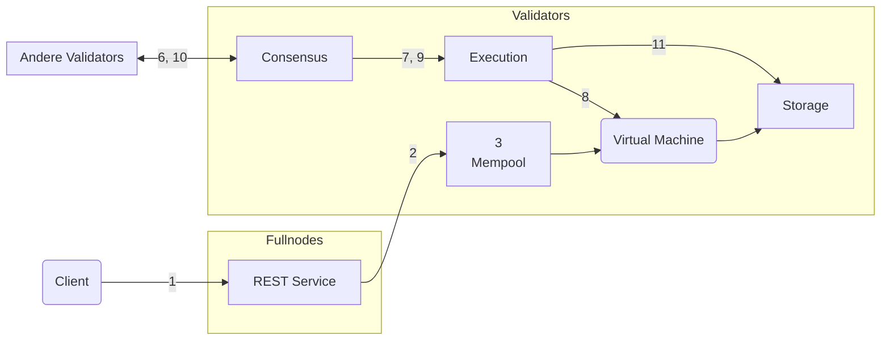

import { Aside } from '@astrojs/starlight/components';

Für ein tieferes Verständnis des Lebenszyklus einer Aptos-Transaktion (aus operativer Sicht) werden wir eine Transaktion auf ihrer Reise verfolgen, von der Übermittlung an einen Aptos Full Node bis zur Bestätigung in der Aptos-Blockchain. Wir werden uns dann auf die logischen Komponenten der Aptos-Nodes konzentrieren und betrachten, wie die Transaktion mit diesen Komponenten interagiert.

## Leben einer Transaktion

- Alice und Bob sind zwei Benutzer, die jeweils ein [Konto](/de/network/glossary#account) auf der Aptos-Blockchain haben.
- Alices Konto hat 110 Aptos Coins.
- Alice sendet 10 Aptos Coins an Bob.
- Die aktuelle [Sequenznummer](/de/network/glossary#sequence-number) von Alices Konto ist 5 (was anzeigt, dass bereits 5 Transaktionen von Alices Konto gesendet wurden).
- Es gibt insgesamt 100 Validator-Nodes — V1 bis V100 im Netzwerk.
- Ein Aptos-Client übermittelt Alices Transaktion an einen REST-Service auf einem Aptos Full Node. Der Full Node leitet diese Transaktion an einen Validator Full Node weiter, der sie wiederum an Validator V1 weiterleitet.
- Validator V1 ist ein Proposer/Leader für die aktuelle Runde.

### Die Reise

In diesem Abschnitt beschreiben wir den Lebenszyklus der Transaktion T5, vom Zeitpunkt der Client-Übermittlung bis zur Bestätigung in der Aptos-Blockchain.

Für die relevanten Schritte haben wir einen Link zu den entsprechenden Inter-Komponenten-Interaktionen des Validator-Nodes eingefügt. Nachdem Sie sich mit allen Schritten im Lebenszyklus der Transaktion vertraut gemacht haben, möchten Sie vielleicht die Informationen zu den entsprechenden Inter-Komponenten-Interaktionen für jeden Schritt einsehen.

### Schritt 1: Client übermittelt Transaktion

Alices Wallet erstellt die Transaktion T5 zur Übertragung von 10 Aptos Coins an Bob. Die Transaktion T5 enthält die folgenden Informationen:

- **Sender-Adresse** — Alices Konto.
- **Sender-Programm** — Dieses Feld zeigt an, dass Alice einen Smart Contract zur Übertragung von Aptos Coins verwendet.
- **Gaspreis** — Der Preis, den Alice bereit ist, pro Gaseinheit für die Ausführung dieser Transaktion zu zahlen. Gas ist eine Möglichkeit, für Rechenressourcen zu bezahlen.
- **Gaslimit** — Die maximale Anzahl von Gaseinheiten, die Alice bereit ist, für diese Transaktion zu zahlen.
- **Sequenznummer** — Die dieser Transaktion von Alices Konto zugewiesene Sequenznummer. Für diese Transaktion ist es 5.
- **Ablaufzeit** — Die Ablaufzeit der Transaktion.
- **Signatur** — Alices digitale Signatur der Transaktion. Dies stellt sicher, dass niemand diese Transaktion fälschen kann.

Alices Wallet übermittelt die Transaktion T5 über ihren REST-Service an einen Full Node. Der Full Node verwendet einen [Proxy](https://en.wikipedia.org/wiki/Proxy_server), um die Transaktion an einen Validator Full Node weiterzuleiten, der sie an Validator V1 weiterleitet.

[Inter-Komponenten-Interaktionen: Transaktion akzeptieren](/de/network/blockchain/blockchain-deep-dive#inter-component-interactions---accepting-the-transaction)

### Schritt 2: Transaktionsakzeptanz und -verbreitung

Wenn Validator V1 die Transaktion T5 vom Full Node erhält (über seinen eigenen Full Node), fügt V1 sie seinem Mempool hinzu und führt eine anfängliche Validierung durch. Wenn diese Transaktion die anfängliche Validierung nicht besteht, wird sie sofort abgelehnt und die Transaktion würde hier enden. Wenn sie die anfängliche Validierung besteht, würde sie an die Mempools anderer Validators verbreitet.

[Inter-Komponenten-Interaktionen: Transaktion mit anderen Validators teilen](/de/network/blockchain/blockchain-deep-dive#inter-component-interactions---sharing-the-transaction-with-other-validators)

### Schritt 3: Transaktion im Mempool

Jetzt, da die Transaktion T5 verbreitet wurde, würde sie in den Mempools von V1 und anderen Validators residieren.

[Inter-Komponenten-Interaktionen: Mempool zu Consensus](/de/network/blockchain/blockchain-deep-dive#inter-component-interactions---mempool-to-consensus)

### Schritt 4: Block vorschlagen

Da V1 der Leader/Proposer für diese Runde ist, wird er einen Zustandsblock vorschlagen, der die Transaktion T5 enthält.

[Inter-Komponenten-Interaktionen: Consensus](/de/network/blockchain/blockchain-deep-dive#inter-component-interactions---consensus)

### Schritt 5: Block ausführen und bestätigen

- V1, der Proposer für Runde 1, sammelt die Transaktionen vom Mempool seiner eigenen Node in einen Block.
- V1 verbreitet diesen Block als einen Vorschlag an alle anderen Validators.
- Jeder Validator (einschließlich V1) führt die Transaktionen im vorgeschlagenen Block aus.
- Jeder Validator erreicht das gleiche Ergebnis und stimmt diesem Block zu.
- Der Block wird bestätigt und im lokalen Speicher jedes Validators aktualisiert.

[Inter-Komponenten-Interaktionen: Ausführung](/de/network/blockchain/blockchain-deep-dive#inter-component-interactions---executing-the-block)

Die Transaktion T5 ist jetzt abgeschlossen! Alice hat erfolgreich 10 Aptos Coins an Bob übertragen. Der neue Zustand zeigt, dass Alices Konto 100 Aptos Coins hat und Bobs Konto 10 Aptos Coins hat.

## Inter-Komponenten-Interaktionen

Lassen Sie uns nun die Inter-Komponenten-Interaktionen der Validator-Node für jeden Schritt der Transaktion betrachten.

### Inter-Komponenten-Interaktionen - Transaktion akzeptieren

**Zusammenfassung:** In diesem Schritt erhält die JSON-RPC-Service-Komponente der Validator-Node die Transaktion von einem Client. Die JSON-RPC-Service-Komponente leitet die Transaktion dann an die Mempool-Komponente der Validator-Node weiter.

**Beschreibung:**

1. Der Client übermittelt eine Transaktion über die JSON-RPC-Service-Komponente der Validator-Node.
2. Die JSON-RPC-Service-Komponente führt grundlegende Syntax-Validierungschecks durch.
3. Die Transaktion wird an die Mempool-Komponente weitergeleitet.

### Inter-Komponenten-Interaktionen - Transaktion mit anderen Validators teilen

**Zusammenfassung:** Die Mempool-Komponente der Validator-Node teilt die Transaktionen in ihrem Mempool mit den Mempool-Komponenten anderer Validators im Netzwerk.

**Beschreibung:**

1. Die Mempool-Komponente erhält die Transaktion von der JSON-RPC-Service-Komponente.
2. Die Mempool-Komponente führt weitere Validierungschecks durch.
3. Die Transaktion wird mit anderen Validator-Nodes geteilt.

### Inter-Komponenten-Interaktionen - Mempool zu Consensus

**Zusammenfassung:** Die Consensus-Komponente zieht Transaktionen aus dem Mempool und bildet einen Block. Diese Transaktionen sind noch nicht ausgeführt.

**Beschreibung:**

1. Die Consensus-Komponente fordert einen Block von Transaktionen vom Mempool an.
2. Der Mempool gibt einen Block von Transaktionen zurück.
3. Die Consensus-Komponente ist bereit, einen Vorschlag zu machen.

### Inter-Komponenten-Interaktionen - Consensus

**Zusammenfassung:** Die Consensus-Komponente ist verantwortlich für die Koordinierung der Vereinbarung zwischen allen Validators im Netzwerk über die Reihenfolge der Transaktionen.

**Beschreibung:**

1. Als Leader schlägt die Consensus-Komponente einen Block vor.
2. Die Consensus-Komponente stimmt über Vorschläge von anderen Validators ab.
3. Ein Block wird bestätigt, wenn genügend Validators zustimmen.

### Inter-Komponenten-Interaktionen - Block ausführen

**Zusammenfassung:** Die Execution-Komponente führt einen Block von Transaktionen aus. Die Transaktion könnte erfolgreich ausgeführt werden oder abgebrochen werden, aber in beiden Fällen wird die Transaktion bestätigt und in der distribuierten Datenbank der Blockchain gespeichert.

**Beschreibung:**

1. Die Execution-Komponente erhält einen bestätigten Block von der Consensus-Komponente.
2. Die Execution-Komponente führt jede Transaktion über die Move Virtual Machine aus.
3. Die Ergebnisse werden in der Storage-Komponente gespeichert.

## Aptos Blockchain-Komponenten

Die Aptos-Blockchain besteht aus drei logischen Komponenten:

### JSON-RPC Service

- Empfängt Anfragen von Clients
- Führt grundlegende Validierung durch
- Leitet Transaktionen an Mempool weiter
- Beantwortet Abfragen über Blockchain-Zustände

### Mempool

- Hält einen In-Memory-Puffer ausstehender Transaktionen
- Validiert eingehende Transaktionen
- Teilt Transaktionen mit anderen Nodes
- Bietet Transaktionen für Consensus an

### Consensus

- Erreicht Vereinbarung über Transaktionsreihenfolge
- Verwendet den AptosBFT-Consensus-Algorithmus
- Führt Leader-Rotation durch
- Bestätigt Blöcke zur Ausführung

### Execution

- Führt Transaktionen über Move VM aus
- Berechnet Kryptographic Accumulator
- Speichert Ergebnisse persistent
- Emittiert Events

### Storage

- Persistiert Blockchain-Daten
- Speichert Kontostatus
- Verwaltet Ledger-Verlauf
- Unterstützt State-Synchronisation

### State Synchronizer

- Hilft Nodes beim Aufholen mit dem Netzwerk
- Lädt fehlende Blockchain-Daten herunter
- Validiert empfangene Daten
- Aktualisiert lokalen Zustand

Diese Komponenten arbeiten zusammen, um eine sichere, skalierbare und effiziente Blockchain-Plattform zu bieten.
