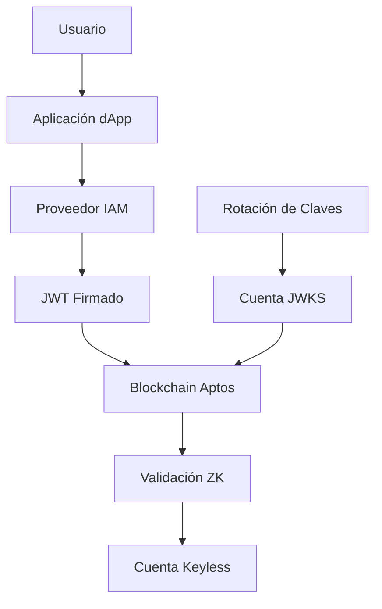

## Consideraciones Clave de Keyless Federado

**IAMs Soportados**

Actualmente, los IAMs soportados son Amazon Cognito y Auth0 a través de devnet, testnet, y mainnet. Ver una tabla del conjunto completo de proveedores IAM soportados [aquí](/es/build/guides/aptos-keyless/oidc-support).

**Flujo de Keyless Federado**

El flujo para transacciones Keyless Federadas es el mismo que se describe [aquí](/es/build/guides/aptos-keyless/how-keyless-works). Sin embargo, la diferencia es que en Keyless Federado, en lugar de que el proveedor OIDC (ej., Google, Apple) actúe como el emisor del JWT, el proveedor IAM (ej., Auth0, Cognito) actúa como el emisor. El usuario se autentica con la aplicación, el IAM recibe las credenciales del usuario, y luego el IAM emite el JWT compatible con Keyless.

**Métodos de autenticación disponibles**

Todos los métodos de autenticación que son soportados por los proveedores IAM están disponibles para uso - esto incluye OTP por SMS, enlace por email, y el tradicional usuario + contraseña.

**Limitaciones de configuración**

Una dirección de cuenta Keyless varía según el `aud` (también conocido como ID de aplicación o ID de cliente), y `iss` (también conocido como emisor). La configuración de tus datos de usuario dentro del IAM debe reflejar la interoperabilidad que buscas proporcionar a tus usuarios. Los tokens JWT emitidos para un usuario en el mismo pool de usuarios pero para diferentes aplicaciones resultarán en una derivación de dirección diferente si el valor `aud` es diferente.

**Gestión del JSON Web Key Set**

Si tú o la plataforma IAM rotan los pares de claves usados para firmar los tokens JWT, el conjunto JWK debe ser actualizado en cadena usando la misma cuenta usada para instanciar las cuentas Keyless Federadas de tu aplicación. Como tal, es vital:

1. Mantener acceso a tu cuenta propietaria del JWKS
2. Actualizar el conjunto JWK en cadena cuando ocurra una rotación de clave

Cuando un par de claves es rotado, las instanciaciones de cuenta keyless existentes continuarán funcionando siempre que la JWK antigua no haya sido removida. Cualquier JWT nuevo emitido por el nuevo par de claves no será aceptado hasta que el conjunto JWK en cadena sea actualizado para contener su clave pública.

**El modelo de confianza y seguridad para Keyless Federado**

Comparado con la implementación Keyless existente, los desarrolladores de dApp que utilizan Keyless Federado junto con ciertos métodos de autenticación como email/SMS, OTP y email/contraseña pueden tener más acceso a credenciales de usuario al aprovechar proveedores IAM que con las integraciones directas de proveedor OIDC existentes.

Recomendamos que cada desarrollador de dApp realice su propia investigación y consulte con su consejero legal antes de integrar un método de autenticación. Los desarrolladores también deben entender hasta qué punto pueden tener acceso a credenciales de usuario y qué controles tienen en lugar.

## Consideraciones Técnicas Detalladas

### Arquitectura de Seguridad

#### **Modelo de Confianza**



La seguridad de Keyless Federado depende de múltiples capas:

1. **Seguridad del Proveedor IAM**: Auth0, Cognito, etc.
2. **Gestión de Claves JWKS**: Tu responsabilidad como desarrollador
3. **Validación Blockchain**: Pruebas zero-knowledge en Aptos
4. **Seguridad del dApp**: Implementación de tu aplicación

#### **Vectores de Ataque Potenciales**

```typescript
// Validaciones de seguridad recomendadas
class SecurityValidator {
  static validateJWT(jwt: string, expectedIssuer: string, expectedAudience: string): boolean {
    const decoded = this.decodeJWT(jwt);
    
    // Validar emisor
    if (decoded.iss !== expectedIssuer) {
      throw new Error('Emisor JWT no válido');
    }
    
    // Validar audiencia
    if (decoded.aud !== expectedAudience) {
      throw new Error('Audiencia JWT no válida');
    }
    
    // Validar expiración
    if (decoded.exp <= Date.now() / 1000) {
      throw new Error('JWT expirado');
    }
    
    // Validar tiempo de emisión
    if (decoded.iat > Date.now() / 1000 + 60) { // 60 segundos de tolerancia
      throw new Error('JWT emitido en el futuro');
    }
    
    return true;
  }
  
  static enforceRateLimit(userIdentifier: string): boolean {
    const attempts = this.getRecentAttempts(userIdentifier);
    return attempts < MAX_ATTEMPTS_PER_HOUR;
  }
}
```

### Gestión de Claves Avanzada

#### **Estrategias de Rotación**

```typescript
class JWKSRotationManager {
  private aptos: Aptos;
  private jwkAccount: Account;
  private monitoringInterval: NodeJS.Timeout;

  constructor(aptos: Aptos, jwkAccount: Account) {
    this.aptos = aptos;
    this.jwkAccount = jwkAccount;
  }

  async startMonitoring(issuer: string, checkIntervalMs: number = 3600000) { // 1 hora
    this.monitoringInterval = setInterval(async () => {
      try {
        await this.checkAndUpdateJWKS(issuer);
      } catch (error) {
        console.error('Error en monitoreo JWKS:', error);
        this.alertAdministrators(error);
      }
    }, checkIntervalMs);
  }

  private async checkAndUpdateJWKS(issuer: string): Promise<void> {
    // Obtener JWKS actual del proveedor
    const currentJWKS = await this.fetchJWKS(issuer);
    
    // Obtener JWKS registrado en blockchain
    const onChainJWKS = await this.getOnChainJWKS(issuer);
    
    // Comparar y actualizar si es necesario
    if (this.hasKeysChanged(currentJWKS, onChainJWKS)) {
      console.log('Detectada rotación de claves, actualizando JWKS...');
      await this.updateJWKS(issuer);
      this.notifyKeyRotation(issuer);
    }
  }

  private async updateJWKS(issuer: string): Promise<void> {
    const transaction = await this.aptos.updateFederatedKeylessJwkSetTransaction({
      sender: this.jwkAccount.accountAddress,
      iss: issuer
    });

    const response = await this.aptos.signAndSubmitTransaction({
      signer: this.jwkAccount,
      transaction
    });

    await this.aptos.waitForTransaction({
      transactionHash: response.hash
    });

    console.log(`JWKS actualizado para ${issuer}. Hash: ${response.hash}`);
  }
}
```

#### **Backup y Recuperación**

```typescript
class JWKSBackupManager {
  async createBackup(jwkAccount: Account): Promise<string> {
    const backup = {
      address: jwkAccount.accountAddress.toString(),
      privateKey: jwkAccount.privateKey.toString(),
      publicKey: jwkAccount.publicKey.toString(),
      timestamp: Date.now(),
      network: this.getCurrentNetwork()
    };

    // Encriptar backup con contraseña segura
    const encryptedBackup = await this.encryptBackup(backup);
    
    // Almacenar en múltiples ubicaciones seguras
    await this.storeBackup(encryptedBackup, [
      'aws-s3-encrypted',
      'azure-key-vault',
      'google-secret-manager'
    ]);

    return encryptedBackup;
  }

  async restoreFromBackup(encryptedBackup: string, password: string): Promise<Account> {
    const backup = await this.decryptBackup(encryptedBackup, password);
    
    return Account.fromPrivateKey({
      privateKey: new Ed25519PrivateKey(backup.privateKey)
    });
  }
}
```

### Consideraciones de Cumplimiento

#### **GDPR y Privacidad**

```typescript
class PrivacyCompliance {
  static sanitizeUserData(userData: any): any {
    // Remover información personal identificable
    const sanitized = { ...userData };
    delete sanitized.email;
    delete sanitized.phone;
    delete sanitized.name;
    
    // Mantener solo identificadores hash
    sanitized.userHash = this.hashUserIdentifier(userData.sub);
    
    return sanitized;
  }

  static implementDataRetention(maxRetentionDays: number = 90): void {
    // Configurar eliminación automática de logs
    setInterval(() => {
      this.cleanupOldLogs(maxRetentionDays);
    }, 24 * 60 * 60 * 1000); // Diario
  }

  static auditTrail(action: string, userHash: string, metadata: any): void {
    const auditEntry = {
      timestamp: Date.now(),
      action,
      userHash,
      metadata: this.sanitizeMetadata(metadata),
      ip: this.getHashedIP(),
      userAgent: this.getHashedUserAgent()
    };

    this.storeAuditEntry(auditEntry);
  }
}
```

#### **SOC 2 y Controles de Seguridad**

```typescript
class SecurityControls {
  static implementAccessControls(): void {
    // Control de acceso basado en roles
    const rbac = new RoleBasedAccessControl({
      roles: {
        'jwks-admin': ['update_jwks', 'view_analytics'],
        'developer': ['view_analytics'],
        'auditor': ['view_logs', 'view_analytics']
      }
    });

    // Implementar principio de menor privilegio
    rbac.enforceMinimumPrivilege();
  }

  static enableSecurityMonitoring(): void {
    // Monitoreo de anomalías
    const monitor = new SecurityMonitor({
      detectAnomalies: true,
      alertThresholds: {
        failedAuthAttempts: 10,
        suspiciousGeolocation: true,
        rapidAccountCreation: 100
      }
    });

    monitor.start();
  }
}
```

### Optimización de Performance

#### **Caching Inteligente**

```typescript
class JWKSCache {
  private cache = new Map<string, CacheEntry>();
  private readonly TTL = 3600000; // 1 hora

  async getJWKS(issuer: string): Promise<any> {
    const cached = this.cache.get(issuer);
    
    if (cached && (Date.now() - cached.timestamp) < this.TTL) {
      return cached.data;
    }

    // Cache miss o expirado
    const jwks = await this.fetchJWKSFromProvider(issuer);
    
    this.cache.set(issuer, {
      data: jwks,
      timestamp: Date.now()
    });

    return jwks;
  }

  invalidateCache(issuer?: string): void {
    if (issuer) {
      this.cache.delete(issuer);
    } else {
      this.cache.clear();
    }
  }
}
```

#### **Optimización de Red**

```typescript
class NetworkOptimizer {
  static async batchJWKSUpdates(updates: JWKSUpdate[]): Promise<void> {
    // Agrupar actualizaciones para reducir transacciones
    const batched = this.groupUpdatesByBlock(updates);
    
    for (const batch of batched) {
      await this.executeBatchUpdate(batch);
      await this.delay(1000); // Rate limiting
    }
  }

  static implementCircuitBreaker(issuer: string): CircuitBreaker {
    return new CircuitBreaker({
      timeout: 5000,
      errorThresholdPercentage: 50,
      resetTimeout: 30000,
      name: `jwks-${issuer}`
    });
  }
}
```

### Monitoreo y Alertas

#### **Métricas Clave**

```typescript
class KeylessMetrics {
  static trackAccountCreation(success: boolean, provider: string, latency: number): void {
    metrics.increment('keyless.account.creation', {
      success: success.toString(),
      provider,
      latency_bucket: this.getLatencyBucket(latency)
    });
  }

  static trackJWKSHealth(issuer: string, isHealthy: boolean): void {
    metrics.gauge('keyless.jwks.health', isHealthy ? 1 : 0, { issuer });
  }

  static trackSecurityEvents(eventType: string, severity: 'low' | 'medium' | 'high'): void {
    metrics.increment('keyless.security.events', {
      event_type: eventType,
      severity
    });

    if (severity === 'high') {
      this.sendImmediateAlert(eventType);
    }
  }
}
```

#### **Alertas Automatizadas**

```typescript
class AlertingSystem {
  static setupAlerts(): void {
    // Alert: JWKS desactualizado
    this.createAlert({
      name: 'jwks-outdated',
      condition: 'keyless.jwks.last_update > 24h',
      severity: 'high',
      actions: ['email', 'slack', 'pagerduty']
    });

    // Alert: Tasa de fallo alta
    this.createAlert({
      name: 'high-failure-rate',
      condition: 'keyless.account.creation.failure_rate > 10%',
      severity: 'medium',
      actions: ['email', 'slack']
    });

    // Alert: Actividad sospechosa
    this.createAlert({
      name: 'suspicious-activity',
      condition: 'keyless.security.events{severity=high} > 0',
      severity: 'critical',
      actions: ['email', 'slack', 'pagerduty', 'auto-lock']
    });
  }
}
```

Estas consideraciones aseguran una implementación robusta, segura y conforme de Keyless Federado en tu aplicación.
