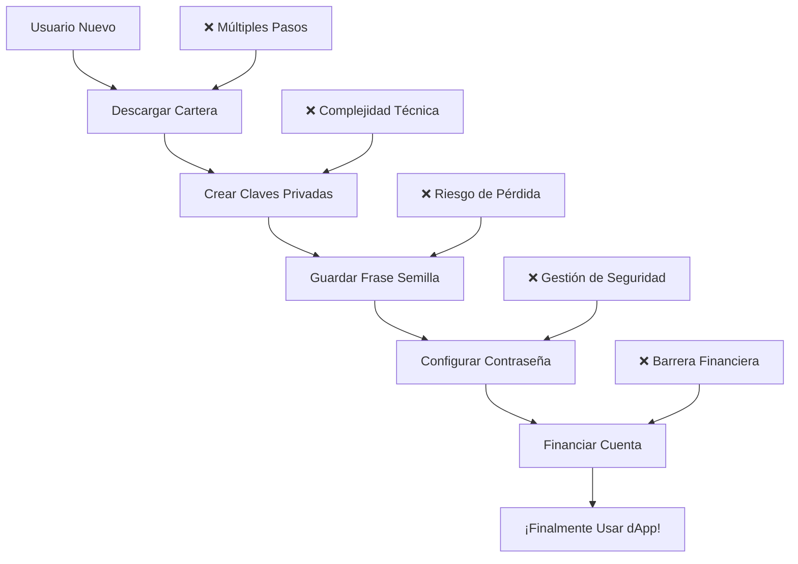

Las cuentas keyless representan un avance fundamental dentro del ecosistema Aptos, revolucionando la forma en que los usuarios se incorporan e interactúan con aplicaciones descentralizadas (dApps). Aptos Keyless permite a los usuarios obtener la propiedad de una cuenta blockchain Aptos **autocustodiada** desde sus cuentas OpenID Connect (OIDC) existentes (ej., Iniciar sesión con Google; Iniciar sesión con Apple), en lugar de desde una clave secreta tradicional o mnemónico. En pocas palabras, con Aptos Keyless, la cuenta blockchain de un usuario es su cuenta OIDC. Con el tiempo, Keyless evolucionará para soportar muchos IdPs que soporten el estándar OIDC, pero comenzaremos con soporte para los proveedores listados [aquí](/es/build/guides/aptos-keyless/oidc-support).

En el núcleo del paradigma de cuentas keyless yace una comprensión profunda de los desafíos de experiencia de usuario y seguridad prevalentes en sistemas blockchain tradicionales. Gestionar claves privadas, la piedra angular de la identidad del usuario y propiedad de activos, a menudo resulta engorroso y propenso a errores para los usuarios, particularmente aquellos que carecen de experiencia técnica. Las cuentas keyless ofrecen una solución elegante al obviar la necesidad de que los usuarios lidien con las complejidades de la gestión de claves privadas. En su lugar, los usuarios se autentican a través del acceso a opciones comunes de inicio de sesión social como Google, Apple, y muchas más. Con este nuevo sistema vienen algunas compensaciones importantes que entender en nombre de tus usuarios antes de implementar Keyless en tu aplicación. Las siguientes páginas expandirán sobre los beneficios de las cuentas Keyless, cómo integrar, la arquitectura del sistema, y FAQs. Para una inmersión más detallada y técnica en cuentas Keyless, por favor ver [AIP-61-Keyless Accounts](https://github.com/aptos-foundation/AIPs/blob/main/aips/aip-61.md).

Hay dos formas de interactuar con cuentas Keyless en el ecosistema Aptos. Los desarrolladores pueden ya sea 1) integrar el SDK Aptos Keyless directamente en su dApp o 2) integrar una cartera, como Aptos Connect, que soporta creación de cuentas Keyless. Esta documentación se enfocará en el caso #1 y más detalles sobre #2 pueden encontrarse [aquí](https://aptosconnect.app/docs/). Por favor nota que una integración directa del SDK Keyless resultará en cuentas de usuario siendo específicas del dominio de tu dApp mientras que el uso de una integración de cartera permitirá a tus usuarios llevar sus cuentas a cualquier aplicación que soporte esa cartera.

Nota: el SDK Aptos Keyless y Aptos Connect son ejemplos representativos de la experiencia de producto antes mencionada, pero desarrolladores en nuestro ecosistema están construyendo alternativas, como un SDK Keyless Unity y productos de cartera alternativos con integración Keyless.

## Beneficios de Aptos Keyless

Las cuentas keyless son revolucionarias para los usuarios por las siguientes razones:

1. **Experiencia de login simplificada**: Creación de cuenta de "1-click" vía logins Web2 familiares como Iniciar Sesión con Google.
2. **Experiencia de usuario de dApp mejorada**: Habilidad para transaccionar en la blockchain Aptos sin necesidad de navegar fuera de la experiencia de aplicación para descargar una cartera.
3. **Gestión segura de claves**: No requiere gestión manual de claves secretas por el usuario. Los usuarios firman transacciones con el token JSON Web Token (JWT) emitido por proveedores OIDC. Como tal, el acceso a la cuenta blockchain es sinónimo con acceso a la cuenta OIDC de uno.
4. **Recuperación de cuenta mejorada**: Flujos de recuperación tipo Web2 están disponibles para recuperar acceso a la cuenta blockchain de uno en caso de que el usuario pierda acceso a su cuenta OIDC.
5. **Experiencias cross-device sin problemas**: Los usuarios inician sesión con su cuenta OIDC sin importar en qué dispositivo estén - no hay necesidad de descargar software de cartera en cada dispositivo, importar sus claves y encriptarlas con una contraseña, que debe ser mantenida.

Con estos beneficios, vienen algunos componentes estructurales importantes de las cuentas Keyless para que los desarrolladores estén conscientes. Puedes ver más sobre esto en nuestros FAQs.

## Revolucionando la Experiencia Web3

### El Problema Tradicional



### La Solución Keyless

```mermaid
graph TD
    A[Usuario Nuevo] --> B[Click "Iniciar con Google"]
    B --> C[Autorizar Aplicación]
    C --> D[¡Cuenta Blockchain Lista!]
    
    E[✅ Un Solo Click] --> B
    F[✅ Experiencia Familiar] --> C
    G[✅ Inmediatamente Usable] --> D
```

## Casos de Uso Transformadores

### 1. Gaming Web3 Masivo

```typescript
// Ejemplo: Juego NFT sin barreras
async function joinGame(googleUser: GoogleUser): Promise<GameAccount> {
  // El jugador usa su cuenta Google existente
  const keylessAccount = await KeylessAccount.create({
    jwt: googleUser.jwt,
    ephemeralKeyPair: EphemeralKeyPair.generate(),
    jwkAddress: GAME_JWK_ADDRESS
  });
  
  // Inmediatamente puede empezar a jugar y ganar NFTs
  const gameAccount = await initializePlayer(keylessAccount);
  
  return gameAccount;
}
```

### 2. DeFi para Usuarios Mainstream

```typescript
// Ejemplo: Trading DeFi simplificado
async function startTrading(appleUser: AppleUser): Promise<TradingAccount> {
  const keylessAccount = await KeylessAccount.create({
    jwt: appleUser.jwt,
    ephemeralKeyPair: EphemeralKeyPair.generate(),
    jwkAddress: DEFI_JWK_ADDRESS
  });
  
  // Usuario puede empezar trading inmediatamente
  // sin entender claves privadas o carteras
  return await createTradingAccount(keylessAccount);
}
```

### 3. NFT Marketplace Social

```typescript
// Ejemplo: Creación y venta de NFTs social
async function createAndSellNFT(
  twitterUser: TwitterUser,
  artworkData: ArtworkData
): Promise<NFTListing> {
  const keylessAccount = await KeylessAccount.create({
    jwt: twitterUser.jwt,
    ephemeralKeyPair: EphemeralKeyPair.generate(),
    jwkAddress: NFT_JWK_ADDRESS
  });
  
  // Crear NFT usando identidad social
  const nft = await mintNFT(keylessAccount, {
    ...artworkData,
    creator: twitterUser.username,
    socialProof: twitterUser.verified
  });
  
  // Listar para venta automáticamente
  return await listNFT(nft, keylessAccount);
}
```

## Arquitectura Técnica Simplificada

### Flujo de Autenticación

```typescript
// 1. Usuario se autentica con proveedor social
const googleAuth = await signInWithGoogle();

// 2. Obtener JWT del proveedor
const jwt = googleAuth.idToken;

// 3. Derivar cuenta blockchain determinísticamente
const keylessAccount = await KeylessAccount.create({
  jwt,
  ephemeralKeyPair: EphemeralKeyPair.generate(),
  jwkAddress: YOUR_JWK_ADDRESS
});

// 4. ¡Listo para usar blockchain!
console.log('Dirección blockchain:', keylessAccount.accountAddress);
```

### Seguridad Zero-Knowledge

```move
// Prueba ZK verifica identidad sin exponer JWT
module keyless_verification {
    // Verificación on-chain sin revelar secretos
    public fun verify_keyless_signature(
        signature: vector<u8>,
        public_inputs: vector<u8>,
        jwt_header: vector<u8>
    ): bool {
        // Verificación criptográfica usando pruebas ZK
        verify_zk_proof(signature, public_inputs, jwt_header)
    }
}
```

## Comparación: Tradicional vs Keyless

| Aspecto | Blockchain Tradicional | Aptos Keyless |
|---------|----------------------|---------------|
| **Onboarding** | 15+ pasos, 30+ minutos | 2 clicks, 30 segundos |
| **Gestión de Claves** | Usuario responsable | Automatizada |
| **Recuperación** | Frase semilla o pérdida total | Recuperación Web2 estándar |
| **Cross-Device** | Importar claves manualmente | Login automático |
| **Experiencia UX** | Compleja, técnica | Familiar, intuitiva |
| **Seguridad** | Humana (errores comunes) | Criptográfica + Proveedores OAuth |
| **Adopción** | Solo crypto-nativos | Usuario mainstream |

## Beneficios para Desarrolladores

### 1. Reducción Dramática de Abandono

```typescript
// Métricas típicas de conversión
const traditionalFunnel = {
  landingPage: 1000,
  walletDownload: 300,    // 70% abandono
  accountCreation: 150,   // 50% abandono adicional  
  firstTransaction: 75,   // 50% abandono adicional
  activeUser: 30         // 60% abandono adicional
};

const keylessFunnel = {
  landingPage: 1000,
  socialLogin: 800,      // 20% abandono
  accountCreation: 780,  // 2.5% abandono
  firstTransaction: 700, // 10% abandono
  activeUser: 600       // 14% abandono
};

// Resultado: 30x vs 600 usuarios activos = 20x mejora
```

### 2. Costos de Soporte Reducidos

```typescript
class SupportMetrics {
  traditional = {
    lostKeys: 40,          // tickets por semana
    walletIssues: 25,      // problemas técnicos
    recoveryRequests: 15,  // imposibles de resolver
    avgResolutionTime: 120 // minutos
  };
  
  keyless = {
    accountIssues: 5,      // mayoría auto-resueltos
    providerProblems: 2,   // referir a Google/Apple
    recoveryRequests: 0,   // recuperación automática
    avgResolutionTime: 15  // minutos
  };
}
```

### 3. Time-to-Market Acelerado

```typescript
// Desarrollo tradicional
const traditionalDevelopment = {
  walletIntegration: '2-4 semanas',
  keyManagement: '3-6 semanas', 
  securityAudit: '4-8 semanas',
  userEducation: '2-4 semanas',
  total: '11-22 semanas'
};

// Desarrollo Keyless
const keylessDevelopment = {
  keylessIntegration: '1-2 semanas',
  providerSetup: '1 semana',
  testing: '1 semana', 
  deployment: '1 semana',
  total: '4-5 semanas'
};

// Resultado: 3-5x más rápido al mercado
```

## Comenzando con Keyless

### Configuración Rápida (5 minutos)

```bash
# 1. Instalar SDK
npm install @aptos-labs/ts-sdk

# 2. Configurar proveedor OAuth
# Google: https://console.developers.google.com
# Apple: https://developer.apple.com
# Auth0: https://auth0.com

# 3. Registrar JWKS en blockchain
npx aptos keyless setup-jwks

# 4. ¡Integrar en tu app!
```

### Próximos Pasos

1. **[Guía de Integración](/es/build/guides/aptos-keyless/integration-guide)** - Implementación paso a paso
2. **[Keyless Federado](/es/build/guides/aptos-keyless/federated-keyless)** - Para proveedores IAM personalizados
3. **[Ejemplos Prácticos](/es/build/guides/aptos-keyless/federated-keyless/simple-example)** - Código funcional completo
4. **[Consideraciones Técnicas](/es/build/guides/aptos-keyless/federated-keyless/key-considerations)** - Seguridad y mejores prácticas

Keyless representa la evolución natural de blockchain hacia la adopción masiva, eliminando barreras técnicas mientras mantiene la seguridad y descentralización que define Web3.
