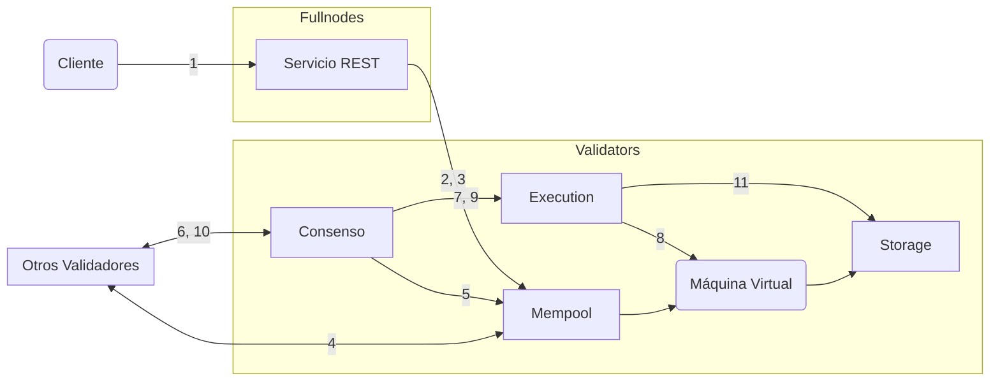

import { Aside } from '@astrojs/starlight/components';

Para una comprensión más profunda del ciclo de vida de una transacción en Aptos (desde una perspectiva operacional), seguiremos una transacción en su recorrido, desde que se envía a un nodo completo de Aptos hasta que se confirma en la blockchain de Aptos. Luego nos enfocaremos en los componentes lógicos de los nodos de Aptos y veremos cómo la transacción interactúa con estos componentes.

## Vida de una Transacción

- Alice y Bob son dos usuarios que cada uno tiene una [cuenta](/es/network/glossary#account) en la blockchain de Aptos.
- La cuenta de Alice tiene 110 Monedas Aptos.
- Alice está enviando 10 Monedas Aptos a Bob.
- El [número de secuencia](/es/network/glossary#sequence-number) actual de la cuenta de Alice es 5 (lo que indica que ya se han enviado 5 transacciones desde la cuenta de Alice).
- Hay un total de 100 nodos validadores — V1 a V100 en la red.
- Un cliente de Aptos envía la transacción de Alice a un servicio REST en un Nodo Completo de Aptos. El nodo completo reenvía esta transacción a un nodo completo validador que a su vez la reenvía al validador V1.
- El validador V1 es un proponente/líder para la ronda actual.

### El Recorrido

En esta sección, describiremos el ciclo de vida de la transacción T5, desde cuando el cliente la envía hasta cuando se confirma en la blockchain de Aptos.

Para los pasos relevantes, hemos incluido un enlace a las interacciones inter-componente correspondientes del nodo validador. Después de que estés familiarizado con todos los pasos en el ciclo de vida de la transacción, puedes querer referirte a la información sobre las interacciones inter-componente correspondientes para cada paso.

<Aside type="note">
  Las flechas en todos los visuales en este artículo se originan en el componente que inicia una interacción/acción y
  terminan en el componente en el que se está realizando la acción. Las flechas no representan datos leídos,
  escritos o devueltos.
</Aside>

El ciclo de vida de una transacción tiene cinco etapas:

- **Aceptando**: [Aceptar la transacción](#aceptar-la-transacción)
- **Compartiendo**: [Compartir la transacción con otros nodos validadores](#compartir-la-transacción-con-otros-nodos-validadores)
- **Proponiendo**: [Proponer el bloque](#proponer-el-bloque)
- **Ejecutando y Consenso**: [Ejecutar el bloque y alcanzar consenso](#ejecutar-el-bloque-y-alcanzar-consenso)
- **Confirmando**: [Confirmar el bloque](#confirmar-el-bloque)

Hemos descrito lo que sucede en cada etapa a continuación, junto con enlaces a las interacciones de componentes del nodo de Aptos correspondientes.

<Aside type="caution">
  Las transacciones se validan al ingresar a un mempool y antes de la ejecución por consenso.
  El cliente solo se entera de los resultados de validación devueltos durante el envío inicial a través del servicio REST.
  Las transacciones pueden fallar silenciosamente en ejecutarse, especialmente en el caso donde la cuenta se ha quedado sin
  token de utilidad o cambió su clave de autenticación en medio de muchas transacciones. Aunque esto sucede infrecuentemente,
  hay esfuerzos en curso para mejorar la visibilidad en este espacio.
</Aside>

### El cliente envía una transacción

Un **cliente de Aptos construye una transacción sin procesar** (llamémosla Traw5) para transferir 10 Monedas Aptos de la cuenta de Alice a la cuenta de Bob. El cliente de Aptos firma la transacción con la clave privada de Alice. La transacción firmada T5 incluye lo siguiente:

- La transacción sin procesar.
- La clave pública de Alice.
- La firma de Alice.

La transacción sin procesar incluye los siguientes campos:

| Campos                                                                               | Descripción                                                                                                                                                                                                                                                                                                                                                                                                                                                                                                                                                                                            |
| ------------------------------------------------------------------------------------ | ------------------------------------------------------------------------------------------------------------------------------------------------------------------------------------------------------------------------------------------------------------------------------------------------------------------------------------------------------------------------------------------------------------------------------------------------------------------------------------------------------------------------------------------------------------------------------------------------------ |
| [Dirección de cuenta](/es/network/glossary#account-address)                             | La dirección de cuenta de Alice                                                                                                                                                                                                                                                                                                                                                                                                                                                                                                                                                                           |
| Carga útil                                                                              | Indica una acción o conjunto de acciones en nombre de Alice. En el caso de que sea una función Move, llama directamente al bytecode Move en la cadena. Alternativamente, puede ser un [script de transacción](/es/network/glossary#transaction-script) bytecode Move peer-to-peer. También contiene una lista de entradas a la función o script. Para este ejemplo, es una llamada de función para transferir una cantidad de Monedas Aptos de la cuenta de Alice a la cuenta de Bob, donde la cuenta de Alice está implícita al enviar la transacción y la cuenta de Bob y la cantidad se especifican como entradas de transacción. |
| [Precio de unidad de gas](/es/network/glossary#gas-unit-price)                               | La cantidad que el remitente está dispuesto a pagar por unidad de gas, para ejecutar la transacción. Esto se representa en [Octas](/es/network/glossary#octa).                                                                                                                                                                                                                                                                                                                                                                                                                                       |
| [Cantidad máxima de gas](/es/network/glossary#maximum-gas-amount)                       | La cantidad máxima de gas en APT que Alice está dispuesta a pagar por esta transacción. Los cargos de gas son iguales al costo base de gas cubierto por computación e IO multiplicado por el precio del gas. Los costos de gas también incluyen almacenamiento con un modelo de almacenamiento de precio fijo APT. Esto se representa en [Octas](/es/network/glossary#octa).                                                                                                                                                                                                                                                                                                                   |
| [Tiempo de expiración](/es/network/glossary#expiration-time)                             | Tiempo de expiración de la transacción.                                                                                                                                                                                                                                                                                                                                                                                                                                                                                                                                                                    |
| [Número de secuencia](/es/network/glossary#sequence-number)                             | El número de secuencia (5, en este ejemplo) para una cuenta indica el número de transacciones que se han enviado y confirmado en la cadena desde esa cuenta. En este caso, se han enviado 5 transacciones desde la cuenta de Alice, incluyendo Traw5. Nota: una transacción con número de secuencia 5 solo puede confirmarse en la cadena si el número de secuencia de la cuenta es 5.                                                                                                                                                                                                                      |
| [ID de Cadena](https://github.com/aptos-labs/aptos-core/blob/main/types/src/chain_id.rs) | Un identificador que distingue las redes de Aptos (para prevenir ataques entre redes).                                                                                                                                                                                                                                                                                                                                                                                                                                                                                                                |

### Aceptar la transacción

**[→ Ver interacciones de componentes del nodo de Aptos](#)**

1. El cliente envía la transacción T5 al servicio REST.
2. El servicio REST reenvía T5 al mempool del validador V1 (el validador líder).
3. El mempool del validador V1 acepta T5.

Un validador acepta una transacción solo si pasa la validación inicial. Durante la validación, el validador ejecuta verificaciones básicas, como:

- Verificar la validez de la firma de la transacción.
- Verificar que el remitente de la transacción (Alice) tenga fondos suficientes para pagar la tarifa máxima de transacción.
- Verificar que el número de secuencia de la transacción coincida con el número de secuencia de la cuenta del remitente.

La mayoría de los errores de validación son reconocidos inmediatamente y devueltos al cliente. Sin embargo, si el mempool está lleno, la transacción puede ser descartada silenciosamente.

_\[Continúa con las siguientes etapas del ciclo de vida de la transacción...]_

## Componentes del Nodo de Aptos

Los nodos de Aptos están compuestos de componentes lógicos que trabajan juntos para procesar transacciones:

### Mempool

El mempool almacena transacciones que han sido enviadas pero aún no han sido incluidas en un bloque.

### Motor de Consenso

El motor de consenso es responsable de:

- Ordenar bloques de transacciones.
- Coordinar el acuerdo entre validadores.
- Asegurar la finalidad de las transacciones.

### Motor de Ejecución

El motor de ejecución ejecuta transacciones usando la Máquina Virtual Move.

### Máquina Virtual (VM)

La Máquina Virtual ejecuta el bytecode Move y aplica los efectos de las transacciones al estado de la blockchain.

### Almacenamiento

El componente de almacenamiento persiste:

- Los bloques confirmados
- El estado de la blockchain
- Los índices para consultas eficientes

***

_Esta es una versión condensada del análisis profundo de la blockchain. Para la documentación técnica completa, consulta la [versión en inglés](/network/blockchain/blockchain-deep-dive) que incluye detalles exhaustivos sobre cada componente y sus interacciones._
