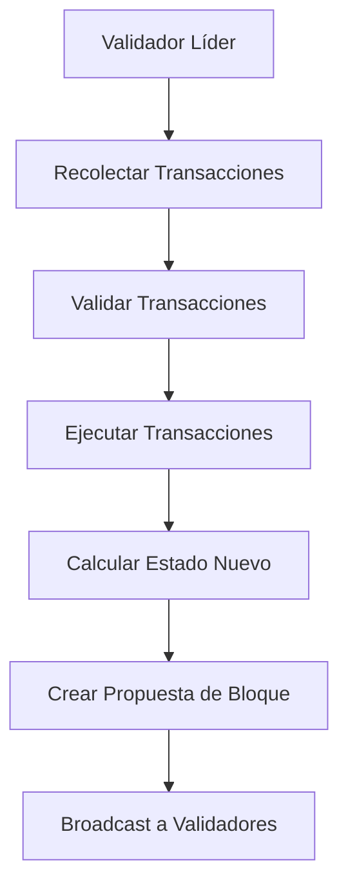
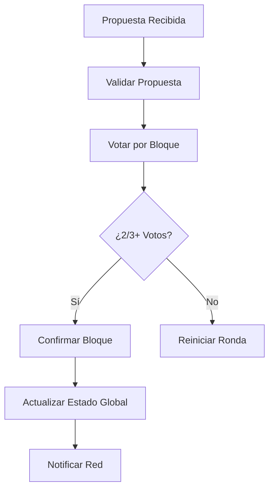

Aptos es una base de datos versionada por transacción. Cuando las transacciones son ejecutadas, el estado resultante de cada transacción es almacenado por separado y por lo tanto permite un acceso a datos más granular. Esto es diferente de otras blockchains donde solo el estado resultante de un bloque (un grupo de transacciones) es almacenado.

Los bloques siguen siendo una unidad fundamental dentro de Aptos. Las transacciones son agrupadas y ejecutadas juntas en un bloque. Además, las [pruebas](/es/network/blockchain/txns-states#proofs) dentro del almacenamiento están a nivel de granularidad de bloque. El número de transacciones dentro de un bloque varía dependiendo de la actividad de la red y un límite configurable de tamaño máximo de bloque. A medida que la blockchain se vuelve más ocupada, los bloques probablemente contendrán más transacciones.

## Transacciones del sistema

Cada bloque Aptos contiene tanto transacciones de usuario como transacciones especiales del sistema para _marcar_ el comienzo y final del lote de transacciones. Específicamente, hay dos transacciones del sistema:

1. `BlockMetadataTransaction` - es insertada al comienzo del bloque. Una transacción `BlockMetadata` también puede marcar el final de una [época](#epochs) y activar la distribución de recompensas a los validadores.
2. `StateCheckpointTransaction` - es añadida al final del bloque y es usada como un hito de checkpoint.

## Épocas

En Aptos, las épocas representan un período de tiempo más largo para sincronizar de manera segura cambios importantes como adiciones/eliminaciones del conjunto de validadores. Una época es una duración fija de tiempo, actualmente definida como dos horas en mainnet. El número de bloques en una época depende de cuántos bloques pueden ejecutarse dentro de este período de tiempo. Es solo al inicio de una nueva época que cambios importantes como un validador uniéndose al conjunto de validadores toman efecto entre los validadores.

## Arquitectura de Bloques en Detalle

### Estructura de Bloque

Un bloque Aptos típico contiene la siguiente estructura:

```
┌─────────────────────────────────────────┐
│           BLOQUE APTOS                  │
├─────────────────────────────────────────┤
│ 1. BlockMetadataTransaction             │
│    - Timestamp del bloque               │
│    - Información del validador          │
│    - Número de época                    │
│    - Distribución de recompensas        │
├─────────────────────────────────────────┤
│ 2. Transacciones de Usuario             │
│    - Transfer de activos                │
│    - Llamadas a smart contracts         │
│    - Creación de cuentas                │
│    - Actualizaciones de configuración   │
├─────────────────────────────────────────┤
│ 3. StateCheckpointTransaction           │
│    - Hash del estado final              │
│    - Pruebas de integridad              │
│    - Checkpoint para sincronización     │
└─────────────────────────────────────────┘
```

### Metadatos de Bloque

```move
// Estructura conceptual de BlockMetadata
struct BlockMetadata {
    // Identificador único del bloque
    id: address,
    
    // Altura del bloque en la blockchain
    height: u64,
    
    // Timestamp cuando el bloque fue propuesto
    timestamp_usecs: u64,
    
    // Dirección del validador que propuso el bloque
    proposer: address,
    
    // Epoch actual
    epoch: u64,
    
    // Número de ronda dentro de la época
    round: u64,
    
    // Pruebas de consenso
    consensus_data: vector<u8>,
}
```

## Proceso de Creación de Bloques

### 1. Fase de Propuesta



### 2. Fase de Consenso



### 3. Validación de Bloque

```typescript
// Proceso de validación conceptual
interface BlockValidation {
  // Verificar estructura básica
  validateStructure(block: Block): boolean;
  
  // Verificar todas las transacciones
  validateTransactions(transactions: Transaction[]): boolean;
  
  // Verificar pruebas criptográficas
  verifyProofs(block: Block): boolean;
  
  // Verificar consenso
  verifyConsensus(block: Block, validators: ValidatorSet): boolean;
  
  // Verificar transición de estado
  verifyStateTransition(
    previousState: StateRoot, 
    transactions: Transaction[], 
    newState: StateRoot
  ): boolean;
}
```

## Características Únicas de Aptos

### Versionado Por Transacción

A diferencia de blockchains tradicionales que solo almacenan el estado final del bloque:

```
BLOCKCHAIN TRADICIONAL:
Bloque N: Estado Final Consolidado
├─ Tx1, Tx2, Tx3 → Estado Final
└─ Solo el estado final es accesible

APTOS:
Bloque N: Estados Individuales
├─ Tx1 → Estado_1 (accesible)
├─ Tx2 → Estado_2 (accesible) 
└─ Tx3 → Estado_3 (accesible)
```

**Beneficios:**

- **Consultas Granulares**: Acceso a estado en cualquier punto
- **Debugging Avanzado**: Rastrear cambios paso a paso
- **Optimización**: Pruebas paralelas y verificación
- **Analytics**: Análisis detallado de transacciones

### Ejecución Paralela Block-STM

```typescript
// Ejecución paralela conceptual
class BlockSTMExecution {
  async executeBlock(transactions: Transaction[]): Promise<BlockResult> {
    // 1. Análisis de dependencias
    const dependencies = this.analyzeDependencies(transactions);
    
    // 2. Ejecución paralela optimista
    const parallelResults = await this.executeInParallel(
      transactions, 
      dependencies
    );
    
    // 3. Detección de conflictos
    const conflicts = this.detectConflicts(parallelResults);
    
    // 4. Re-ejecución secuencial si es necesario
    if (conflicts.length > 0) {
      const sequentialResults = await this.reExecuteSequentially(
        conflicts
      );
      return this.mergeResults(parallelResults, sequentialResults);
    }
    
    return parallelResults;
  }
}
```

## Gestión de Épocas

### Transición de Época

```move
// Lógica conceptual de transición de época
module aptos_framework::epoch {
    struct EpochConfiguration has key {
        epoch_interval: u64,        // Duración en microsegundos
        current_epoch: u64,         // Época actual
        next_epoch_validators: vector<ValidatorInfo>,
        reward_rate: u64,           // Tasa de recompensa
    }
    
    public fun trigger_epoch_transition(
        account: &signer,
        new_validators: vector<ValidatorInfo>
    ) {
        // Verificar autorización
        assert!(is_framework_address(signer::address_of(account)), UNAUTHORIZED);
        
        // Distribuir recompensas de época actual
        distribute_epoch_rewards();
        
        // Actualizar conjunto de validadores
        update_validator_set(new_validators);
        
        // Incrementar número de época
        increment_epoch_number();
        
        // Emitir evento de nueva época
        emit_epoch_change_event();
    }
}
```

### Distribución de Recompensas

```typescript
// Sistema de recompensas por época
interface EpochRewards {
  // Recompensas base por proponer bloques
  blockProposalRewards: number;
  
  // Recompensas por participación en consenso
  consensusParticipationRewards: number;
  
  // Penalizaciones por comportamiento malicioso
  penalties: number;
  
  // Distribución a delegadores
  delegatorRewards: number;
}

class RewardDistribution {
  calculateEpochRewards(
    validator: ValidatorInfo,
    epochStats: EpochStatistics
  ): EpochRewards {
    const baseReward = this.calculateBaseReward(epochStats);
    const performanceMultiplier = this.calculatePerformance(
      validator, 
      epochStats
    );
    
    return {
      blockProposalRewards: baseReward * validator.blocksProposed,
      consensusParticipationRewards: baseReward * validator.votesParticipated,
      penalties: this.calculatePenalties(validator),
      delegatorRewards: this.calculateDelegatorShare(validator, baseReward)
    };
  }
}
```

## Optimización de Performance

### Tamaño Dinámico de Bloques

```typescript
class DynamicBlockSizing {
  calculateOptimalBlockSize(
    networkLoad: number,
    avgTransactionSize: number,
    consensusLatency: number
  ): number {
    const baseSize = 1000; // Transacciones base
    const loadMultiplier = Math.min(networkLoad / 100, 3.0);
    const latencyPenalty = consensusLatency > 2000 ? 0.8 : 1.0;
    
    return Math.floor(baseSize * loadMultiplier * latencyPenalty);
  }
  
  adaptBlockSizeInRealTime(
    currentMetrics: NetworkMetrics
  ): BlockSizeConfiguration {
    return {
      maxTransactions: this.calculateOptimalBlockSize(
        currentMetrics.tps,
        currentMetrics.avgTxnSize,
        currentMetrics.consensusTime
      ),
      maxBytes: currentMetrics.bandwidthCapacity * 0.8,
      timeoutMs: this.calculateOptimalTimeout(currentMetrics)
    };
  }
}
```

### Procesamiento de Transacciones

```move
// Optimización de ejecución de transacciones
module aptos_framework::transaction_processor {
    // Procesar lote de transacciones optimizadamente
    public fun process_transaction_batch(
        transactions: vector<Transaction>
    ): BatchResult {
        let results = vector::empty<TransactionResult>();
        let current_state = get_current_state();
        
        // Análisis previo para optimización
        let dependency_graph = analyze_dependencies(&transactions);
        
        // Ejecución paralela cuando sea posible
        if (can_execute_in_parallel(&dependency_graph)) {
            results = execute_parallel_batch(&transactions, current_state);
        } else {
            results = execute_sequential_batch(&transactions, current_state);
        };
        
        // Verificar consistencia final
        assert!(verify_state_consistency(&results), INVALID_STATE_TRANSITION);
        
        BatchResult {
            transaction_results: results,
            new_state_root: calculate_state_root(&results),
            gas_used: calculate_total_gas(&results),
        }
    }
}
```

## Monitoreo y Debugging

### Métricas de Bloque

```typescript
interface BlockMetrics {
  // Métricas básicas
  blockHeight: number;
  transactionCount: number;
  totalGasUsed: number;
  blockSizeBytes: number;
  
  // Métricas de performance
  executionTimeMs: number;
  consensusTimeMs: number;
  stateUpdateTimeMs: number;
  
  // Métricas de red
  propagationTimeMs: number;
  validatorParticipation: number;
  networkLatency: number;
}

class BlockAnalyzer {
  analyzeBlock(block: Block): BlockAnalysis {
    return {
      efficiency: this.calculateEfficiency(block),
      bottlenecks: this.identifyBottlenecks(block),
      optimization: this.suggestOptimizations(block),
      comparison: this.compareWithHistorical(block)
    };
  }
  
  identifyAnomalies(blocks: Block[]): BlockAnomaly[] {
    return blocks
      .map(block => this.detectAnomalies(block))
      .filter(anomaly => anomaly.severity > 0.5);
  }
}
```

### Herramientas de Debugging

```bash
# Comandos CLI para análisis de bloques
aptos node analyze-block --height 12345678
aptos node block-metrics --from-height 100 --to-height 200
aptos node consensus-debug --epoch 45 --round 123
aptos node state-diff --before-height 100 --after-height 101
```

Los bloques en Aptos representan una evolución sofisticada del diseño blockchain tradicional, combinando granularidad a nivel de transacción con eficiencia de procesamiento paralelo, estableciendo una base sólida para aplicaciones de alto rendimiento y baja latencia.
