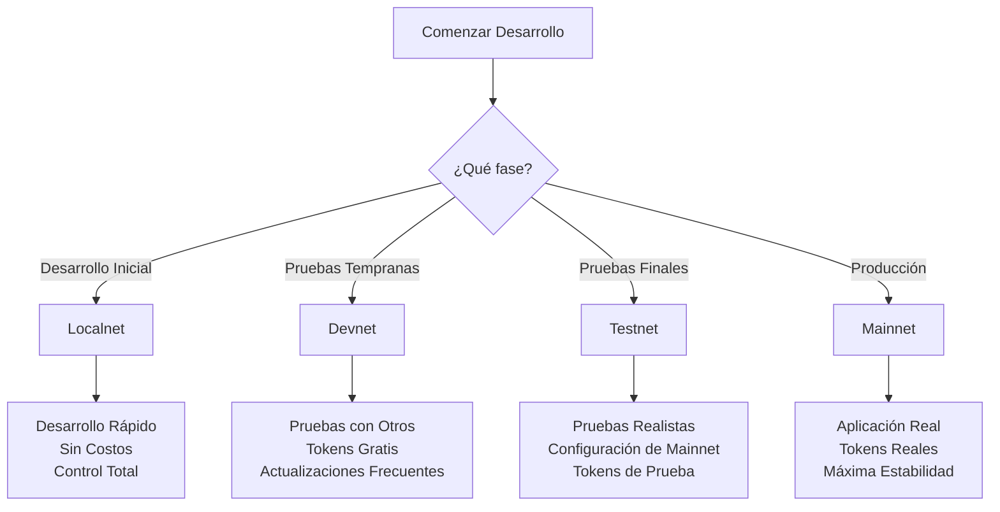

## Visión General de Redes

1. [Localnet](http://127.0.0.1:8080) -- nuestra herramienta independiente para desarrollo local contra una versión conocida del código base sin red externa.
2. [Devnet](https://api.devnet.aptoslabs.com/v1/spec#/) -- un recurso compartido para la comunidad, los datos se reinician semanalmente, actualización semanal desde la rama principal de aptos-core.
3. [Testnet](https://api.testnet.aptoslabs.com/v1/spec#/) -- un recurso compartido para la comunidad, los datos se preservarán, la configuración de red imitará a Mainnet.
4. [Mainnet](https://api.mainnet.aptoslabs.com/v1/spec#/) -- una red de producción con activos reales.

### Propiedades de la red

| Nombre de Red | ID de Cadena                                                                                                         | Genesis y Waypoint                                                              | Faucet                                                                           | Duración de Época | Proveedor de Red                                        | Cadencia de Lanzamiento | Cadencia de Limpieza |
| ------------- | -------------------------------------------------------------------------------------------------------------------- | ------------------------------------------------------------------------------- | -------------------------------------------------------------------------------- | ----------------- | ------------------------------------------------------- | ----------------------- | -------------------- |
| Mainnet       | 1                                                                                                                    | [Archivos Aquí](https://github.com/aptos-labs/aptos-networks/tree/main/mainnet) | N/A                                                                              | 2 horas           | Completamente Descentralizada                           | Mensual, varía          | Nunca                |
| Testnet       | 2                                                                                                                    | [Archivos Aquí](https://github.com/aptos-labs/aptos-networks/tree/main/testnet) | Sin acceso programático, debes usar la [página de acuñación](/es/network/faucet) | 2 horas           | Gestionada por Aptos Labs en nombre de Aptos Foundation | Mensual, varía          | Nunca                |
| Devnet        | [En Aptos Explorer **selecciona Devnet desde arriba a la derecha**](https://explorer.aptoslabs.com/?network=Devnet). | [Archivos Aquí](https://github.com/aptos-labs/aptos-networks/tree/main/devnet)  | Accesible programáticamente vía la API                                           | 2 horas           | Gestionada por Aptos Labs en nombre de Aptos Foundation | Semanal                 | En actualización     |

### URLs de Red

Las siguientes URLs son proporcionadas por Aptos Labs.

| Nombre de Red | API REST                                         | Especificación API REST                                                | API GraphQL del Indexador                                         | Especificación API GraphQL del Indexador                                                                                          | GRPC del Indexador                         | Faucet                                         | API de Suministro de Tokens Actual                      |
| ------------- | ------------------------------------------------ | ---------------------------------------------------------------------- | ----------------------------------------------------------------- | --------------------------------------------------------------------------------------------------------------------------------- | ------------------------------------------ | ---------------------------------------------- | ------------------------------------------------------- |
| Mainnet       | [API REST](https://api.mainnet.aptoslabs.com/v1) | [Especificación API REST](https://api.mainnet.aptoslabs.com/v1/spec#/) | [API del Indexador](https://api.mainnet.aptoslabs.com/v1/graphql) | [Especificación API del Indexador](https://cloud.hasura.io/public/graphiql?endpoint=https://api.mainnet.aptoslabs.com/v1/graphql) | [GRPC](https://grpc.mainnet.aptoslabs.com) | N/A                                            | [API](https://aptos-supply.dev.gcp.aptosdev.com/supply) |
| Testnet       | [API REST](https://api.testnet.aptoslabs.com/v1) | [Especificación API REST](https://api.testnet.aptoslabs.com/v1/spec#/) | [API del Indexador](https://api.testnet.aptoslabs.com/v1/graphql) | [Especificación API del Indexador](https://cloud.hasura.io/public/graphiql?endpoint=https://api.testnet.aptoslabs.com/v1/graphql) | [GRPC](https://grpc.testnet.aptoslabs.com) | [Acuñar](/es/network/faucet)                   | N/A                                                     |
| Devnet        | [API REST](https://api.devnet.aptoslabs.com/v1)  | [Especificación API REST](https://api.devnet.aptoslabs.com/v1/spec#/)  | [API del Indexador](https://api.devnet.aptoslabs.com/v1/graphql)  | [Especificación API del Indexador](https://cloud.hasura.io/public/graphiql?endpoint=https://api.devnet.aptoslabs.com/v1/graphql)  | [GRPC](https://grpc.devnet.aptoslabs.com)  | [Faucet](https://faucet.devnet.aptoslabs.com/) | N/A                                                     |

## Características de Cada Red

### **Mainnet (Red Principal)**

- **Propósito**: Red de producción con activos reales
- **Estabilidad**: Alta, datos permanentes
- **Uso recomendado**: Aplicaciones de producción, transacciones reales
- **Consideraciones**: Los tokens APT tienen valor real, las tarifas de gas se aplican

### **Testnet (Red de Prueba)**

- **Propósito**: Pruebas finales antes de mainnet
- **Estabilidad**: Alta, datos preservados
- **Uso recomendado**: Pruebas de aplicaciones, validación final
- **Consideraciones**: Configuración similar a mainnet, tokens sin valor

### **Devnet (Red de Desarrollo)**

- **Propósito**: Desarrollo y pruebas tempranas
- **Estabilidad**: Baja, reinicios semanales
- **Uso recomendado**: Desarrollo activo, experimentación
- **Consideraciones**: Datos pueden perderse, actualizaciones frecuentes

### **Localnet (Red Local)**

- **Propósito**: Desarrollo local
- **Estabilidad**: Controlada por el desarrollador
- **Uso recomendado**: Desarrollo inicial, pruebas unitarias
- **Consideraciones**: Sin conexión externa, entorno completamente controlado

## Guía de Selección de Red

### **Para Desarrolladores**



### **Casos de Uso Típicos**

1. **Localnet**:
   - Escribir y probar contratos Move
   - Desarrollar lógica de aplicación
   - Iteración rápida sin conexión de red

2. **Devnet**:
   - Probar integración entre contratos
   - Verificar interacciones con APIs públicas
   - Probar con datos que cambian semanalmente

3. **Testnet**:
   - Validación final antes del lanzamiento
   - Pruebas de rendimiento y carga
   - Verificar configuraciones de producción

4. **Mainnet**:
   - Aplicaciones en vivo con usuarios reales
   - Contratos con activos de valor
   - Servicios de producción críticos

## Configuración y Acceso

### **Variables de Entorno Típicas**

```bash
# Para Mainnet
export APTOS_NETWORK=mainnet
export APTOS_NODE_URL=https://api.mainnet.aptoslabs.com/v1
export APTOS_FAUCET_URL=  # No disponible

# Para Testnet
export APTOS_NETWORK=testnet
export APTOS_NODE_URL=https://api.testnet.aptoslabs.com/v1
export APTOS_FAUCET_URL=  # Solo vía web

# Para Devnet
export APTOS_NETWORK=devnet
export APTOS_NODE_URL=https://api.devnet.aptoslabs.com/v1
export APTOS_FAUCET_URL=https://faucet.devnet.aptoslabs.com
```

### **Configuración del SDK**

```typescript
import { Aptos, AptosConfig, Network } from "@aptos-labs/ts-sdk";

// Configuración para diferentes redes
const configs = {
  mainnet: new AptosConfig({ network: Network.MAINNET }),
  testnet: new AptosConfig({ network: Network.TESTNET }),
  devnet: new AptosConfig({ network: Network.DEVNET }),
  local: new AptosConfig({
    network: Network.LOCAL,
    fullnode: "http://127.0.0.1:8080"
  })
};

const aptos = new Aptos(configs.devnet);
```

<details>
  <summary>Actualización de la API de Suministro de Tokens</summary>
  El 12 de diciembre de 2024, la Fundación Aptos actualizó su API de suministro de tokens actual. Esta versión actualizada de la API refleja con más precisión el suministro circulante actual de mainnet al actualizar el número de suministro circulante al comienzo del período mensual actual. La versión anterior de la API reportaba el suministro circulante del período mensual anterior. No ha habido cambios en el cronograma de suministro circulante de la red y el suministro circulante de la red sigue siendo consistente con la tokenómica original publicada [aquí](https://aptosnetwork.com/currents/aptos-tokenomics-overview).
</details>
