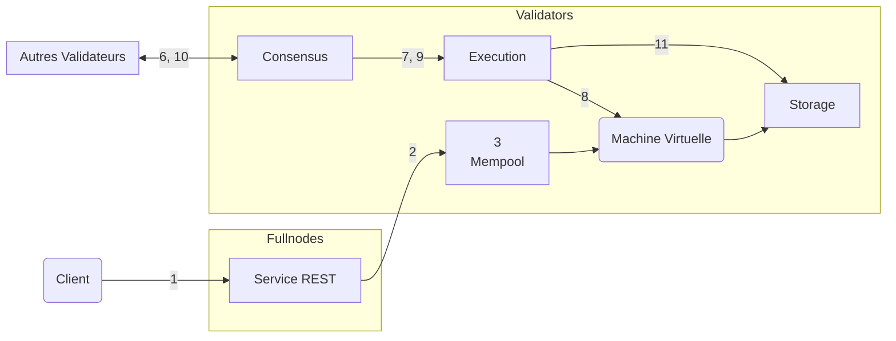

import { Aside } from '@astrojs/starlight/components';

Pour une compréhension plus approfondie du cycle de vie d'une transaction Aptos (d'un point de vue opérationnel), nous suivrons une transaction dans son parcours, depuis sa soumission à un nœud complet Aptos, jusqu'à son engagement dans la blockchain Aptos. Nous nous concentrerons ensuite sur les composants logiques des nœuds Aptos et examinerons comment la transaction interagit avec ces composants.

## Vie d'une Transaction

- Alice et Bob sont deux utilisateurs qui ont chacun un [compte](/fr/network/glossary#account) sur la blockchain Aptos.
- Le compte d'Alice a 110 Aptos Coins.
- Alice envoie 10 Aptos Coins à Bob.
- Le [numéro de séquence](/fr/network/glossary#sequence-number) actuel du compte d'Alice est 5 (ce qui indique que 5 transactions ont déjà été envoyées depuis le compte d'Alice).
- Il y a un total de 100 nœuds validateurs — V1 à V100 sur le réseau.
- Un client Aptos soumet la transaction d'Alice à un service REST sur un nœud complet Aptos. Le nœud complet transmet cette transaction à un nœud complet validateur qui la transmet à son tour au validateur V1.
- Le validateur V1 est un proposant/leader pour le tour actuel.

### Le Parcours

Dans cette section, nous décrirons le cycle de vie de la transaction T5, depuis le moment où le client la soumet jusqu'à ce qu'elle soit engagée dans la blockchain Aptos.

Pour les étapes pertinentes, nous avons inclus un lien vers les interactions inter-composants correspondantes du nœud validateur. Après vous être familiarisé avec toutes les étapes du cycle de vie de la transaction, vous pourriez vouloir vous référer aux informations sur les interactions inter-composants correspondantes pour chaque étape.

### Étape 1 : Client soumet la transaction

Alice's wallet construit la transaction T5 pour transférer 10 Aptos Coins à Bob. La transaction T5 contient les informations suivantes :

- **Adresse de l'expéditeur** — Le compte d'Alice.
- **Programme de l'expéditeur** — Ce champ indique que Alice utilise un smart contract pour transférer des pièces Aptos.
- **Prix du gaz** — Le prix que Alice est prête à payer par unité de gaz pour exécuter cette transaction. Le gaz est un moyen de payer la ressource computationnelle.
- **Limite de gaz** — La quantité maximale d'unités de gaz qu'Alice est prête à payer pour cette transaction.
- **Numéro de séquence** — Le numéro de séquence attribué à cette transaction depuis le compte d'Alice. Pour cette transaction, il s'agit de 5.
- **Délai d'expiration** — L'heure d'expiration de la transaction.
- **Signature** — La signature numérique d'Alice sur la transaction. Cela garantit que personne ne peut falsifier cette transaction.

Le portefeuille d'Alice soumet la transaction T5 à un nœud complet via son service REST. Le nœud complet utilise un [proxy](https://en.wikipedia.org/wiki/Proxy_server) pour transmettre la transaction à un validateur fullnode, qui la transmet au validateur V1.

[Inter-composant interactions : Accepter la transaction](/fr/network/blockchain/blockchain-deep-dive#inter-component-interactions---accepting-the-transaction)

### Étape 2 : Acceptation et diffusion de la transaction

Lorsque le validateur V1 reçoit la transaction T5 depuis le nœud complet (via son propre nœud complet), V1 l'ajoute à son mempool et effectue une validation initiale. Si cette transaction échoue à la validation initiale, elle sera rejetée immédiatement et la transaction se terminerait ici. Si elle passe la validation initiale, elle serait diffusée vers les mempools des autres validateurs.

[Inter-composant interactions : Partager la transaction avec d'autres validateurs](/fr/network/blockchain/blockchain-deep-dive#inter-component-interactions---sharing-the-transaction-with-other-validators)

### Étape 3 : Transaction dans le mempool

Maintenant que la transaction T5 a été diffusée, elle résiderait dans les mempools de V1 et d'autres validateurs.

[Inter-composant interactions : Mempool vers Consensus](/fr/network/blockchain/blockchain-deep-dive#inter-component-interactions---mempool-to-consensus)

### Étape 4 : Proposer le bloc

Parce que V1 est le leader/proposant pour ce tour, il va proposer un bloc d'états qui inclut la transaction T5.
