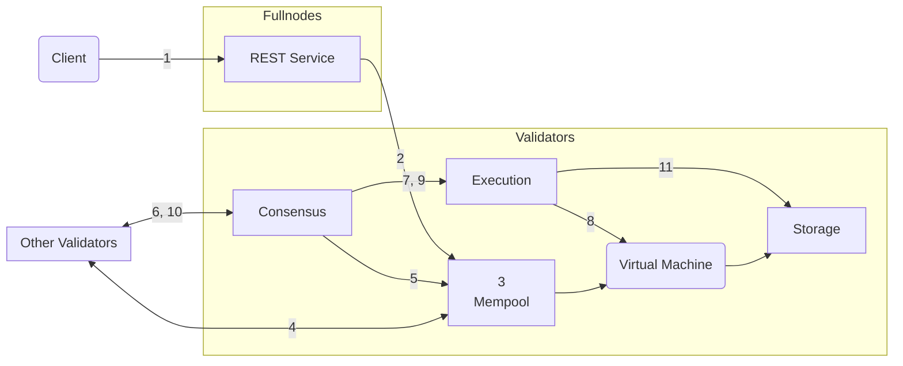

import { Aside } from '@astrojs/starlight/components';

Aptosトランザクションのライフサイクル（運用の観点から）をより深く理解するために、Aptosフルノードに送信されてからAptosブロックチェーンにコミットされるまでのトランザクションの旅路を辿ります。その後、Aptosノードの論理コンポーネントに焦点を当て、トランザクションがこれらのコンポーネントとどのように相互作用するかを見ていきます。

## トランザクションの一生

- AliceとBobは、それぞれAptosブロックチェーン上に[アカウント](/ja/network/glossary#account)を持つ2人のユーザーです。
- Aliceのアカウントには110 Aptos Coinがあります。
- AliceはBobに10 Aptos Coinを送信しています。
- Aliceのアカウントの現在の[シーケンス番号](/ja/network/glossary#sequence-number)は5です（これは、Aliceのアカウントから既に5つのトランザクションが送信されたことを示しています）。
- ネットワーク上には合計100のバリデーターノード — V1からV100があります。
- AptosクライアントがAliceのトランザクションをAptosフルノードのRESTサービスに送信します。フルノードはこのトランザクションをバリデーターフルノードに転送し、それがバリデーターV1に転送します。
- バリデーターV1は現在のラウンドの提案者/リーダーです。

### 旅路

このセクションでは、クライアントがトランザクションT5を送信してからAptosブロックチェーンにコミットされるまでのライフサイクルを説明します。

関連するステップについては、バリデーターノードの対応するコンポーネント間相互作用へのリンクを含めています。トランザクションのライフサイクルのすべてのステップに慣れた後、各ステップの対応するコンポーネント間相互作用の情報を参照することをお勧めします。

<Aside type="note">
  この記事のすべての図表の矢印は、相互作用/アクションを開始するコンポーネントから始まり、アクションが実行されるコンポーネントで終わります。矢印はデータの読み取り、書き込み、または返却を表すものではありません。
</Aside>

トランザクションのライフサイクルには5つの段階があります：

- **受信**: [トランザクションの受信](#トランザクションの受信)
- **共有**: [他のバリデーターノードとのトランザクション共有](#他のバリデーターノードとのトランザクション共有)
- **提案**: [ブロックの提案](#ブロックの提案)
- **実行とコンセンサス**: [ブロックの実行とコンセンサス達成](#ブロックの実行とコンセンサス達成)
- **コミット**: [ブロックのコミット](#ブロックのコミット)

以下では、各段階で何が起こるかを、対応するAptosノードコンポーネント相互作用へのリンクと共に説明しています。

<Aside type="caution">
  トランザクションはメンプールに入る際とコンセンサスによる実行前に検証されます。
  クライアントはRESTサービス経由の初期送信時に返される検証結果のみを知ることができます。
  トランザクションは静かに実行に失敗する可能性があり、特にアカウントがユーティリティトークンを使い果たしたり、多数のトランザクションの最中に認証キーを変更した場合に発生します。これは稀にしか起こりませんが、この分野での可視性を向上させるための継続的な取り組みがあります。
</Aside>

### クライアントがトランザクションを送信

Aptos**クライアントが生のトランザクション**（Traw5と呼びましょう）を構築し、AliceのアカウントからBobのアカウントに10 Aptos Coinを転送します。AptosクライアントはAliceの秘密鍵でトランザクションに署名します。署名されたトランザクションT5には以下が含まれます：

- 生のトランザクション
- Aliceの公開鍵
- Aliceの署名

生のトランザクションには以下のフィールドが含まれます：

| フィールド                                                                               | 説明                                                                                                                                                                                                                                                                                                                                                                                                                                                                                                                                                                                            |
| ------------------------------------------------------------------------------------ | ---------------------------------------------------------------------------------------------------------------------------------------------------------------------------------------------------------------------------------------------------------------------------------------------------------------------------------------------------------------------------------------------------------------------------------------------------------------------------------------------------------------------------------------------------------------------------------------------- |
| [アカウントアドレス](/ja/network/glossary#account-address)                             | Aliceのアカウントアドレス                                                                                                                                                                                                                                                                                                                                                                                                                                                                                                                                                                           |
| ペイロード                                                                              | Aliceの代わりに実行するアクションまたは一連のアクションを示します。これがMove関数の場合、チェーン上のMoveバイトコードに直接呼び出します。あるいは、Moveバイトコードのピアツーピア[トランザクションスクリプト](/ja/network/glossary#transaction-script)の場合もあります。また、関数またはスクリプトへの入力のリストも含まれます。この例では、AliceのアカウントからBobのアカウントにAptos Coinの金額を転送する関数呼び出しで、Aliceのアカウントはトランザクション送信により暗示され、Bobのアカウントと金額がトランザクション入力として指定されます。 |
| [ガス単価](/ja/network/glossary#gas-unit-price)                               | 送信者がトランザクションを実行するためにガス単位あたりに支払う意志のある金額。これは[Octas](/ja/network/glossary#octa)で表されます。                                                                                                                                                                                                                                                                                                                                                                                                                                                                       |
| [最大ガス量](/ja/network/glossary#maximum-gas-amount)                       | AliceがこのトランザクションのためにAPTで支払う意志のある最大ガス量。ガス料金は、計算とIOによってカバーされる基本ガスコストにガス価格を掛けたものと等しくなります。ガスコストには、APT固定価格ストレージモデルによるストレージも含まれます。これは[Octas](/ja/network/glossary#octa)で表されます。                                                                                                                                                                                                                                                                                                                   |
| [有効期限](/ja/network/glossary#expiration-time)                             | トランザクションの有効期限。                                                                                                                                                                                                                                                                                                                                                                                                                                                                                                                                                                                    |
| [シーケンス番号](/ja/network/glossary#sequence-number)                             | アカウントのシーケンス番号（この例では5）は、そのアカウントから送信されてオンチェーンでコミットされたトランザクションの数を示します。この場合、Traw5を含めてAliceのアカウントから5つのトランザクションが送信されています。注意：シーケンス番号5のトランザクションは、アカウントのシーケンス番号が5の場合のみオンチェーンでコミットできます。                                                                                                                                                                                                                                      |
| [チェーンID](https://github.com/aptos-labs/aptos-core/blob/main/types/src/chain_id.rs) | Aptosネットワークを区別する識別子（クロスネットワーク攻撃を防ぐため）。                                                                                                                                                                                                                                                                                                                                                                                                                                                                                                                                |

### トランザクションの受信

| 説明                                                                                                                                                                                                                                                                                                                                                                                                                                                   | Aptosノードコンポーネント相互作用                                                   |
| ------------------------------------------------------------------------------------------------------------------------------------------------------------------------------------------------------------------------------------------------------------------------------------------------------------------------------------------------------------------------------------------------------------------------------------------------------------- | ----------------------------------------------------------------------------------- |
| 1. **クライアント → RESTサービス**: クライアントがトランザクションT5をAptosフルノードのRESTサービスに送信します。フルノードはRESTサービスを使用してトランザクションを自身のメンプールに転送し、メンプールはネットワーク内の他のノードで実行されているメンプールにトランザクションを転送します。トランザクションは最終的にバリデーターフルノードで実行されているメンプールに転送され、それがバリデーターノード（この場合はV1）に送信されます。 | [1. RESTサービス](#1-クライアント--restサービス)                                          |
| 2. **RESTサービス → メンプール**: フルノードのメンプールがトランザクションT5をバリデーターV1のメンプールに送信します。                                                                                                                                                                                                                                                                                                     | [2. RESTサービス](#2-restサービス--メンプール), [1. メンプール](#1-restサービス--メンプール) |
| 3. **メンプール → 仮想マシン（VM）**: メンプールは仮想マシン（VM）コンポーネントを使用して、署名検証、アカウント残高検証、シーケンス番号を使用したリプレイ耐性などのトランザクション検証を実行します。                                                                                                                                                                                                                   | [4. メンプール](#4-メンプール--vm), [3. 仮想マシン](#3-メンプール--仮想マシン)     |

### 他のバリデーターノードとのトランザクション共有

| 説明                                                                                                                                                                                                                                                         | Aptosノードコンポーネント相互作用               |
| ------------------------------------------------------------------------------------------------------------------------------------------------------------------------------------------------------------------------------------------------------------------- | ----------------------------------------------- |
| 4. **メンプール**: メンプールはT5をインメモリバッファに保持します。メンプールには既にAliceのアドレスから送信された複数のトランザクションが含まれている可能性があります。                                                                                                       | [メンプール](#メンプール)                             |
| 5. **メンプール → 他のバリデーター**: 共有メンプールプロトコルを使用して、V1は自身のメンプール内のトランザクション（T5を含む）を他のバリデーターノードと共有し、それらから受信したトランザクションを自身の（V1の）メンプールに配置します。 | [2. メンプール](#2-メンプール--他のバリデーターノード) |

### ブロックの提案

| 説明                                                                                                                                                                                                                                            | Aptosノードコンポーネント相互作用                                          |
| ------------------------------------------------------------------------------------------------------------------------------------------------------------------------------------------------------------------------------------------------------ | -------------------------------------------------------------------------- |
| 6. **コンセンサス → メンプール**: — バリデーターV1がこのトランザクションの提案者/リーダーとして、メンプールからトランザクションのブロックを引き出し、このブロックをコンセンサスコンポーネント経由で他のバリデーターノードへの提案として複製します。 | [1. コンセンサス](#1-コンセンサス--メンプール), [3. メンプール](#3-コンセンサス--メンプール) |
| 7. **コンセンサス → 他のバリデーター**: V1のコンセンサスコンポーネントは、提案されたブロック内のトランザクションの順序について、すべてのバリデーター間の合意を調整する責任があります。                                                       | [2. コンセンサス](#2-コンセンサス--他のバリデーター)                             |

### ブロックの実行とコンセンサス達成

| 説明                                                                                                                                                                                                                                                                                                                                                                                                                                                                                                                                                                                                                            | Aptosノードコンポーネント相互作用                                                                            |
| -------------------------------------------------------------------------------------------------------------------------------------------------------------------------------------------------------------------------------------------------------------------------------------------------------------------------------------------------------------------------------------------------------------------------------------------------------------------------------------------------------------------------------------------------------------------------------------------------------------------------------------- | ------------------------------------------------------------------------------------------------------------ |
| 8. **コンセンサス → 実行**: 合意達成の一環として、トランザクションのブロック（T5を含む）が実行コンポーネントと共有されます。                                                                                                                                                                                                                                                                                                                                                                                                                                                                                              | [3. コンセンサス](#3-コンセンサス--実行コンセンサス--他のバリデーター), [1. 実行](#1-コンセンサス--実行) |
| 9. **実行 → 仮想マシン**: 実行コンポーネントはVM内でのトランザクション実行を管理します。この実行は、ブロック内のトランザクションについて合意が成立する前に投機的に行われることに注意してください。                                                                                                                                                                                                                                                                                                                                                                                                                                | [2. 実行](#2-実行--vm), [3. 仮想マシン](#3-メンプール--仮想マシン)                          |
| 10. **コンセンサス → 実行**: ブロック内のトランザクションを実行した後、実行コンポーネントはブロック内のトランザクション（T5を含む）を（台帳履歴の）[Merkleアキュムレーター](/ja/network/glossary#merkle-accumulator)に追加します。これはMerkleアキュムレーターのインメモリ/一時的なバージョンです。これらのトランザクション実行の提案/投機的結果の必要な部分がコンセンサスコンポーネントに返され、合意されます。「コンセンサス」から「実行」への矢印は、トランザクション実行要求がコンセンサスコンポーネントによって行われたことを示します。 | [3. コンセンサス](#3-コンセンサス--実行コンセンサス--他のバリデーター), [1. 実行](#1-コンセンサス--実行) |
| 11. **コンセンサス → 他のバリデーター**: V1（コンセンサスリーダー）は、コンセンサスに参加している他のバリデーターノードと提案されたブロックの実行結果についてコンセンサス達成を試みます。                                                                                                                                                                                                                                                                                                                                                                                                                        | [3. コンセンサス](#3-コンセンサス--実行コンセンサス--他のバリデーター)                                          |

### ブロックのコミット

| 説明                                                                                                                                                                                                                                                                                                                                                                                                                          | Aptosノードコンポーネント相互作用                                                                                                                            |
| ------------------------------------------------------------------------------------------------------------------------------------------------------------------------------------------------------------------------------------------------------------------------------------------------------------------------------------------------------------------------------------------------------------------------------------ | ------------------------------------------------------------------------------------------------------------------------------------------------------------ |
| 12. **コンセンサス → 実行**, **実行 → ストレージ**: 提案されたブロックの実行結果について合意が成立し、クォーラムの票数を持つバリデーターのセットによって署名された場合、バリデーターV1の実行コンポーネントは投機的実行キャッシュから提案されたブロック実行の完全な結果を読み取り、提案されたブロック内のすべてのトランザクションをその結果と共に永続ストレージにコミットします。 | [4. コンセンサス](#4-コンセンサス--実行), [3. 実行](#3-コンセンサス--実行), [4. 実行](#4-実行--ストレージ), [3. ストレージ](#3-実行--ストレージ) |

Aliceのアカウントは現在100 Aptos Coinを持ち、そのシーケンス番号は6になります。もしBobがT5をリプレイしようとしても、Aliceのアカウントのシーケンス番号（6）がリプレイされたトランザクションのシーケンス番号（5）より大きいため、それは拒否されます。
