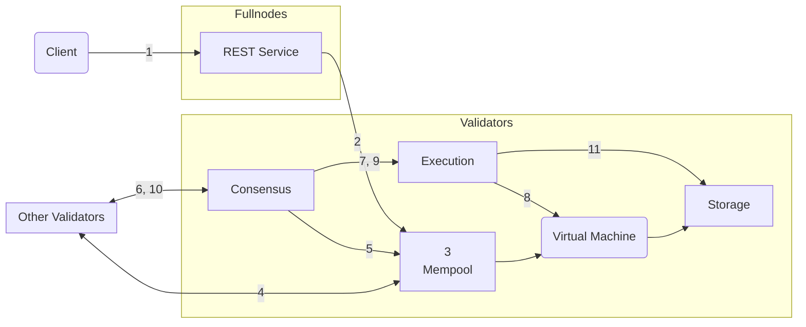

import { Aside } from '@astrojs/starlight/components';

Aptos 거래의 생명주기를 더 깊이 이해하기 위해 (운영 관점에서), 거래가 Aptos 풀노드에 제출되어 Aptos 블록체인에 커밋되는 여정을 따라가 보겠습니다. 그런 다음 Aptos 노드의 논리적 구성 요소에 초점을 맞추고 거래가 이러한 구성 요소와 어떻게 상호작용하는지 살펴보겠습니다.

## 거래의 생명주기

- Alice와 Bob은 각각 Aptos 블록체인에 [계정](/ko/network/glossary#account)을 가진 두 사용자입니다.
- Alice의 계정에는 110 Aptos 코인이 있습니다.
- Alice는 Bob에게 10 Aptos 코인을 보내고 있습니다.
- Alice 계정의 현재 [시퀀스 번호](/ko/network/glossary#sequence-number)는 5입니다 (이는 Alice의 계정에서 이미 5개의 거래가 전송되었음을 나타냅니다).
- 네트워크에는 총 100개의 검증자 노드 — V1부터 V100까지 있습니다.
- Aptos 클라이언트는 Alice의 거래를 Aptos 풀노드의 REST 서비스에 제출합니다. 풀노드는 이 거래를 검증자 풀노드에 전달하고, 검증자 풀노드는 이를 검증자 V1에 전달합니다.
- 검증자 V1은 현재 라운드의 제안자/리더입니다.

### 여정

이 섹션에서는 클라이언트가 거래 T5를 제출할 때부터 Aptos 블록체인에 커밋될 때까지의 생명주기를 설명합니다.

관련 단계들에 대해서는 검증자 노드의 해당 구성 요소 간 상호작용에 대한 링크를 포함했습니다. 거래 생명주기의 모든 단계를 숙지한 후, 각 단계에 대한 해당 구성 요소 간 상호작용에 대한 정보를 참조할 수 있습니다.

<Aside type="note">
  이 문서의 모든 시각 자료에서 화살표는 상호작용/액션을 시작하는 구성 요소에서 시작되어
  액션이 수행되는 구성 요소에서 끝납니다. 화살표는 읽기, 쓰기, 또는 반환되는 데이터를
  나타내지 않습니다.
</Aside>

거래의 생명주기는 다섯 단계로 구성됩니다:

- **수락**: [거래 수락](#accepting-the-transaction)
- **공유**: [다른 검증자 노드와 거래 공유](#sharing-the-transaction-with-other-validator-nodes)
- **제안**: [블록 제안](#proposing-the-block)
- **실행 및 합의**: [블록 실행 및 합의 도달](#executing-the-block-and-reaching-consensus)
- **커밋**: [블록 커밋](#committing-the-block)

각 단계에서 일어나는 일을 해당 Aptos 노드 구성 요소 상호작용에 대한 링크와 함께 아래에 설명했습니다.

<Aside type="caution">
  거래는 메모리풀에 진입할 때와 합의에 의한 실행 이전에 검증됩니다.
  클라이언트는 REST 서비스를 통한 초기 제출 중에 반환된 검증 결과만 알 수 있습니다.
  거래는 특히 계정이 유틸리티 토큰이 부족하거나 많은 거래 중에 인증 키를 변경한 경우
  조용히 실행에 실패할 수 있습니다. 이는 드물게 발생하지만, 이 영역의 가시성을 개선하기 위한
  지속적인 노력이 있습니다.
</Aside>

### 클라이언트가 거래를 제출합니다

Aptos **클라이언트는 원시 거래**를 구성합니다 (Traw5라고 하겠습니다) Alice의 계정에서 Bob의 계정으로 10 Aptos 코인을 전송하기 위해. Aptos 클라이언트는 Alice의 개인 키로 거래에 서명합니다. 서명된 거래 T5는 다음을 포함합니다:

- 원시 거래.
- Alice의 공개 키.
- Alice의 서명.

원시 거래는 다음 필드들을 포함합니다:

| 필드                                                                               | 설명                                                                                                                                                                                                                                                                                                                                                                                                                                                                                                                                                                                            |
| ------------------------------------------------------------------------------------ | ------------------------------------------------------------------------------------------------------------------------------------------------------------------------------------------------------------------------------------------------------------------------------------------------------------------------------------------------------------------------------------------------------------------------------------------------------------------------------------------------------------------------------------------------------------------------------------------------------ |
| [계정 주소](/ko/network/glossary#account-address)                             | Alice의 계정 주소                                                                                                                                                                                                                                                                                                                                                                                                                                                                                                                                                                           |
| 페이로드                                                                              | Alice를 대신한 액션 또는 액션 세트를 나타냅니다. Move 함수의 경우, 체인의 Move 바이트코드에 직접 호출합니다. 또는 Move 바이트코드 피어 투 피어 [거래 스크립트](/ko/network/glossary#transaction-script)일 수 있습니다. 또한 함수 또는 스크립트에 대한 입력 목록을 포함합니다. 이 예제에서는 Alice 계정에서 Bob의 계정으로 Aptos 코인 양을 전송하는 함수 호출로, Alice의 계정은 거래 전송으로 암시되고 Bob의 계정과 양은 거래 입력으로 지정됩니다. |
| [가스 단위 가격](/ko/network/glossary#gas-unit-price)                               | 송신자가 거래 실행을 위해 가스 단위당 지불할 의향이 있는 금액입니다. 이는 [Octas](/ko/network/glossary#octa)로 표현됩니다.                                                                                                                                                                                                                                                                                                                                                                                                                                                                       |
| [최대 가스 양](/ko/network/glossary#maximum-gas-amount)                       | Alice가 이 거래에 대해 지불할 의향이 있는 APT의 최대 가스 양입니다. 가스 요금은 계산 및 IO로 커버되는 기본 가스 비용에 가스 가격을 곱한 것과 같습니다. 가스 비용에는 Apt 고정 가격 저장 모델을 사용한 저장도 포함됩니다. 이는 [Octas](/ko/network/glossary#octa)로 표현됩니다.                                                                                                                                                                                                                                                                                                   |
| [만료 시간](/ko/network/glossary#expiration-time)                             | 거래의 만료 시간입니다.                                                                                                                                                                                                                                                                                                                                                                                                                                                                                                                                                                    |
| [시퀀스 번호](/ko/network/glossary#sequence-number)                             | 계정의 시퀀스 번호(이 예제에서는 5)는 해당 계정에서 제출되고 온체인에 커밋된 거래의 수를 나타냅니다. 이 경우, Traw5를 포함하여 Alice의 계정에서 5개의 거래가 제출되었습니다. 참고: 시퀀스 번호 5를 가진 거래는 계정 시퀀스 번호가 5인 경우에만 온체인에 커밋될 수 있습니다.                                                                                                                                                                                                                                                                                                      |
| [체인 ID](https://github.com/aptos-labs/aptos-core/blob/main/types/src/chain_id.rs) | Aptos 네트워크를 구별하는 식별자입니다 (크로스 네트워크 공격을 방지하기 위해).                                                                                                                                                                                                                                                                                                                                                                                                                                                                                                                                |

### 거래 수락

거래가 검증자 V1에 도달하면, V1의 메모리풀은 거래를 검증하고 유효한 경우 이를 저장합니다...
