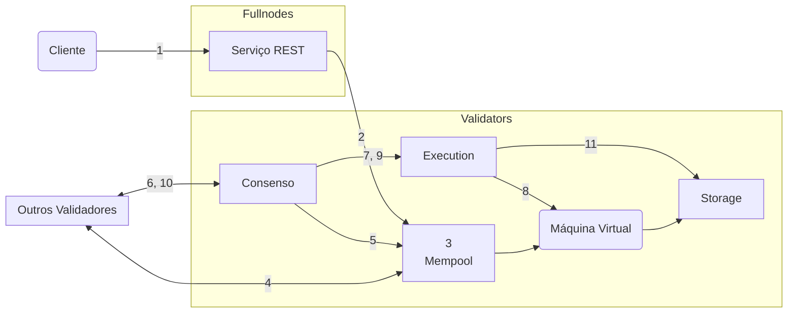

import { Aside } from '@astrojs/starlight/components';

Para um entendimento mais profundo do ciclo de vida de uma transação Aptos (de uma perspectiva operacional), seguiremos uma transação em sua jornada, desde ser enviada a um fullnode Aptos, até ser confirmada no blockchain Aptos. Então focaremos nos componentes lógicos dos nós Aptos e veremos como a transação interage com esses componentes.

## Vida de uma Transação

- Alice e Bob são dois usuários que cada um tem uma [conta](/pt/network/glossary#account) no blockchain Aptos.
- A conta da Alice tem 110 Aptos Coins.
- Alice está enviando 10 Aptos Coins para Bob.
- O [número de sequência](/pt/network/glossary#sequence-number) atual da conta da Alice é 5 (o que indica que 5 transações já foram enviadas da conta da Alice).
- Há um total de 100 nós validadores — V1 a V100 na rede.
- Um cliente Aptos envia a transação da Alice para um serviço REST em um Fullnode Aptos. O fullnode encaminha esta transação para um fullnode validador que por sua vez a encaminha para o validador V1.
- Validador V1 é um proponente/líder para a rodada atual.

### A Jornada

Nesta seção, descreveremos o ciclo de vida da transação T5, desde quando o cliente a envia até quando ela é confirmada no blockchain Aptos.

Para os passos relevantes, incluímos um link para as interações inter-componentes correspondentes do nó validador. Depois que você estiver familiarizado com todos os passos no ciclo de vida da transação, pode querer consultar as informações sobre as interações inter-componentes correspondentes para cada passo.

<Aside type="note">
  As setas em todos os visuais neste artigo se originam no componente que inicia uma interação/ação e terminam no componente no qual a ação está sendo realizada. As setas não representam dados lidos, escritos ou retornados.
</Aside>

O ciclo de vida de uma transação tem cinco estágios:

- **Aceitando**: [Aceitando a transação](#aceitando-a-transação)
- **Compartilhando**: [Compartilhando a transação com outros nós validadores](#compartilhando-a-transação-com-outros-nós-validadores)
- **Propondo**: [Propondo o bloco](#propondo-o-bloco)
- **Executando e Consenso**: [Executando o bloco e alcançando consenso](#executando-o-bloco-e-alcançando-consenso)
- **Confirmando**: [Confirmando o bloco](#confirmando-o-bloco)

Descrevemos o que acontece em cada estágio abaixo, junto com links para as interações de componentes do nó Aptos correspondentes.

<Aside type="caution">
  Transações são validadas ao entrar em um mempool e antes da execução pelo consenso.
  O cliente só fica sabendo dos resultados de validação retornados durante o envio inicial via serviço REST.
  Transações podem silenciosamente falhar ao executar, especialmente no caso onde a conta ficou sem token de utilidade ou mudou sua chave de autenticação no meio de muitas transações. Embora isso aconteça com pouca frequência, há esforços contínuos para melhorar a visibilidade neste espaço.
</Aside>

### Cliente envia uma transação

Um **cliente Aptos constrói uma transação bruta** (vamos chamá-la de Traw5) para transferir 10 Aptos Coins da conta da Alice para a conta do Bob. O cliente Aptos assina a transação com a chave privada da Alice. A transação assinada T5 inclui o seguinte:

- A transação bruta.
- A chave pública da Alice.
- A assinatura da Alice.

A transação bruta inclui os seguintes campos:

| Campos                                                                               | Descrição                                                                                                                                                                                                                                                                                                                                                                                                                                                                                                                                                                                            |
| ------------------------------------------------------------------------------------ | ------------------------------------------------------------------------------------------------------------------------------------------------------------------------------------------------------------------------------------------------------------------------------------------------------------------------------------------------------------------------------------------------------------------------------------------------------------------------------------------------------------------------------------------------------------------------------------------------------ |
| [Endereço da conta](/pt/network/glossary#account-address)                             | Endereço da conta da Alice                                                                                                                                                                                                                                                                                                                                                                                                                                                                                                                                                                           |
| Payload                                                                              | Indica uma ação ou conjunto de ações em nome da Alice. No caso de ser uma função Move, chama diretamente o bytecode Move na chain. Alternativamente, pode ser bytecode Move peer-to-peer [script de transação](/pt/network/glossary#transaction-script). Também contém uma lista de entradas para a função ou script. Para este exemplo, é uma chamada de função para transferir uma quantidade de Aptos Coins da conta da Alice para a conta do Bob, onde a conta da Alice é implícita pelo envio da transação e a conta do Bob e a quantidade são especificadas como entradas da transação. |
| [Preço unitário de gas](/pt/network/glossary#gas-unit-price)                               | A quantidade que o remetente está disposto a pagar por unidade de gas, para executar a transação. Isso é representado em [Octas](/pt/network/glossary#octa).                                                                                                                                                                                                                                                                                                                                                                                                                                       |
| [Quantidade máxima de gas](/pt/network/glossary#maximum-gas-amount)                       | A quantidade máxima de gas em APT que Alice está disposta a pagar por esta transação. Taxas de gas são iguais ao custo base de gas coberto por computação e IO multiplicado pelo preço do gas. Custos de gas também incluem armazenamento com um modelo de armazenamento de preço fixo em Apt. Isso é representado em [Octas](/pt/network/glossary#octa).                                                                                                                                                                                                                                                   |
| [Tempo de expiração](/pt/network/glossary#expiration-time)                             | Tempo de expiração da transação.                                                                                                                                                                                                                                                                                                                                                                                                                                                                                                                                                                    |
| [Número de sequência](/pt/network/glossary#sequence-number)                             | O número de sequência (5, neste exemplo) para uma conta indica o número de transações que foram enviadas e confirmadas on-chain a partir dessa conta. Neste caso, 5 transações foram enviadas da conta da Alice, incluindo Traw5. Nota: uma transação com número de sequência 5 só pode ser confirmada on-chain se o número de sequência da conta for 5.                                                                                                                                                                                                                      |
| [ID da Chain](https://github.com/aptos-labs/aptos-core/blob/main/types/src/chain_id.rs) | Um identificador que distingue as redes Aptos (para prevenir ataques cross-network).                                                                                                                                                                                                                                                                                                                                                                                                                                                                                                                |

### Aceitando a transação

| Descrição                                                                                                                                                                                                                                                                                                                                                                                                                                                   | Interações de Componentes do Nó Aptos                                                   |
| ------------------------------------------------------------------------------------------------------------------------------------------------------------------------------------------------------------------------------------------------------------------------------------------------------------------------------------------------------------------------------------------------------------------------------------------------------------- | ----------------------------------------------------------------------------------- |
| 1. **Cliente → serviço REST**: O cliente envia a transação T5 para o serviço REST de um fullnode Aptos. O fullnode usa o serviço REST para encaminhar a transação para seu próprio mempool, que então encaminha a transação para mempools executando em outros nós na rede. A transação será eventualmente encaminhada para um mempool executando em um fullnode validador, que a enviará para um nó validador (V1 neste caso). | [1. Serviço REST](#1-cliente--serviço-rest)                                          |
| 2. **Serviço REST → Mempool**: O mempool do fullnode transmite a transação T5 para o mempool do validador V1.                                                                                                                                                                                                                                                                                                     | [2. Serviço REST](#2-serviço-rest--mempool), [1. Mempool](#1-serviço-rest--mempool) |
| 3. **Mempool → Máquina Virtual (VM)**: Mempool usará o componente de máquina virtual (VM) para realizar validação de transação, como verificação de assinatura, verificação de saldo da conta e resistência a replay usando o número de sequência.                                                                                                                                                                                                   | [4. Mempool](#4-mempool--vm), [3. Máquina Virtual](#3-mempool--máquina-virtual)     |

A conta da Alice agora terá 100 Aptos Coins, e seu número de sequência será 6. Se T5 for reexecutada por Bob, será rejeitada pois o número de sequência da conta da Alice (6) é maior que o número de sequência da transação reexecutada (5).
