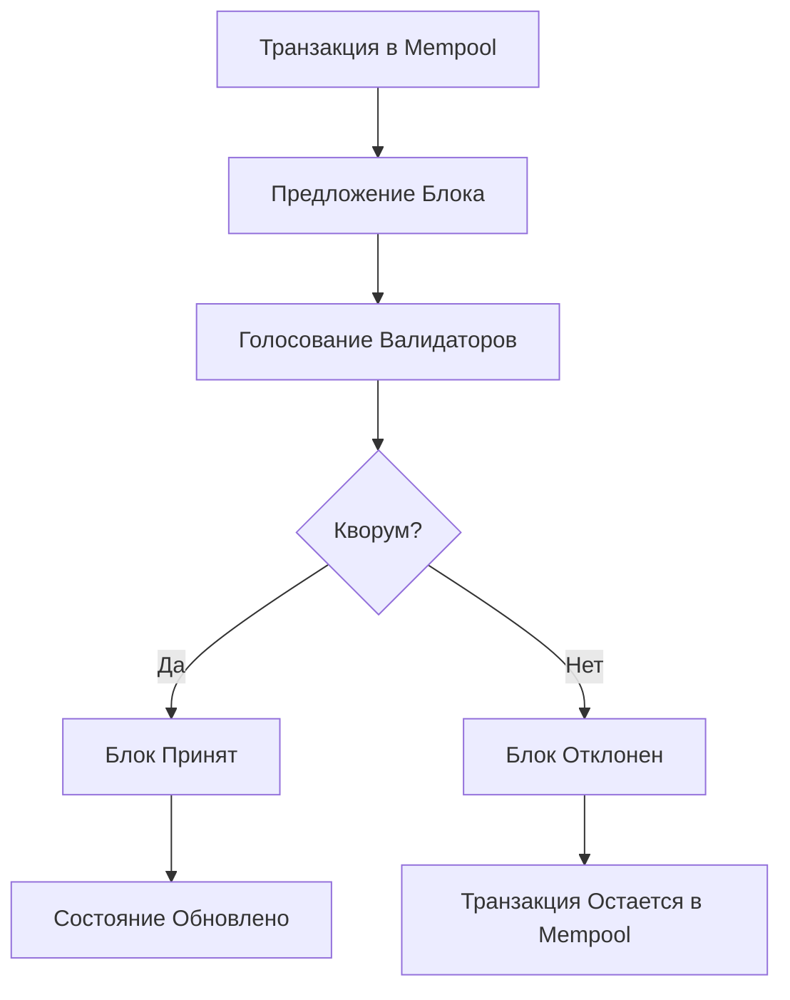

import { Aside } from '@astrojs/starlight/components';

В блокчейне Aptos **транзакции** являются единственным способом изменения состояния блокчейна, а **состояние** представляет весь набор данных, хранящихся в блокчейне в конкретный момент времени. Понимание их взаимосвязи критично для эффективной разработки на Aptos.

## Обзор Транзакций

### Что такое Транзакция?

Транзакция в Aptos - это подписанное пользователем сообщение, которое выражает намерение выполнить конкретное действие в блокчейне. Каждая транзакция должна быть:

- **Подписана**: Криптографически подписана владельцем аккаунта
- **Последовательна**: Имеет правильный номер последовательности
- **Финансируема**: У аккаунта достаточно APT для оплаты газа
- **Валидна**: Соответствует правилам блокчейна

### Типы Транзакций

```rust
pub enum Transaction {
    UserTransaction(SignedTransaction),     // Обычные пользовательские транзакции
    GenesisTransaction(GenesisTransaction), // Инициализация блокчейна
    BlockMetadata(BlockMetadataTransaction), // Метаданные блоков
}
```

**Пользовательские Транзакции**

- Переводы APT и токенов
- Вызовы функций смарт-контрактов
- Развертывание модулей Move
- Транзакции управления аккаунтом

**Системные Транзакции**

- Вознаграждения валидаторам
- Эпоха изменений
- Обновления конфигурации

## Анатомия Транзакции

### Структура Подписанной Транзакции

```rust
pub struct SignedTransaction {
    raw_txn: RawTransaction,           // Необработанная транзакция
    authenticator: TransactionAuthenticator, // Подпись
}

pub struct RawTransaction {
    sender: AccountAddress,            // Адрес отправителя
    sequence_number: u64,              // Номер последовательности
    payload: TransactionPayload,       // Что выполнить
    max_gas_amount: u64,              // Максимальный газ
    gas_unit_price: u64,              // Цена за единицу газа
    expiration_timestamp_secs: u64,    // Срок истечения
    chain_id: ChainId,                // Идентификатор цепи
}
```

### Типы Полезной Нагрузки

**Script (Скрипт)**

```move
script {
    use std::signer;
    use aptos_framework::aptos_account;
    
    fun main(sender: &signer, recipient: address, amount: u64) {
        aptos_account::transfer(sender, recipient, amount);
    }
}
```

**Entry Function (Входная Функция)**

```rust
pub struct EntryFunction {
    module: ModuleId,        // 0x1::aptos_account
    function: Identifier,    // transfer
    ty_args: Vec<TypeTag>,   // []
    args: Vec<Vec<u8>>,      // [recipient, amount]
}
```

**Module Bundle (Пакет Модулей)**

```rust
pub struct ModuleBundle {
    codes: Vec<Vec<u8>>,     // Байт-код модулей
}
```

### Пример Создания Транзакции

```typescript
import { Aptos, AptosConfig, Network, Account } from "@aptos-labs/ts-sdk";

const aptos = new Aptos(new AptosConfig({ network: Network.DEVNET }));

// Создание простой транзакции перевода
const transaction = await aptos.transaction.build.simple({
  sender: senderAccount.accountAddress,
  data: {
    function: "0x1::aptos_account::transfer",
    functionArguments: [recipientAddress, amount],
  },
  options: {
    maxGasAmount: 100000,
    gasUnitPrice: 100,
    expireTimestamp: Math.floor(Date.now() / 1000) + 30, // 30 секунд
  },
});

// Подписание транзакции
const signedTransaction = await aptos.signAndSubmitTransaction({
  signer: senderAccount,
  transaction,
});
```

## Состояние Блокчейна

### Глобальное Состояние

Состояние блокчейна Aptos можно понимать как отображение:

```
Состояние = Map<AccountAddress, AccountResource>
```

Где каждый аккаунт содержит:

```rust
pub struct AccountResource {
    authentication_key: Vec<u8>,    // Ключ аутентификации
    sequence_number: u64,           // Номер последовательности
    coin_store: CoinStore<AptosCoin>, // APT баланс
    // ... другие ресурсы
}
```

### Модель Ресурсов

В Aptos данные хранятся как **ресурсы** под аккаунтами:

```move
// Определение ресурса
resource struct Balance<phantom CoinType> has key {
    coin: Coin<CoinType>,
}

// Размещение ресурса
public fun initialize_balance<CoinType>(account: &signer) {
    move_to(account, Balance<CoinType> { 
        coin: Coin { value: 0 } 
    });
}

// Доступ к ресурсу
public fun balance<CoinType>(addr: address): u64 acquires Balance {
    borrow_global<Balance<CoinType>>(addr).coin.value
}
```

### Версионирование Состояния

Aptos использует **версионированное состояние**:

```
Version 0: Genesis State
Version 1: State after transaction 1
Version 2: State after transaction 2
...
Version N: Current State
```

Это позволяет:

- **Исторические запросы**: Доступ к прошлым состояниям
- **Параллельное исполнение**: Оптимистическая конкурентность
- **Откат**: Безопасное восстановление от ошибок

## Жизненный Цикл Транзакции

### 1. Создание и Подписание

```typescript
// Пользователь создает намерение транзакции
const rawTransaction = new RawTransaction(
  senderAddress,
  sequenceNumber,
  payload,
  maxGasAmount,
  gasUnitPrice,
  expirationTime,
  chainId
);

// Пользователь подписывает транзакцию
const signature = senderAccount.sign(rawTransaction);
const signedTransaction = new SignedTransaction(rawTransaction, signature);
```

### 2. Отправка в Mempool

```typescript
// Отправка в сеть
const pendingTransaction = await aptos.transaction.submit.simple({
  transaction: signedTransaction,
});

console.log(`Транзакция отправлена: ${pendingTransaction.hash}`);
```

### 3. Валидация

Узел валидации проверяет:

- **Подпись**: Корректность криптографической подписи
- **Номер последовательности**: Правильный порядок (sequence\_number = account.sequence\_number)
- **Баланс газа**: Достаточно APT для max\_gas\_amount × gas\_unit\_price
- **Срок действия**: Транзакция не истекла
- **Синтаксис**: Корректная полезная нагрузка

### 4. Исполнение

```rust
// Псевдокод выполнения транзакции
fn execute_transaction(txn: SignedTransaction, state: &mut GlobalState) -> TransactionOutput {
    // 1. Дебетование газа
    charge_gas(&mut state, txn.sender(), txn.gas_fee());
    
    // 2. Выполнение полезной нагрузки
    let result = execute_payload(txn.payload(), &mut state);
    
    // 3. Увеличение номера последовательности
    increment_sequence_number(&mut state, txn.sender());
    
    // 4. Возврат неиспользованного газа
    refund_unused_gas(&mut state, txn.sender(), unused_gas);
    
    result
}
```

### 5. Консенсус и Финализация



## Переходы Состояния

### Детерминистические Переходы

```
Состояние(N) + Транзакция(T) → Состояние(N+1)
```

**Свойства:**

- **Детерминизм**: Одна и та же транзакция всегда производит один и тот же результат
- **Атомарность**: Транзакция либо полностью успешна, либо полностью не выполняется
- **Изоляция**: Транзакции выполняются изолированно

### Параллельное Исполнение

Aptos использует **Block-STM** для параллельного исполнения:

```rust
// Оптимистическое выполнение
fn parallel_execute(transactions: Vec<Transaction>) -> Vec<TransactionOutput> {
    transactions.par_iter().map(|txn| {
        // Выполнить оптимистически
        let output = execute_optimistically(txn);
        
        // Проверить конфликты
        if has_conflicts(txn, output) {
            // Повторить последовательно
            execute_sequentially(txn)
        } else {
            output
        }
    }).collect()
}
```

### Конфликты и Зависимости

**Конфликты Чтения-Записи:**

```move
// Транзакция A читает balance[Alice]
let alice_balance = coin::balance<AptosCoin>(alice_addr);

// Транзакция B изменяет balance[Alice]  
coin::transfer<AptosCoin>(bob, alice_addr, 100);

// Конфликт! A должна быть переобработана
```

**Разрешение Зависимостей:**

```rust
fn resolve_dependencies(txns: Vec<Transaction>) -> Vec<Transaction> {
    let mut ordered = Vec::new();
    let mut dependency_graph = build_dependency_graph(txns);
    
    while !dependency_graph.is_empty() {
        let ready = find_ready_transactions(&dependency_graph);
        ordered.extend(ready);
        remove_completed(&mut dependency_graph, &ready);
    }
    
    ordered
}
```

## События

### Эмиссия Событий

Транзакции могут эмитировать события для внешних наблюдателей:

```move
#[event]
struct TransferEvent has drop, store {
    from: address,
    to: address,
    amount: u64,
}

public fun transfer_with_event(
    sender: &signer,
    recipient: address, 
    amount: u64
) {
    // Выполнить перевод
    coin::transfer<AptosCoin>(sender, recipient, amount);
    
    // Эмитировать событие
    event::emit(TransferEvent {
        from: signer::address_of(sender),
        to: recipient,
        amount,
    });
}
```

### Запрос События

```typescript
// Получить события перевода для аккаунта
const events = await aptos.getAccountEvents({
  accountAddress: accountAddress,
  eventType: "0x1::coin::TransferEvents",
});

events.forEach(event => {
  console.log(`Перевод: ${event.data.amount} от ${event.data.from} к ${event.data.to}`);
});
```

## Доказательства Состояния

### Merkle Доказательства

Aptos использует **Sparse Merkle Trees** для криптографических доказательств:

```typescript
// Получить доказательство для баланса аккаунта
const proof = await aptos.getAccountResource({
  accountAddress: address,
  resourceType: "0x1::coin::CoinStore<0x1::aptos_coin::AptosCoin>",
  ledgerVersion: specificVersion, // Опционально для исторических запросов
});

// Верифицировать доказательство
const isValid = verifyMerkleProof(proof, stateRoot, accountAddress);
```

### Верификация Состояния

```rust
// Псевдокод верификации
fn verify_state_proof(
    proof: SparseMerkleProof,
    state_root: HashValue,
    key: StateKey,
    value: Option<StateValue>,
) -> bool {
    let computed_root = proof.compute_root_hash(key, value);
    computed_root == state_root
}
```

## Запросы Состояния

### Текущее Состояние

```typescript
// Получить текущий баланс
const balance = await aptos.getAccountAPTAmount({
  accountAddress: address,
});

// Получить ресурс аккаунта
const coinStore = await aptos.getAccountResource({
  accountAddress: address,
  resourceType: "0x1::coin::CoinStore<0x1::aptos_coin::AptosCoin>",
});
```

### Историческое Состояние

```typescript
// Получить баланс на конкретной версии
const historicalBalance = await aptos.getAccountResource({
  accountAddress: address,
  resourceType: "0x1::coin::CoinStore<0x1::aptos_coin::AptosCoin>",
  ledgerVersion: 1000000, // Состояние на версии 1,000,000
});
```

### Пакетные Запросы

```typescript
// Получить множественные ресурсы эффективно
const resources = await Promise.all([
  aptos.getAccountResource({ accountAddress: alice, resourceType: coinStoreType }),
  aptos.getAccountResource({ accountAddress: bob, resourceType: coinStoreType }),
  aptos.getAccountResource({ accountAddress: charlie, resourceType: coinStoreType }),
]);
```

## Оптимизация Производительности

### Минимизация Операций Состояния

```move
// ❌ Неэффективно: множественные доступы к состоянию
public fun inefficient_batch_transfer(
    sender: &signer,
    recipients: vector<address>,
    amounts: vector<u64>
) acquires Balance {
    let i = 0;
    while (i < vector::length(&recipients)) {
        let recipient = *vector::borrow(&recipients, i);
        let amount = *vector::borrow(&amounts, i);
        transfer(sender, recipient, amount); // Каждый вызов обращается к состоянию
        i = i + 1;
    };
}

// ✅ Эффективно: пакетные операции состояния
public fun efficient_batch_transfer(
    sender: &signer,
    recipients: vector<address>,
    amounts: vector<u64>
) acquires Balance {
    let sender_addr = signer::address_of(sender);
    let sender_balance = borrow_global_mut<Balance>(sender_addr);
    
    let i = 0;
    let total_amount = 0;
    while (i < vector::length(&recipients)) {
        let amount = *vector::borrow(&amounts, i);
        total_amount = total_amount + amount;
        i = i + 1;
    };
    
    // Один раз дебетуем отправителя
    sender_balance.value = sender_balance.value - total_amount;
    
    // Пакетное кредитование получателей
    i = 0;
    while (i < vector::length(&recipients)) {
        let recipient = *vector::borrow(&recipients, i);
        let amount = *vector::borrow(&amounts, i);
        credit_account(recipient, amount);
        i = i + 1;
    };
}
```

### Кэширование Состояния

```typescript
class StateCache {
  private cache = new Map<string, any>();
  
  async getAccountResource(address: string, resourceType: string) {
    const key = `${address}::${resourceType}`;
    
    if (this.cache.has(key)) {
      return this.cache.get(key);
    }
    
    const resource = await aptos.getAccountResource({
      accountAddress: address,
      resourceType,
    });
    
    this.cache.set(key, resource);
    return resource;
  }
  
  invalidate(address: string) {
    // Инвалидировать все записи для аккаунта после транзакции
    for (const key of this.cache.keys()) {
      if (key.startsWith(address)) {
        this.cache.delete(key);
      }
    }
  }
}
```

## Лучшие Практики

### Разработка Транзакций

**1. Атомарные Операции**

```move
// Убедитесь, что связанные операции атомарны
public fun atomic_swap(
    user: &signer,
    coin_a_amount: u64,
    coin_b_amount: u64
) acquires CoinStore {
    // Все операции успешны или все не выполняются
    withdraw_coin_a(user, coin_a_amount);
    deposit_coin_b(user, coin_b_amount);
}
```

**2. Проверка Предварительных Условий**

```move
public fun safe_transfer(
    sender: &signer,
    recipient: address,
    amount: u64
) acquires Balance {
    let sender_addr = signer::address_of(sender);
    let sender_balance = borrow_global<Balance>(sender_addr);
    
    // Проверить достаточность средств
    assert!(sender_balance.value >= amount, E_INSUFFICIENT_FUNDS);
    
    // Проверить валидность получателя
    assert!(account::exists_at(recipient), E_ACCOUNT_NOT_EXISTS);
    
    // Выполнить перевод
    transfer_impl(sender, recipient, amount);
}
```

**3. Обработка Ошибок**

```typescript
async function safeTransactionSubmit(transaction: any) {
  try {
    const result = await aptos.signAndSubmitTransaction(transaction);
    
    // Ждать подтверждения
    const receipt = await aptos.waitForTransaction({
      transactionHash: result.hash,
    });
    
    if (!receipt.success) {
      throw new Error(`Транзакция не выполнена: ${receipt.vm_status}`);
    }
    
    return receipt;
  } catch (error) {
    console.error('Ошибка транзакции:', error);
    throw error;
  }
}
```

## Мониторинг и Отладка

### Логирование Транзакций

```typescript
class TransactionLogger {
  async logTransaction(txHash: string) {
    const receipt = await aptos.waitForTransaction({ transactionHash: txHash });
    
    console.log('Результат транзакции:', {
      hash: txHash,
      success: receipt.success,
      gasUsed: receipt.gas_used,
      vmStatus: receipt.vm_status,
      changes: receipt.changes?.length || 0,
      events: receipt.events?.length || 0,
    });
    
    if (!receipt.success) {
      console.error('Неудачная транзакция:', receipt.vm_status);
    }
  }
}
```

### Анализ Изменений Состояния

```typescript
function analyzeStateChanges(receipt: any) {
  const changes = receipt.changes || [];
  
  changes.forEach((change: any) => {
    switch (change.type) {
      case 'write_resource':
        console.log(`Ресурс обновлен: ${change.address}::${change.data.type}`);
        break;
      case 'delete_resource':
        console.log(`Ресурс удален: ${change.address}::${change.data.type}`);
        break;
      case 'write_module':
        console.log(`Модуль развернут: ${change.address}::${change.data.name}`);
        break;
    }
  });
}
```

## Заключение

Транзакции и состояния формируют основу блокчейна Aptos. Ключевые концепции:

- **Транзакции** - единственный способ изменения состояния блокчейна
- **Состояние** - версионированное, детерминистическое, и верифицируемое
- **Параллельное исполнение** - высокая производительность через Block-STM
- **События** - наблюдаемые изменения состояния
- **Доказательства** - криптографическая верификация состояния

Понимание этих концепций позволяет создавать эффективные, безопасные и масштабируемые dApps на Aptos.

## Дополнительные Ресурсы

- [Виртуальная машина Move](/ru/build/smart-contracts/book/virtual-machine)
- [Справочник по API транзакций](/reference/api)
- [Руководство по оптимизации газа](/ru/network/blockchain/gas-txn-fee)
- [Консенсус и финализация](/ru/network/blockchain/blockchain-deep-dive)
