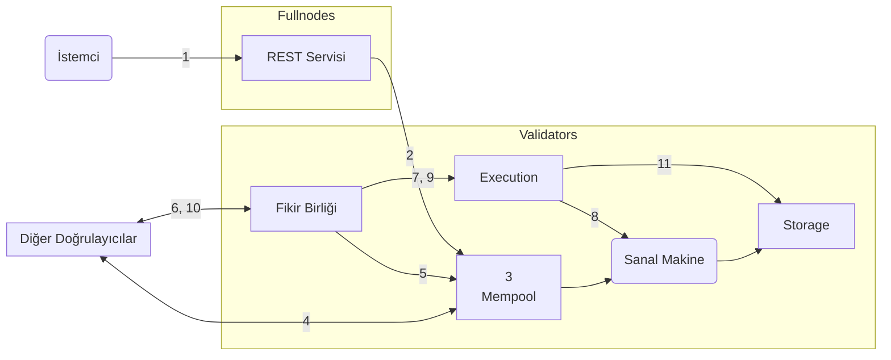
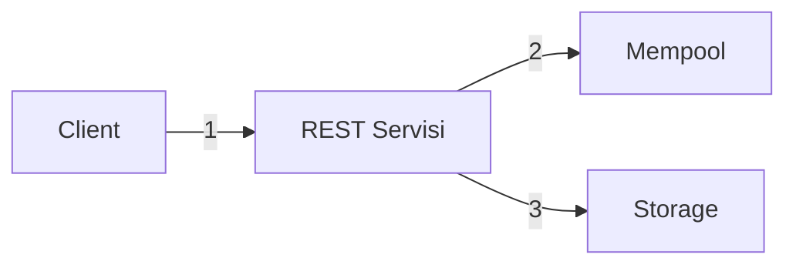
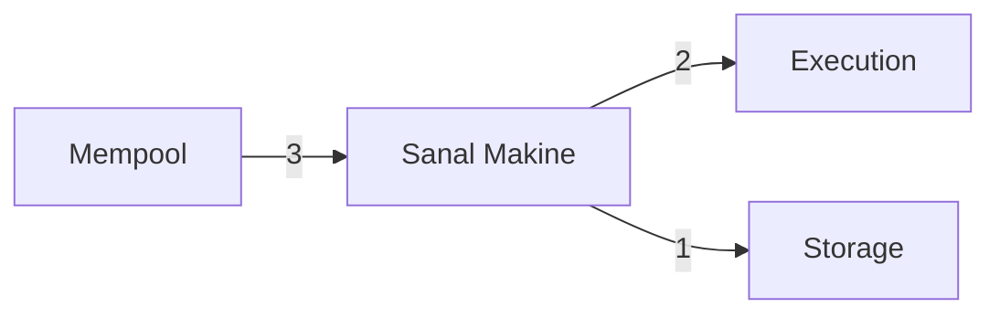
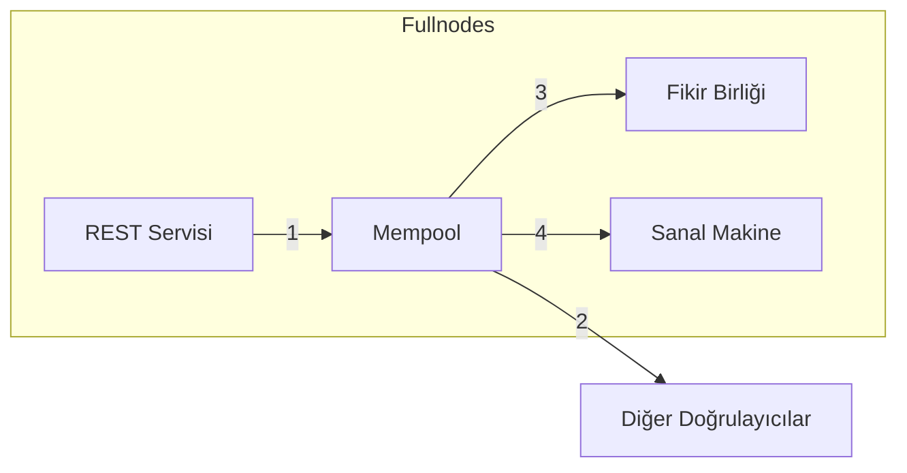
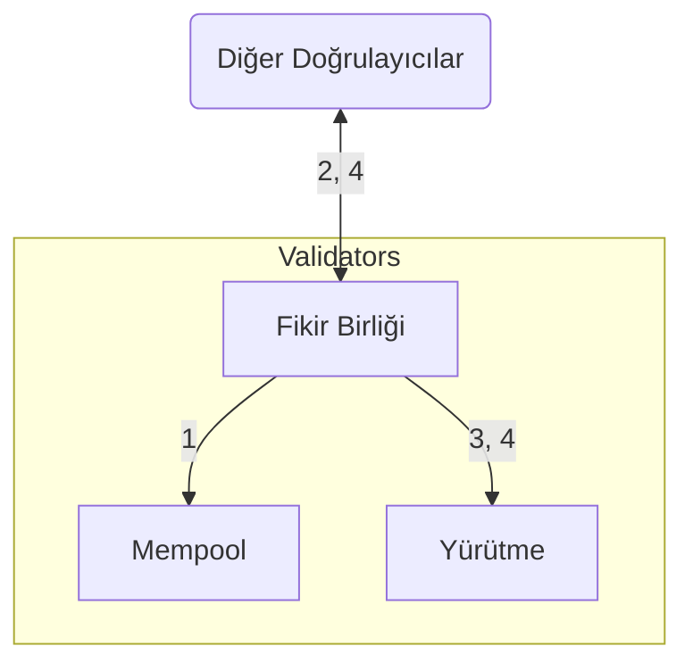
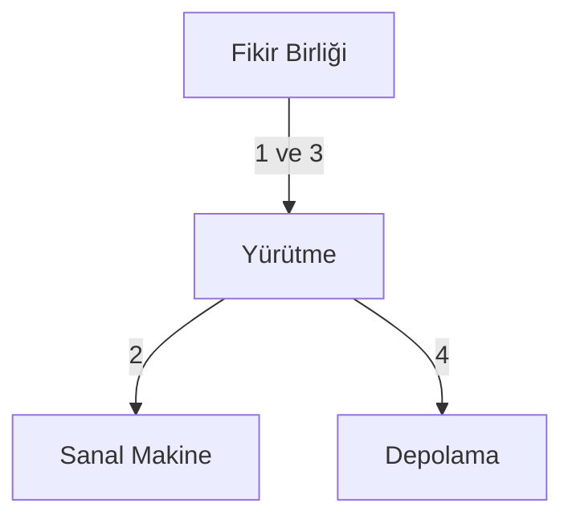
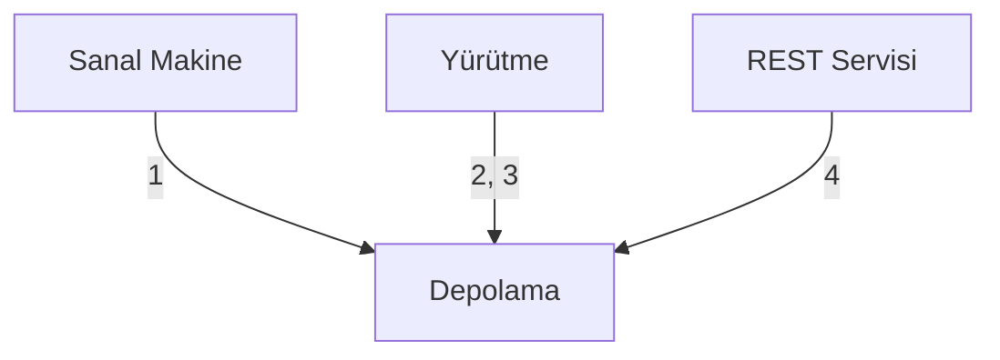

import { Aside } from '@astrojs/starlight/components';

Aptos işleminin yaşam döngüsünü (operasyonel perspektiften) daha derinlemesine anlamak için, bir işlemi Aptos tam düğümüne gönderilmesinden Aptos blokzincirine taahhüt edilmesine kadar olan yolculuğunda takip edeceğiz. Daha sonra Aptos düğümlerinin mantıksal bileşenlerine odaklanacağız ve işlemin bu bileşenlerle nasıl etkileşime girdiğine bakacağız.

## Bir İşlemin Yaşamı

- Alice ve Bob, Aptos blokzincirinde [hesabı](/network/glossary#account) olan iki kullanıcıdır.
- Alice'in hesabında 110 Aptos Coin vardır.
- Alice, Bob'a 10 Aptos Coin gönderiyor.
- Alice'in hesabının mevcut [sıra numarası](/network/glossary#sequence-number) 5'tir (bu, Alice'in hesabından zaten 5 işlemin gönderildiğini gösterir).
- Ağda toplam 100 doğrulayıcı düğüm vardır — V1 ile V100 arası.
- Bir Aptos istemcisi Alice'in işlemini bir Aptos Tam Düğümündeki REST servisine gönderir. Tam düğüm bu işlemi bir doğrulayıcı tam düğümüne iletir, o da bunu doğrulayıcı V1'e iletir.
- Doğrulayıcı V1 mevcut tur için bir önerici/liderdir.

### Yolculuk

Bu bölümde, istemci tarafından gönderildiği andan Aptos blokzincirine taahhüt edildiği ana kadar T5 işleminin yaşam döngüsünü açıklayacağız.

İlgili adımlar için, doğrulayıcı düğümünün karşılık gelen bileşenler arası etkileşimlerine bir bağlantı ekledik. İşlemin yaşam döngüsündeki tüm adımlara aşina olduktan sonra, her adım için karşılık gelen bileşenler arası etkileşimler hakkındaki bilgilere başvurmak isteyebilirsiniz.

<Aside type="note">
  Bu makaledeki tüm görsellerdeki oklar bir etkileşim/eylem başlatan bileşenden başlar ve
  eylemin gerçekleştirildiği bileşende biter. Oklar okunan, yazılan veya döndürülen verileri temsil etmez.
</Aside>

Bir işlemin yaşam döngüsünün beş aşaması vardır:

- **Kabul Etme**: [İşlemi kabul etme](#işlemi-kabul-etme)
- **Paylaşma**: [İşlemi diğer doğrulayıcı düğümlerle paylaşma](#işlemi-diğer-doğrulayıcı-düğümlerle-paylaşma)
- **Önerme**: [Bloğu önerme](#bloğu-önerme)
- **Yürütme ve Fikir Birliği**: [Bloğu yürütme ve fikir birliğine varma](#bloğu-yürütme-ve-fikir-birliğine-varma)
- **Taahhüt Etme**: [Bloğu taahhüt etme](#bloğu-taahhüt-etme)

Her aşamada neler olduğunu aşağıda açıkladık, karşılık gelen Aptos düğüm bileşeni etkileşimlerine bağlantılarla birlikte.

<Aside type="caution">
  İşlemler bir bellek havuzuna girerken ve fikir birliği tarafından yürütülmeden önce doğrulanır.
  İstemci yalnızca REST servisi aracılığıyla ilk gönderim sırasında döndürülen doğrulama sonuçlarını öğrenir.
  İşlemler sessizce yürütülemeyebilir, özellikle hesabın yardımcı tokenının bittiği veya birçok işlem ortasında kimlik doğrulama anahtarını değiştirdiği durumlarda. Bu nadiren olsa da,
  bu alandaki görünürlüğü artırmak için devam eden çabalar vardır.
</Aside>

### İstemci bir işlem gönderir

Bir Aptos **istemcisi ham bir işlem** (buna Traw5 diyelim) oluşturur ve Alice'in hesabından Bob'un hesabına 10 Aptos Coin transfer eder. Aptos istemcisi işlemi Alice'in özel anahtarı ile imzalar. İmzalı işlem T5 aşağıdakileri içerir:

- Ham işlem.
- Alice'in açık anahtarı.
- Alice'in imzası.

Ham işlem aşağıdaki alanları içerir:

| Alanlar                                                                               | Açıklama                                                                                                                                                                                                                                                                                                                                                                                                                                                                                                                                                                                               |
| ------------------------------------------------------------------------------------- | ------------------------------------------------------------------------------------------------------------------------------------------------------------------------------------------------------------------------------------------------------------------------------------------------------------------------------------------------------------------------------------------------------------------------------------------------------------------------------------------------------------------------------------------------------------------------------------------------------ |
| [Hesap adresi](/network/glossary#account-address)                                    | Alice'in hesap adresi                                                                                                                                                                                                                                                                                                                                                                                                                                                                                                                                                                                 |
| Yük                                                                                   | Alice adına bir eylem veya eylem setini belirtir. Bu durumda bir Move fonksiyonu ise, doğrudan zinciirdeki Move bytecode'una çağrı yapar. Alternatif olarak, Move bytecode eşler arası [işlem betiği](/network/glossary#transaction-script) olabilir. Ayrıca fonksiyon veya betik için girdi listesi içerir. Bu örnekte, Alice hesabından Bob'un hesabına bir miktar Aptos Coin transfer etmek için fonksiyon çağrısıdır, burada Alice'in hesabı işlemi göndererek belirtilir ve Bob'un hesabı ile miktar işlem girdileri olarak belirtilir. |
| [Gas birim fiyatı](/network/glossary#gas-unit-price)                                 | Gönderenin işlemi yürütmek için gas birimi başına ödemeye razı olduğu miktar. Bu [Octa](/network/glossary#octa) cinsinden temsil edilir.                                                                                                                                                                                                                                                                                                                                                                                                                                                              |
| [Maksimum gas miktarı](/network/glossary#maximum-gas-amount)                         | Alice'in bu işlem için ödemeye razı olduğu maksimum gas miktarı APT cinsinden. Gas ücretleri, hesaplama ve IO ile kaplanan temel gas maliyetinin gas fiyatı ile çarpımına eşittir. Gas maliyetleri ayrıca Apt-sabit fiyatlı depolama modeli ile depolamayı da içerir. Bu [Octa](/network/glossary#octa) cinsinden temsil edilir.                                                                                                                                                                                                                                                               |
| [Son kullanma zamanı](/network/glossary#expiration-time)                             | İşlemin son kullanma zamanı.                                                                                                                                                                                                                                                                                                                                                                                                                                                                                                                                                                          |
| [Sıra numarası](/network/glossary#sequence-number)                                   | Bir hesap için sıra numarası (bu örnekte 5), o hesaptan gönderilen ve zincir üstünde taahhüt edilen işlem sayısını gösterir. Bu durumda, Traw5 dahil olmak üzere Alice'in hesabından 5 işlem gönderilmiştir. Not: sıra numarası 5 olan bir işlem ancak hesap sıra numarası 5 ise zincir üstünde taahhüt edilebilir.                                                                                                                                                                                                                                                           |
| [Zincir ID](https://github.com/aptos-labs/aptos-core/blob/main/types/src/chain_id.rs) | Aptos ağlarını ayırt eden tanımlayıcı (çapraz ağ saldırılarını önlemek için).                                                                                                                                                                                                                                                                                                                                                                                                                                                                                                                        |

### İşlemi kabul etme

| Açıklama                                                                                                                                                                                                                                                                                                                                                                                                                                                      | Aptos Düğüm Bileşeni Etkileşimleri                                              |
| ------------------------------------------------------------------------------------------------------------------------------------------------------------------------------------------------------------------------------------------------------------------------------------------------------------------------------------------------------------------------------------------------------------------------------------------------------------- | -------------------------------------------------------------------------------- |
| 1. **İstemci → REST servisi**: İstemci T5 işlemini bir Aptos tam düğümünün REST servisine gönderir. Tam düğüm REST servisini kullanarak işlemi kendi bellek havuzuna iletir, bu da işlemi ağdaki diğer düğümlerde çalışan bellek havuzlarına iletir. İşlem sonunda bir doğrulayıcı tam düğümünde çalışan bir bellek havuzuna iletilecek ve bu onu bir doğrulayıcı düğümüne (bu durumda V1) gönderecektir. | [1. REST Servisi](#1-istemci--rest-servisi)                                     |
| 2. **REST servisi → Mempool**: Tam düğümün bellek havuzu T5 işlemini doğrulayıcı V1'in bellek havuzuna iletir.                                                                                                                                                                                                                                                                                                                       | [2. REST Servisi](#2-rest-servisi--mempool), [1. Mempool](#1-rest-servisi--mempool) |
| 3. **Mempool → Sanal Makine (VM)**: Bellek havuzu işlem doğrulaması yapmak için sanal makine (VM) bileşenini kullanır, örneğin imza doğrulaması, hesap bakiyesi doğrulaması ve sıra numarası kullanarak tekrar saldırı direnci.                                                                                                                                                                                                                          | [4. Mempool](#4-mempool--vm), [3. Sanal Makine](#3-mempool--sanal-makine)       |

### İşlemi diğer doğrulayıcı düğümlerle paylaşma

| Açıklama                                                                                                                                                                                                                                                            | Aptos Düğüm Bileşeni Etkileşimleri                      |
| ------------------------------------------------------------------------------------------------------------------------------------------------------------------------------------------------------------------------------------------------------------------- | -------------------------------------------------------- |
| 4. **Mempool**: Bellek havuzu T5'i bellek içi arabellek içinde tutar. Bellek havuzu zaten Alice'in adresinden gönderilen birden fazla işlem içerebilir.                                                                                               | [Mempool](#mempool)                                      |
| 5. **Mempool → Diğer Doğrulayıcılar**: Paylaşılan bellek havuzu protokolünü kullanarak, V1 bellek havuzundaki işlemleri (T5 dahil) diğer doğrulayıcı düğümlerle paylaşır ve onlardan aldığı işlemleri kendi (V1) bellek havuzuna yerleştirir. | [2. Mempool](#2-mempool--diger-dogrulayici-dugumler) |

### Bloğu önerme

| Açıklama                                                                                                                                                                                                                                                           | Aptos Düğüm Bileşeni Etkileşimleri                                                    |
| ------------------------------------------------------------------------------------------------------------------------------------------------------------------------------------------------------------------------------------------------------------------ | -------------------------------------------------------------------------------------- |
| 6. **Fikir Birliği → Mempool**: — Doğrulayıcı V1 bu işlem için önerici/lider olduğundan, bellek havuzundan bir işlem bloğu çeker ve bu bloğu fikir birliği bileşeni aracılığıyla diğer doğrulayıcı düğümlere öneri olarak çoğaltır.                 | [1. Fikir Birliği](#1-fikir-birligi--mempool), [3. Mempool](#3-fikir-birligi--mempool) |
| 7. **Fikir Birliği → Diğer Doğrulayıcılar**: V1'in fikir birliği bileşeni, önerilen bloktaki işlemlerin sırası konusunda tüm doğrulayıcılar arasında anlaşmayı koordine etmekten sorumludur.                                                        | [2. Fikir Birliği](#2-fikir-birligi--diger-dogrulayicilar)                             |

### Bloğu yürütme ve fikir birliğine varma

| Açıklama                                                                                                                                                                                                                                                                                                                                                                                                                                                                                                                                                                                                                               | Aptos Düğüm Bileşeni Etkileşimleri                                                                                      |
| -------------------------------------------------------------------------------------------------------------------------------------------------------------------------------------------------------------------------------------------------------------------------------------------------------------------------------------------------------------------------------------------------------------------------------------------------------------------------------------------------------------------------------------------------------------------------------------------------------------------------------------- | ------------------------------------------------------------------------------------------------------------------------ |
| 8. **Fikir Birliği → Yürütme**: Anlaşmaya varmanın bir parçası olarak, işlem bloğu (T5 içeren) yürütme bileşeni ile paylaşılır.                                                                                                                                                                                                                                                                                                                                                                                                                                                                                           | [3. Fikir Birliği](#3-fikir-birligi--yurutme-fikir-birligi--diger-dogrulayicilar), [1. Yürütme](#1-fikir-birligi--yurutme) |
| 9. **Yürütme → Sanal Makine**: Yürütme bileşeni VM'deki işlemlerin yürütülmesini yönetir. Bu yürütmenin bloktaki işlemler üzerinde anlaşmaya varılmadan önce spekülatif olarak gerçekleştiğini unutmayın.                                                                                                                                                                                                                                                                                                                                                                                                                            | [2. Yürütme](#2-yurutme--vm), [3. Sanal Makine](#3-mempool--sanal-makine)                                               |
| 10. **Fikir Birliği → Yürütme**: Bloktaki işlemleri yürüttükten sonra, yürütme bileşeni bloktaki işlemleri (T5 dahil) [Merkle biriktirici](/network/glossary#merkle-accumulator)'ye (defter geçmişinin) ekler. Bu, Merkle biriktiricinin bellek içi/geçici bir versiyonudur. Bu işlemleri yürütmenin önerilen/spekülatif sonucunun gerekli kısmı, üzerinde anlaşmaya varmak için fikir birliği bileşenine döndürülür. "Fikir birliği"nden "yürütme"ye olan ok, işlemleri yürütme talebinin fikir birliği bileşeni tarafından yapıldığını gösterir. | [3. Fikir Birliği](#3-fikir-birligi--yurutme-fikir-birligi--diger-dogrulayicilar), [1. Yürütme](#1-fikir-birligi--yurutme) |
| 11. **Fikir Birliği → Diğer Doğrulayıcılar**: V1 (fikir birliği lideri) önerilen bloğun yürütme sonucu konusunda fikir birliğine katılan diğer doğrulayıcı düğümlerle fikir birliğine varmaya çalışır.                                                                                                                                                                                                                                                                                                                                                                                                                  | [3. Fikir Birliği](#3-fikir-birligi--yurutme-fikir-birligi--diger-dogrulayicilar)                                       |

### Bloğu taahhüt etme

| Açıklama                                                                                                                                                                                                                                                                                                                                                                                                                                            | Aptos Düğüm Bileşeni Etkileşimleri                                                                                                                                              |
| --------------------------------------------------------------------------------------------------------------------------------------------------------------------------------------------------------------------------------------------------------------------------------------------------------------------------------------------------------------------------------------------------------------------------------------------------- | -------------------------------------------------------------------------------------------------------------------------------------------------------------------------------- |
| 12. **Fikir Birliği → Yürütme**, **Yürütme → Depolama**: Önerilen bloğun yürütme sonucu üzerinde anlaşılır ve çoğunluk oyuna sahip doğrulayıcılar seti tarafından imzalanırsa, doğrulayıcı V1'in yürütme bileşeni spekülatif yürütme önbelleğinden önerilen blok yürütmenin tam sonucunu okur ve önerilen bloktaki tüm işlemleri sonuçlarıyla birlikte kalıcı depolamaya taahhüt eder. | [4. Fikir Birliği](#4-fikir-birligi--yurutme), [3. Yürütme](#3-fikir-birligi--yurutme), [4. Yürütme](#4-yurutme--depolama), [3. Depolama](#3-yurutme--depolama) |

Alice'in hesabında artık 100 Aptos Coin olacak ve sıra numarası 6 olacaktır. T5 Bob tarafından tekrarlanırsa, Alice'in hesabının sıra numarası (6) tekrarlanan işlemin sıra numarasından (5) büyük olduğu için reddedilecektir.

## Aptos düğüm bileşeni etkileşimleri

[Bir İşlemin Yaşamı](#bir-işlemin-yaşamı) bölümünde, bir işlemin tipik yaşam döngüsünü (işlem gönderiminden işlem taahhüdüne) açıkladık. Şimdi Aptos düğümlerinin bileşenler arası etkileşimlerine bakalım, blokzincir işlemleri işlerken ve sorgulara yanıt verirken. Bu bilgi en çok şunlar için yararlı olacaktır:

- Sistemin kapakların altında nasıl çalıştığı hakkında bir fikir edinmek isteyenler.
- Sonunda Aptos blokzincirine katkıda bulunmakla ilgilenenler.

Farklı Aptos düğüm türleri hakkında daha fazla bilgiyi burada öğrenebilirsiniz:

- [Doğrulayıcı düğümler](/network/blockchain/validator-nodes)
- [Tam düğümler](/network/blockchain/fullnodes)

Anlatımımız için, bir istemcinin TN işlemini doğrulayıcı VX'e gönderdiğini varsayacağız. Her doğrulayıcı bileşeni için, bileşenler arası etkileşimlerinin her birini ilgili bileşenin bölümü altındaki alt bölümlerde açıklayacağız. Bileşenler arası etkileşimleri açıklayan alt bölümlerin, gerçekleştirildikleri sırada kesinlikle listelenmediğini unutmayın. Etkileşimlerin çoğu bir işlemin işlenmesiyle ilgilidir ve bazıları istemcilerin blokzinciri sorgulamasıyla ilgilidir (blokzincirdeki mevcut bilgiler için sorgular).

Aşağıdakiler, bir işlemin yaşam döngüsünde kullanılan Aptos düğümünün temel bileşenleridir:

**Tam düğüm**

- [REST API Servisi](#rest-servisi)

**Doğrulayıcı düğüm**

- [Mempool](#mempool)
- [Fikir Birliği](#fikir-birligi)
- [Yürütme](#yurutme)
- [Sanal Makine](#sanal-makine-vm)
- [Depolama](#depolama)

## REST Servisi

Bir istemci tarafından yapılan herhangi bir istek önce bir tam düğümün REST Servisine gider. Daha sonra, gönderilen işlem doğrulayıcı tam düğümüne iletilir, o da bunu doğrulayıcı düğüm VX'e gönderir.

### 1. İstemci → REST Servisi

Bir istemci bir Aptos tam düğümünün REST servisine bir işlem gönderir.

### 2. REST Servisi → Mempool

Tam düğümün REST servisi işlemi kendi bellek havuzuna aktarır. Bellek havuzu bazı başlangıç kontrolleri yaptıktan sonra, REST Servisi istemciye işlemin kabul edilip edilmediğini gösteren bir durum döndürür. Örneğin, güncel olmayan işlemler reddedilir: bellek havuzu TN işlemini yalnızca TN'in sıra numarası gönderenin hesabının mevcut sıra numarasından büyük veya eşitse kabul eder.

### 3. Mempool -> Mempool

Tam düğümdeki bellek havuzu işlemi bir doğrulayıcı tam düğümünün bellek havuzuna gönderir, o da işlemi doğrulayıcı düğüm VX'in bellek havuzuna gönderir. İşlemin sıra numarası gönderenin hesabının sıra numarasıyla eşleşene kadar işlemin bir sonraki bellek havuzuna gönderilmeyeceğini (veya fikir birliğine geçirilmeyeceğini) unutmayın. Ayrıca, her bellek havuzu bir işlem aldığında aynı başlangıç kontrollerini yapar, bu da bir işlemin fikir birliğine giderken atılmasına neden olabilir. Mevcut bellek havuzu uygulaması, bu süreçte bir işlem atılırsa herhangi bir geri bildirim sağlamaz.

### 4. REST Servisi → Depolama

Bir istemci Aptos blokzinciri üzerinde okuma sorgusu yaptığında (örneğin, Alice'in hesabının bakiyesini almak için), REST servisi talep edilen bilgiyi elde etmek için doğrudan depolama bileşeni ile etkileşime girer.

## Sanal Makine (VM)

Move VM, Move bytecode'unda yazılmış işlem betiklerini doğrular ve yürütür.

### 1. Sanal Makine → Depolama

Bellek havuzu VM'den `VMValidator::validate_transaction()` aracılığıyla bir işlemi doğrulamasını istediğinde, VM işlem gönderenin hesabını depolamadan yükler ve aşağıdaki listede açıklananların bazıları olan doğrulamalar yapar.

- İmzalı işlemdeki giriş imzasının doğru olduğunu kontrol eder (yanlış imzalanmış işlemleri reddetmek için).
- Gönderenin hesap kimlik doğrulama anahtarının açık anahtarın hash'i ile aynı olduğunu kontrol eder (işlemi imzalamak için kullanılan özel anahtara karşılık gelen).
- İşlemin sıra numarasının gönderenin hesabının mevcut sıra numarasından büyük veya eşit olduğunu doğrular. Bu kontrolü tamamlamak gönderenin hesabına karşı aynı işlemin tekrarını önler.
- İmzalı işlemdeki programın hatalı olmadığını doğrular, çünkü hatalı bir program VM tarafından yürütülemez.
- Gönderenin hesap bakiyesinin işlemde belirtilen maksimum gas miktarının gas fiyatı ile çarpımını en azından içerdiğini doğrular, bu da işlemin kullandığı kaynaklar için ödeme yapabileceğini garanti eder.

### 2. Yürütme → Sanal Makine

Yürütme bileşeni `ExecutorTask::execute_transaction()` aracılığıyla bir işlemi yürütmek için VM'yi kullanır.

Bir işlemi yürütmenin defter durumunu güncellemek ve sonuçları depolamada kalıcılaştırmaktan farklı olduğunu anlamak önemlidir. TN işlemi önce fikir birliği sırasında bloklar üzerinde anlaşmaya varma girişiminin bir parçası olarak yürütülür. Diğer doğrulayıcılarla işlemlerin sıralaması ve yürütme sonuçları konusunda anlaşmaya varılırsa, sonuçlar depolamada kalıcılaştırılır ve defter durumu güncellenir.

### 3. Mempool → Sanal Makine

Bellek havuzu paylaşılan bellek havuzu aracılığıyla diğer doğrulayıcılardan veya REST servisinden bir işlem aldığında, bellek havuzu işlemi doğrulamak için VM'de `VMValidator::validate_transaction()`'ı çağırır.

Uygulama ayrıntıları için [Move Sanal Makine README](https://github.com/move-language/move/tree/main/language/move-vm)'sine bakın.

## Mempool

Mempool, yürütülmeyi "bekleyen" işlemleri tutan paylaşılan bir arabellektir. Bellek havuzuna yeni bir işlem eklendiğinde, bellek havuzu bu işlemi sistemdeki diğer doğrulayıcı düğümlerle paylaşır. "Paylaşılan bellek havuzu"nda ağ tüketimini azaltmak için, her doğrulayıcı kendi işlemlerini diğer doğrulayıcılara iletmekten sorumludur. Bir doğrulayıcı başka bir doğrulayıcının bellek havuzundan bir işlem aldığında, işlem alıcı doğrulayıcının bellek havuzuna eklenir.

### 1. REST Servisi → Mempool

- İstemciden bir işlem aldıktan sonra, REST servisi işlemi kendi bellek havuzuna gönderir, o da işlemi bir doğrulayıcı tam düğümünün bellek havuzu ile paylaşır. Doğrulayıcı tam düğümündeki bellek havuzu daha sonra işlemi bir doğrulayıcının bellek havuzu ile paylaşır.
- Doğrulayıcı düğüm VX için bellek havuzu, TN işlemini gönderenin hesabı için yalnızca TN'in sıra numarası gönderenin hesabının mevcut sıra numarasından büyük veya eşitse kabul eder.

### 2. Mempool → Diğer doğrulayıcı düğümler

- Doğrulayıcı düğüm VX'in bellek havuzu TN işlemini aynı ağdaki diğer doğrulayıcılarla paylaşır.
- Diğer doğrulayıcılar kendi bellek havuzlarındaki işlemleri VX'in bellek havuzu ile paylaşır.

### 3. Fikir Birliği → Mempool

- İşlem bir doğrulayıcı düğümüne iletildiğinde ve doğrulayıcı düğüm lider haline geldiğinde, fikir birliği bileşeni bellek havuzundan bir işlem bloğu çeker ve önerilen bloğu diğer doğrulayıcılara çoğaltır. Bunu işlemlerin sıralaması ve önerilen bloktaki işlemlerin yürütme sonuçları konusunda fikir birliğine varmak için yapar.
- TN işleminin önerilen fikir birliği bloğuna dahil edilmiş olması, TN'in sonunda Aptos blokzincirinin dağıtık veritabanında kalıcılaştırılacağını garanti etmez.

### 4. Mempool → VM

Bellek havuzu diğer doğrulayıcılardan bir işlem aldığında, bellek havuzu işlemi doğrulamak için VM'de `VMValidator::validate_transaction()`'ı çağırır.

## Fikir Birliği

Fikir birliği bileşeni, işlem bloklarını sıralamak ve ağdaki diğer doğrulayıcılarla [fikir birliği protokolü](/network/glossary#consensus-protocol)'ne katılarak yürütme sonuçları üzerinde anlaşmaktan sorumludur.

### 1. Fikir Birliği → Mempool

Doğrulayıcı VX bir lider/önerici olduğunda, VX'in fikir birliği bileşeni `Mempool::get_batch()` aracılığıyla bellek havuzundan bir işlem bloğu çeker ve önerilen bir işlem bloğu oluşturur.

### 2. Fikir Birliği → Diğer Doğrulayıcılar

VX bir önerici/lider ise, fikir birliği bileşeni önerilen işlem bloğunu diğer doğrulayıcılara çoğaltır.

### 3. Fikir Birliği → Yürütme, Fikir Birliği → Diğer Doğrulayıcılar

- Bir işlem bloğunu yürütmek için, fikir birliği yürütme bileşeni ile etkileşime girer. Fikir birliği `BlockExecutorTrait::execute_block()` aracılığıyla bir işlem bloğunu yürütür ([Fikir Birliği → yürütme](#1-fikir-birligi--yurutme)'ye bakın)
- Önerilen bloktaki işlemleri yürüttükten sonra, yürütme bileşeni fikir birliği bileşenine bu işlemleri yürütmenin sonucu ile yanıt verir.
- Fikir birliği bileşeni yürütme sonucunu imzalar ve bu sonuç üzerinde diğer doğrulayıcılarla anlaşmaya varmaya çalışır.

### 4. Fikir Birliği → Yürütme

Yeterli doğrulayıcı aynı yürütme sonucu için oy verirse, VX'in fikir birliği bileşeni `BlockExecutorTrait::commit_blocks()` aracılığıyla yürütmeye bu bloğun taahhüt edilmeye hazır olduğunu bildirir.

## Yürütme

Yürütme bileşeni bir işlem bloğunun yürütülmesini koordine eder ve fikir birliği tarafından oylanabilecek geçici bir durum tutar. Bu işlemler başarılı olursa, depolamaya taahhüt edilirler.

### 1. Fikir Birliği → Yürütme

- Fikir birliği yürütmeden `BlockExecutorTrait::execute_block()` aracılığıyla bir işlem bloğunu yürütmesini ister.
- Yürütme, [Merkle biriktiricinin](/network/glossary#merkle-accumulator) ilgili kısımlarının bellek içi kopyalarını tutan bir "karalama defteri" tutar. Bu bilgi Aptos blokzincirinin mevcut durumunun kök hash'ini hesaplamak için kullanılır.
- Mevcut durumun kök hash'i, önerilen bloktaki işlemler hakkındaki bilgilerle birleştirilerek biriktiricinin yeni kök hash'ini belirler. Bu, herhangi bir veri kalıcılaştırılmadan önce yapılır ve doğrulayıcıların çoğunluğu tarafından anlaşmaya varılana kadar hiçbir durum veya işlemin depolanmamasını sağlar.
- Yürütme spekülatif kök hash'i hesaplar ve daha sonra VX'in fikir birliği bileşeni bu kök hash'i imzalar ve bu kök hash üzerinde diğer doğrulayıcılarla anlaşmaya varmaya çalışır.

### 2. Yürütme → VM

Fikir birliği yürütmeden `BlockExecutorTrait::execute_block()` aracılığıyla bir işlem bloğunu yürütmesini istediğinde, yürütme işlem bloğunu yürütmenin sonuçlarını belirlemek için VM'yi kullanır.

### 3. Fikir Birliği → Yürütme

Doğrulayıcıların çoğunluğu blok yürütme sonuçları üzerinde anlaşırsa, her doğrulayıcının fikir birliği bileşeni `BlockExecutorTrait::commit_blocks()` aracılığıyla yürütme bileşenine bu bloğun taahhüt edilmeye hazır olduğunu bildirir. Yürütme bileşenine yapılan bu çağrı, anlaşmalarının kanıtını sağlamak için doğrulayıcıların imzalarını içerecektir.

### 4. Yürütme → Depolama

Yürütme "karalama defteri"nden değerleri alır ve `DbWriter::save_transactions()` aracılığıyla kalıcılık için depolamaya gönderir. Yürütme daha sonra artık gerekli olmayan eski değerleri "karalama defteri"nden temizler (örneğin, taahhüt edilemeyen paralel bloklar).

Uygulama ayrıntıları için [Yürütme README](https://github.com/aptos-labs/aptos-core/tree/main/execution)'sine bakın.

## Depolama

Depolama bileşeni, üzerinde anlaşılan işlem bloklarını ve yürütme sonuçlarını Aptos blokzincirine kalıcılaştırır. Bir işlem bloğu (TN işlemini içeren), fikir birliğine katılan doğrulayıcıların çoğunluğundan fazlası (2f+1) arasında anlaşma olduğunda depolama aracılığıyla kaydedilecektir. Anlaşma aşağıdakilerin tümünü içermelidir:

- Bloğa dahil edilecek işlemler
- İşlemlerin sırası
- Bloktaki işlemlerin yürütme sonuçları

Aptos blokzincirini temsil eden veri yapısına bir işlemin nasıl eklendiği hakkında bilgi için [Merkle biriktirici](/network/glossary#merkle-accumulator)'ye bakın.

### 1. VM → Depolama

Bellek havuzu bir işlemi doğrulamak için `VMValidator::validate_transaction()`'ı çağırdığında, `VMValidator::validate_transaction()` gönderenin hesabını depolamadan yükler ve işlem üzerinde salt okunur geçerlilik kontrolleri yapar.

### 2. Yürütme → Depolama

Fikir birliği bileşeni `BlockExecutorTrait::execute_block()`'u çağırdığında, yürütme mevcut durumu depolamadan okur ve yürütme sonuçlarını belirlemek için bellek içi "karalama defteri" verisiyle birleştirir.

### 3. Yürütme → Depolama

Bir işlem bloğu üzerinde fikir birliğine varıldığında, yürütme işlem bloğunu kaydetmek ve kalıcı olarak kaydetmek için `DbWriter::save_transactions()` aracılığıyla depolamayı çağırır. Bu ayrıca bu işlem bloğu üzerinde anlaşan doğrulayıcı düğümlerinin imzalarını da depolayacaktır. Bu blok için "karalama defteri"ndeki bellek içi veriler depolamayı güncellemek ve işlemleri kalıcılaştırmak için geçirilir. Depolama güncellendiğinde, bu işlemlerle değiştirilen her hesabın sıra numarası bir artar.

Not: Aptos blokzincirindeki bir hesabın sıra numarası, o hesaptan kaynaklanan her taahhüt edilen işlem için bir artar.

### 4. REST Servisi → Depolama

Blokzincirden bilgi okuyan istemci sorguları için, REST servisi talep edilen bilgiyi okumak için doğrudan depolama ile etkileşime girer.

Uygulama ayrıntıları için [Depolama README](https://github.com/aptos-labs/aptos-core/tree/main/storage)'sine bakın.
