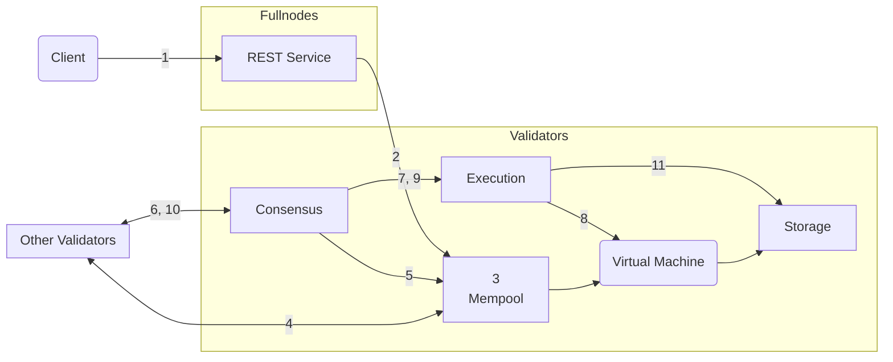

import { Aside } from '@astrojs/starlight/components';

Để hiểu sâu hơn về vòng đời của một giao dịch Aptos (từ góc độ vận hành), chúng tôi sẽ theo dõi một giao dịch trong hành trình của nó, từ khi được gửi đến một fullnode Aptos, đến khi được cam kết vào blockchain Aptos. Sau đó chúng tôi sẽ tập trung vào các thành phần logic của các nút Aptos và xem xét cách giao dịch tương tác với các thành phần này.

## Vòng đời của một giao dịch

- Alice và Bob là hai người dùng, mỗi người có một [tài khoản](/network/glossary#account) trên blockchain Aptos.
- Tài khoản của Alice có 110 Aptos Coins.
- Alice đang gửi 10 Aptos Coins cho Bob.
- [Số thứ tự](/network/glossary#sequence-number) hiện tại của tài khoản Alice là 5 (điều này cho biết rằng 5 giao dịch đã được gửi từ tài khoản của Alice).
- Có tổng cộng 100 nút validator — V1 đến V100 trên mạng.
- Một client Aptos gửi giao dịch của Alice đến dịch vụ REST trên một Aptos Fullnode. Fullnode chuyển tiếp giao dịch này đến một validator fullnode, sau đó chuyển tiếp nó đến validator V1.
- Validator V1 là proposer/leader cho vòng hiện tại.

### Hành trình

Trong phần này, chúng tôi sẽ mô tả vòng đời của giao dịch T5, từ khi client gửi nó đến khi nó được cam kết vào blockchain Aptos.

Đối với các bước liên quan, chúng tôi đã bao gồm một liên kết đến các tương tác giữa các thành phần tương ứng của nút validator. Sau khi bạn đã quen thuộc với tất cả các bước trong vòng đời của giao dịch, bạn có thể muốn tham khảo thông tin về các tương tác giữa các thành phần tương ứng cho mỗi bước.

<Aside type="note">
  Các mũi tên trong tất cả các hình ảnh trong bài viết này bắt nguồn từ thành phần bắt đầu một tương tác/hành động và
  kết thúc tại thành phần mà hành động đang được thực hiện. Các mũi tên không đại diện cho dữ liệu được đọc,
  ghi hoặc trả về.
</Aside>

Vòng đời của một giao dịch có năm giai đoạn:

- **Chấp nhận**: [Chấp nhận giao dịch](#accepting-the-transaction)
- **Chia sẻ**: [Chia sẻ giao dịch với các nút validator khác](#sharing-the-transaction-with-other-validator-nodes)
- **Đề xuất**: [Đề xuất khối](#proposing-the-block)
- **Thực thi và Đồng thuận**: [Thực thi khối và đạt được đồng thuận](#executing-the-block-and-reaching-consensus)
- **Cam kết**: [Cam kết khối](#committing-the-block)

Chúng tôi đã mô tả những gì xảy ra trong mỗi giai đoạn bên dưới, cùng với các liên kết đến các tương tác thành phần nút Aptos tương ứng.

<Aside type="caution">
  Các giao dịch được xác thực khi vào mempool và trước khi thực thi bởi đồng thuận.
  Client chỉ biết về kết quả xác thực được trả về trong quá trình gửi ban đầu thông qua dịch vụ REST.
  Các giao dịch có thể âm thầm thất bại trong việc thực thi, đặc biệt trong trường hợp tài khoản đã hết
  token tiện ích hoặc thay đổi khóa xác thực của nó giữa nhiều giao dịch. Mặc dù điều này xảy ra không thường xuyên,
  có những nỗ lực đang diễn ra để cải thiện khả năng hiển thị trong không gian này.
</Aside>

### Client gửi giao dịch

Một **client Aptos xây dựng một giao dịch thô** (hãy gọi nó là Traw5) để chuyển 10 Aptos Coins từ tài khoản của Alice đến tài khoản của Bob. Client Aptos ký giao dịch bằng khóa riêng của Alice. Giao dịch đã ký T5 bao gồm những điều sau:

- Giao dịch thô.
- Khóa công khai của Alice.
- Chữ ký của Alice.

Giao dịch thô bao gồm các trường sau:

| Trường                                                                               | Mô tả                                                                                                                                                                                                                                                                                                                                                                                                                                                                                                                                                                                            |
| ------------------------------------------------------------------------------------ | ------------------------------------------------------------------------------------------------------------------------------------------------------------------------------------------------------------------------------------------------------------------------------------------------------------------------------------------------------------------------------------------------------------------------------------------------------------------------------------------------------------------------------------------------------------------------------------------------------ |
| [Địa chỉ tài khoản](/network/glossary#account-address)                             | Địa chỉ tài khoản của Alice                                                                                                                                                                                                                                                                                                                                                                                                                                                                                                                                                                           |
| Payload                                                                              | Chỉ ra một hành động hoặc một tập hợp hành động thay mặt cho Alice. Trong trường hợp này là một hàm Move, nó gọi trực tiếp vào Move bytecode trên chuỗi. Ngoài ra, nó có thể là Move bytecode peer-to-peer [transaction script](/network/glossary#transaction-script). Nó cũng chứa danh sách các đầu vào cho hàm hoặc script. Đối với ví dụ này, đó là một lời gọi hàm để chuyển một số lượng Aptos Coins từ tài khoản Alice đến tài khoản của Bob, trong đó tài khoản của Alice được ngụ ý bằng cách gửi giao dịch và tài khoản của Bob và số lượng được chỉ định như là đầu vào giao dịch. |
| [Giá đơn vị gas](/network/glossary#gas-unit-price)                               | Số tiền người gửi sẵn sàng trả cho mỗi đơn vị gas, để thực hiện giao dịch. Điều này được biểu diễn bằng [Octas](/network/glossary#octa).                                                                                                                                                                                                                                                                                                                                                                                                                                                       |
| [Số lượng gas tối đa](/network/glossary#maximum-gas-amount)                       | Số lượng gas tối đa trong APT mà Alice sẵn sàng trả cho giao dịch này. Phí gas bằng chi phí gas cơ bản được bao phủ bởi tính toán và IO nhân với giá gas. Chi phí gas cũng bao gồm lưu trữ với mô hình lưu trữ giá cố định Apt. Điều này được biểu diễn bằng [Octas](/network/glossary#octa).                                                                                                                                                                                                                                                                                                   |
| [Thời gian hết hạn](/network/glossary#expiration-time)                             | Thời gian hết hạn của giao dịch.                                                                                                                                                                                                                                                                                                                                                                                                                                                                                                                                                                    |
| [Số thứ tự](/network/glossary#sequence-number)                             | Số thứ tự (5, trong ví dụ này) cho một tài khoản cho biết số lượng giao dịch đã được gửi và cam kết trên chuỗi từ tài khoản đó. Trong trường hợp này, 5 giao dịch đã được gửi từ tài khoản của Alice, bao gồm Traw5. Lưu ý: một giao dịch với số thứ tự 5 chỉ có thể được cam kết trên chuỗi nếu số thứ tự tài khoản là 5.                                                                                                                                                                                                                                                                                                                      |
| [Chain ID](https://github.com/aptos-labs/aptos-core/blob/main/types/src/chain_id.rs) | Một định danh phân biệt các mạng Aptos (để ngăn chặn các cuộc tấn công cross-network).                                                                                                                                                                                                                                                                                                                                                                                                                                                                                                                |

### Chấp nhận giao dịch

1. **Client gửi giao dịch**: Client gửi giao dịch T5 đến dịch vụ REST của một fullnode Aptos.

2. **Xác thực giao dịch**: Dịch vụ REST xác thực giao dịch bằng cách kiểm tra các điều kiện sau:
   - Giao dịch có cấu trúc hợp lệ không
   - Chữ ký có hợp lệ không
   - Tài khoản có đủ số dư để trả phí gas không

3. **Chuyển tiếp đến Mempool**: Nếu xác thực thành công, dịch vụ REST chuyển tiếp giao dịch đến mempool của validator.

## Các thành phần chính của Aptos Node

### Mempool

Mempool lưu trữ các giao dịch đang chờ xử lý và chia sẻ chúng với các validator khác trong mạng.

### Consensus

Thành phần consensus chịu trách nhiệm sắp xếp các giao dịch và đạt được thỏa thuận về thứ tự của chúng giữa các validator.

### Execution

Thành phần execution xử lý các giao dịch bằng cách chạy chúng trên Move Virtual Machine.

### Storage

Thành phần storage lưu trữ trạng thái blockchain và lịch sử giao dịch.

Đây là tổng quan cấp cao về cách Aptos blockchain xử lý giao dịch. Để biết thông tin chi tiết hơn về từng thành phần và quy trình, vui lòng tham khảo tài liệu kỹ thuật đầy đủ.
