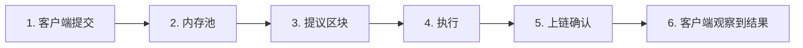

import { Aside, CardGrid, LinkCard } from "@astrojs/starlight/components";

Aptos 是一条用于转移 APT、[稳定币](/zh/build/guides/exchanges#稳定币地址) 和其他[同质化资产](/zh/build/smart-contracts/fungible-asset) 的 Layer 1 结算轨道。支付交易在**上链确认（commit）且执行成功**后即具有最终性（BFT 共识，无需额外区块确认）。本页把出块时间、端到端延迟、最终性和手续费分开说明，再对应到普通转账、机密转账和其他支付流程。

<Aside type="tip">
  要发出第一笔可用的支付，请跟随[您的第一笔交易](/zh/build/guides/first-transaction)。钱包和已有应用请参阅[应用集成](/zh/build/guides/application-integration)。
</Aside>

## 延迟、出块时间与手续费

这四个数字回答不同的问题。不要把出块时间当成用户等待支付完成的时间。



| 指标             | 衡量内容                                     | 主网典型值                                                                                                                   | 如何核验                                                                                                  |
| -------------- | ---------------------------------------- | ----------------------------------------------------------------------------------------------------------------------- | ----------------------------------------------------------------------------------------------------- |
| **出块时间**       | 相邻区块的间隔                                  | 数十毫秒。Aptos 不使用固定槽位时钟；实时时间戳常低于 50 ms                                                                                     | [区块](/zh/network/blockchain/blocks)、[Explorer](https://explorer.aptoslabs.com/blocks?network=mainnet) |
| **最终性**        | 已上链结果何时不可逆                               | [上链确认后立即最终](/zh/build/guides/exchanges#交易何时具有终局性)。无需确认深度，也没有重组窗口。失败的交易同样最终，只是资金没有转移                                     | [交易和状态](/zh/network/blockchain/txns-states)                                                           |
| **端到端（E2E）延迟** | 客户端**提交** → `waitForTransaction` 返回已上链交易 | 正常负载下通常为**亚秒级**。包含到全节点的客户端往返、内存池、共识、执行和轮询。构建、签名和证明生成发生在提交之前，不计入该数字                                                      | 提交后务必调用 `waitForTransaction`                                                                          |
| **交易手续费**      | 向费用支付者收取的 APT                            | 净扣费为 `gas_used × gas_unit_price − storage_refund`（以 [Octa](/zh/network/glossary#octa) 计）。存储费已经折进 `gas_used`。**与转账金额无关** | [Gas 和存储费用](/zh/network/blockchain/gas-txn-fee)                                                       |

<Aside type="note">
  出块时间、网络负载以及以美元计价的手续费会随网络和 APT 价格变化。产品 SLA 请引用 Octa（或模拟得到的 `gas_used`）；美元数字仅作数量级参考。实时 gas 单价见 [`/v1/estimate_gas_price`](https://api.mainnet.aptoslabs.com/v1/estimate_gas_price)。治理设置下限（`txn.min_price_per_gas_unit`，普通交易当前为 100 Octa）。
</Aside>

### 出块时间

验证者在网络时延允许时就会提议下一个区块。主网出块时间通常为数十毫秒。这是链打包交易的速度，不是钱包在展示「已支付」之前应等待的时间。

详见[区块](/zh/network/blockchain/blocks)和[执行](/zh/network/blockchain/execution)（Block-STM）。

### 端到端延迟

本页的 **E2E 延迟** 是从**提交**到 `waitForTransaction` 返回已上链交易的时钟。简单支付的这一等待通常不到一秒。

提交**之前**的工作是另一段时钟，常常主导用户感知时延：

- 构建、可选的模拟、签名。
- 机密资产证明生成、收集多签签名，或加密待处理负载。

提交不等于结算。返回 202 和哈希只表示节点**接受**了交易。用 `waitForTransaction` 轮询，并在 `success === true` 时才把支付视为完成。已上链但失败的交易仍然具有[最终性](#最终性)（不会被撤销），但转账并未发生。

### 最终性

Aptos 使用 BFT 共识。已上链确认的交易即最终，无论成功还是失败。你不必像在概率最终性链上那样再等若干区块。见[交易所常见问题中的终局性](/zh/build/guides/exchanges#交易何时具有终局性)以及[交易生命周期](/zh/network/blockchain/blockchain-deep-dive)。

### 交易手续费

手续费包含两部分，详见 [Gas 和存储费用](/zh/network/blockchain/gas-txn-fee)。当前客户端仍在 `gas_used` 中看到它们的合计：

1. **执行与 IO** — gas 单位 × `gas_unit_price`（Octa）。单价可在负载升高时上涨；更高价格只帮助交易**进入**下一个区块，而不改变它在区块内的顺序。
2. **存储** — 为新建或增大的状态槽支付固定 APT（例如接收方第一次持有某种同质化资产）。该金额按交易的 `gas_unit_price` 折成 gas 单位并计入 `gas_used`。删除状态时可能产生 `storage_refund`，该退款**不在** `gas_used` 内。

支付者净扣 APT 为 `gas_used × gas_unit_price − storage_refund`。同样的负载下，转 1 APT 与转 1,000,000 APT 的 gas 成本几乎相同。主网平均手续费处于**不到 1 美分**的量级（公开网络数据大约为 0.0005 美元，仅作数量级参考）。简单的 APT 和同质化资产转账属于最便宜的交易之列。请始终针对你将提交的准确负载做模拟。

若要让终端用户不持有 APT，使用[赞助交易](/zh/build/guides/sponsored-transactions)或 [Geomi Gas Station](https://geomi.dev/docs/gas-stations)。

## 按用法划分的支付

用下表选择 API，并查看延迟和手续费如何变化。机密转账在此只做摘要；协议细节见机密资产页面。

| 用法                | 典型链上 E2E            | 额外的客户端工作          | 手续费特征                                      | 实现                                                                                              |
| ----------------- | ------------------- | ----------------- | ------------------------------------------ | ----------------------------------------------------------------------------------------------- |
| **APT 转账**        | 提交后亚秒级              | 签名、提交、等待          | 最低。与金额无关                                   | [`0x1::aptos_account::transfer`](#apt-转账)                                                       |
| **同质化资产 / 稳定币转账** | 与 APT 相同            | 签名、提交、等待          | 与 APT 相近。若接收方尚无主存储则含存储费                    | [`0x1::primary_fungible_store::transfer`](#同质化资产与稳定币转账)                                         |
| **机密转账**          | 相同的上链确认路径；执行更重、负载更大 | 在提交之前生成零知识证明      | 高于明文转账                                     | [机密资产](/zh/build/smart-contracts/confidential-asset)（不要根据本页实现）                                  |
| **赞助（免 gas 体验）**  | 与内部转账相同             | 额外的费用支付者签名        | 链上成本相同，由应用支付                               | [赞助交易](/zh/build/guides/sponsored-transactions)                                                 |
| **高吞吐 / 并行提交**    | 每笔相同                | 唯一的重放保护 nonce     | 与内部转账相同                                    | [无序交易](/zh/build/guides/orderless-transactions)、[交易管理](/zh/build/guides/transaction-management) |
| **加密待处理负载**       | 上链确认后相同             | 构建时加密             | `gas_unit_price` 最低为 **200** Octa（普通下限的两倍） | [加密待处理交易](/zh/build/guides/encrypted-pending-transactions)                                      |
| **金库 / 策略**       | 批准带来额外往返            | 收集 N-of-M 签名      | 批准后收取一次执行费                                 | [您的第一个多签](/zh/build/guides/first-multisig)                                                      |
| **无密码登录**         | 与内部转账相同             | OIDC / Keyless 流程 | 与内部转账相同                                    | [Aptos 无密钥](/zh/build/guides/aptos-keyless)                                                     |

批量打款（工资、分发）可以使用 `0x1::aptos_account::batch_transfer` / `batch_transfer_coins`，用一笔交易支付多名接收方。gas 随输出数量增加，但端到端仍只需等待一次。

## APT 转账

使用 `0x1::aptos_account::transfer` 转移原生 APT。该函数会在需要时创建接收方账户资源。

```typescript filename="apt-transfer.ts"
const transaction = await aptos.transaction.build.simple({
  sender: sender.accountAddress,
  data: {
    function: "0x1::aptos_account::transfer",
    functionArguments: [recipientAddress, amountInOctas],
  },
});

const committed = await aptos.signAndSubmitTransaction({ signer: sender, transaction });
const executed = await aptos.waitForTransaction({ transactionHash: committed.hash });
if (!executed.success) {
  throw new Error(executed.vm_status);
}
```

完整流程（水龙头、模拟、签名、等待）见[您的第一笔交易](/zh/build/guides/first-transaction)。各 SDK 快速入门重复同一模式：[TypeScript](/zh/build/sdks/ts-sdk/quickstart)、[Python](/zh/build/sdks/python-sdk/quickstart)、[Go](/zh/build/sdks/go-sdk/quickstart)、[Rust](/zh/build/sdks/rust-sdk/quickstart)。

对于 Coin 类型资产（包括已迁移的 Coin），请优先使用 `0x1::aptos_account::transfer_coins` 而非 `0x1::coin::transfer`，以便自动注册接收方存储。见交易所指南中的[转移资产](/zh/build/guides/exchanges#转移资产)。

## 同质化资产与稳定币转账

USDC、USDT 和当前其他代币使用[同质化资产](/zh/build/smart-contracts/fungible-asset)标准。使用 `0x1::primary_fungible_store::transfer` 转账。若接收方尚无主存储，该函数会创建它。

```typescript filename="fa-transfer.ts"
const transaction = await aptos.transaction.build.simple({
  sender: sender.accountAddress,
  data: {
    function: "0x1::primary_fungible_store::transfer",
    typeArguments: ["0x1::object::ObjectCore"],
    functionArguments: [metadataAddress, recipientAddress, amount],
  },
});

const committed = await aptos.signAndSubmitTransaction({ signer: sender, transaction });
const executed = await aptos.waitForTransaction({ transactionHash: committed.hash });
if (!executed.success) {
  throw new Error(executed.vm_status);
}
```

主网稳定币 metadata 地址列在[稳定币地址](/zh/build/guides/exchanges#稳定币地址)。更广的代币注册表见 [Panora Token List](https://github.com/PanoraExchange/Aptos-Tokens)。要发行自己的资产，从[您的第一个可替代资产](/zh/build/guides/first-fungible-asset)开始。

<Aside type="caution">
  第一次向某账户贷记某种 FA 可能分配存储槽。该存储费会折成 gas 单位并计入 `gas_used`（见 [Gas 和存储费用](/zh/network/blockchain/gas-txn-fee)）。请模拟确切的发送方/接收方组合，不要假设与重复转账成本相同。
</Aside>

读取余额请使用 `aptos.getBalance({ accountAddress, asset })` 或 `0x1::primary_fungible_store::balance` 视图函数。索引与产品表见 [Indexer](/zh/build/indexer) 和[同质化资产余额查询](/zh/build/indexer/indexer-api/fungible-asset-balances)。

## 机密转账

[机密资产（CA）](/zh/build/smart-contracts/confidential-asset) 将同质化资产封装起来，使**金额和机密余额保持隐藏**（包括对验证者），并使用零知识证明。发送方和接收方**地址仍然可见**。入账资金进入待处理机密余额，必须[结转](/zh/build/smart-contracts/confidential-asset#余额结转)后才能花费。

不要手工构建 CA 交易。使用 [机密资产（SDK）](/zh/build/sdks/ts-sdk/confidential-asset) 中记录的 TypeScript 客户端。该包负责生成证明、解密余额并构造入口函数负载。

相对于明文 FA 转账：

- **E2E 延迟：** 提交之后的链上 E2E 通常仍为亚秒级。客户端上的证明生成发生在提交之前，这是常见的额外延迟。
- **手续费：** 因证明验证和更大负载，执行与 IO 更高。请模拟。除普通计量外，没有单独的「机密 gas 表」。
- **不同于加密待处理交易。** CA 隐藏已确认的金额。[加密待处理交易](/zh/build/guides/encrypted-pending-transactions) 仅在交易处于内存池时隐藏 Move 负载。

## 其他支付用法

- **免 gas 结账** — 应用作为费用支付者签名，用户无需持有 APT。[赞助交易](/zh/build/guides/sponsored-transactions)、[Geomi Gas Station](https://geomi.dev/docs/gas-stations)。
- **并行热钱包** — 用[无序交易](/zh/build/guides/orderless-transactions)（AIP-123，60 秒过期）去掉序列号瓶颈。序列号工作流见[交易管理](/zh/build/guides/transaction-management)。
- **隐藏待处理负载** — 在执行前加密参数（[加密待处理交易](/zh/build/guides/encrypted-pending-transactions)，AIP-144）。目前在 devnet 和 testnet；最低 gas 单价 200 Octa。
- **金库** — 铸造、冻结或大额打款的 N-of-M 控制：[您的第一个多签](/zh/build/guides/first-multisig)、[多签管理资产](/zh/build/guides/multisig-managed-fungible-asset)。
- **无助记词登录** — [Aptos 无密钥](/zh/build/guides/aptos-keyless)。
- **NFT 或对象结账** — [数字资产](/zh/build/smart-contracts/digital-asset) 和[您的第一个 NFT](/zh/build/guides/your-first-nft)。结算仍使用相同的出块时间、最终性和手续费模型；负载是对象转移而非 FA 转账。
- **交易所与托管** — 充值、提现和最终性规则：[交易所集成](/zh/build/guides/exchanges)。

## 下一步

<CardGrid>
  <LinkCard href="/zh/build/guides/first-transaction" title="您的第一笔交易" description="为账户充值并发送一笔已验证的 APT 转账。" />

  <LinkCard href="/zh/build/smart-contracts/fungible-asset" title="同质化资产" description="USDC、USDT 和新支付资产使用的代币标准。" />

  <LinkCard href="/zh/build/smart-contracts/confidential-asset" title="机密资产" description="用零知识证明隐藏转账金额和机密余额。" />

  <LinkCard href="/zh/network/blockchain/gas-txn-fee" title="Gas 和存储费用" description="执行、IO 和存储费用如何计费与退款。" />

  <LinkCard href="/zh/build/guides/sponsored-transactions" title="赞助交易" description="让应用代付 gas，用户无需持有 APT 即可交易。" />

  <LinkCard href="/zh/build/guides/application-integration" title="应用集成" description="账户、签名、余额，以及提交后等待的生命周期。" />
</CardGrid>
