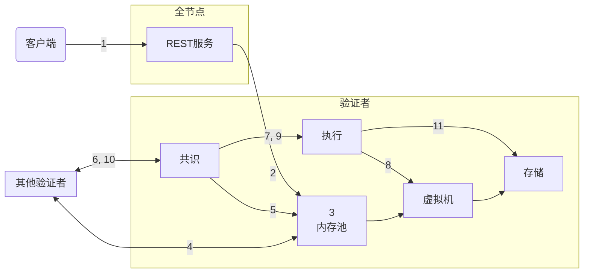

import { Aside } from '@astrojs/starlight/components';

为了深入了解Aptos交易的生命周期（从操作角度），我们将跟踪一个交易的旅程，从提交到Aptos全节点，到提交到Aptos区块链。然后我们将专注于Aptos节点的逻辑组件，并了解交易如何与这些组件交互。

## 交易的生命周期

- Alice和Bob是两个用户，每个人都在Aptos区块链上有一个[账户](/zh/network/glossary#account)。
- Alice的账户有110个Aptos币。
- Alice正在向Bob发送10个Aptos币。
- Alice账户的当前[序列号](/zh/network/glossary#sequence-number)是5（这表明已经从Alice的账户发送了5笔交易）。
- 网络上总共有100个验证者节点——V1到V100。
- Aptos客户端将Alice的交易提交到Aptos全节点上的REST服务。全节点将此交易转发给验证者全节点，后者又将其转发给验证者V1。
- 验证者V1是当前轮次的提议者/领导者。

### 交易旅程

在本节中，我们将描述交易T5的生命周期，从客户端提交它到它被提交到Aptos区块链。

<Aside type="note">
  本文所有视觉图表中的箭头都起源于发起交互/动作的组件，终止于执行动作的组件。箭头不代表数据读取、写入或返回。
</Aside>

交易的生命周期有五个阶段：

- **接受**: [接受交易](#接受交易)
- **共享**: [与其他验证者节点共享交易](#与其他验证者节点共享交易)
- **提议**: [提议区块](#提议区块)
- **执行和共识**: [执行区块并达成共识](#执行区块并达成共识)
- **提交**: [提交区块](#提交区块)

我们在下面描述了每个阶段发生的情况，以及相应的Aptos节点组件交互的链接。

<Aside type="caution">
  交易在进入内存池时和在共识执行之前会被验证。客户端只能通过REST服务在初始提交期间了解返回的验证结果。交易可能会静默执行失败，特别是在账户用尽实用代币或在许多交易中途更改其认证密钥的情况下。虽然这种情况很少发生，但正在持续努力改善这一领域的可见性。
</Aside>

### 客户端提交交易

Aptos**客户端构造一个原始交易**（我们称之为Traw5）来将10个Aptos币从Alice的账户转移到Bob的账户。Aptos客户端使用Alice的私钥签署交易。已签署的交易T5包括以下内容：

- 原始交易。
- Alice的公钥。
- Alice的签名。

原始交易包括以下字段：

| 字段                                                                                 | 描述                                                                                                                                                                                                                                                                                                                                                                                                                                                                                                                                                                                               |
| ------------------------------------------------------------------------------------ | -------------------------------------------------------------------------------------------------------------------------------------------------------------------------------------------------------------------------------------------------------------------------------------------------------------------------------------------------------------------------------------------------------------------------------------------------------------------------------------------------------------------------------------------------------------------------------------------------- |
| [账户地址](/zh/network/glossary#account-address)                                    | Alice的账户地址                                                                                                                                                                                                                                                                                                                                                                                                                                                                                                                                                                                    |
| 有效载荷                                                                             | 指示代表Alice的操作或操作集。如果这是一个Move函数，它直接调用链上的Move字节码。或者，它可能是Move字节码点对点[交易脚本](/zh/network/glossary#transaction-script)。它还包含函数或脚本的输入列表。对于此示例，它是一个函数调用，将一定数量的Aptos币从Alice账户转移到Bob的账户，其中Alice的账户通过发送交易来暗示，Bob的账户和金额被指定为交易输入。 |
| [Gas单位价格](/zh/network/glossary#gas-unit-price)                                  | 发送者愿意为每个gas单位支付的金额，以执行交易。这以[Octas](/zh/network/glossary#octa)表示。                                                                                                                                                                                                                                                                                                                                                                                                                                                                                                       |
| [最大gas量](/zh/network/glossary#maximum-gas-amount)                               | Alice愿意为此交易支付的最大gas量（以APT为单位）。Gas费用等于由计算和IO覆盖的基础gas成本乘以gas价格。Gas成本还包括使用Apt固定价格存储模型的存储。这以[Octas](/zh/network/glossary#octa)表示。                                                                                                                                                                                                                                                                                                                                                                                                      |
| [过期时间](/zh/network/glossary#expiration-time)                                   | 交易的过期时间。                                                                                                                                                                                                                                                                                                                                                                                                                                                                                                                                                                                   |
| [序列号](/zh/network/glossary#sequence-number)                                     | 账户的序列号（在此示例中为5）表示已从该账户提交并在链上提交的交易数量。在这种情况下，已从Alice的账户提交了5笔交易，包括Traw5。注意：只有当账户序列号为5时，序列号为5的交易才能在链上提交。                                                                                                                                                                                                                                                                                                                                                                                           |
| [链ID](https://github.com/aptos-labs/aptos-core/blob/main/types/src/chain_id.rs)    | 区分Aptos网络的标识符（以防止跨网络攻击）。                                                                                                                                                                                                                                                                                                                                                                                                                                                                                                                                                        |

### 接受交易

**步骤1** — 客户端将交易T5提交到REST服务。

**步骤2** — REST服务将交易T5转发到内存池。

<Aside type="note">
  内存池是一个组件，用于保存等待在共识中提议和执行的交易。它充当一个缓冲区。
</Aside>

**步骤3** — 内存池将交易T5添加到其缓冲区。

### 与其他验证者节点共享交易

**步骤4** — 内存池与网络中的其他验证者共享交易T5。

### 提议区块

**步骤5** — 共识从内存池中获取交易T5。作为当前轮次的领导者，验证者V1将创建包含交易T5的区块B5。

**步骤6** — 验证者V1作为提议者将区块B5传播到其他验证者节点。

### 执行区块并达成共识

**步骤7** — 共识请求执行引擎执行区块B5。

**步骤8** — 执行引擎从存储中读取交易T5所需的数据，并请求虚拟机执行交易T5。

验证者验证：

- Alice的账户余额确实是110个Aptos币。
- Alice的序列号确实是5。
- Alice的签名在交易T5上有效。

如果验证成功，虚拟机执行交易。在我们的示例中，执行将：

- 从Alice的账户中扣除10个Aptos币。
- 向Bob的账户添加10个Aptos币。
- 将Alice的序列号从5增加到6。

**步骤9** — 执行引擎将交易T5的结果返回给共识。

**步骤10** — 验证者V1试图通过与其他验证者节点的共识协议就区块B5的执行结果达成协议。

### 提交区块

**步骤11** — 如果达成共识（即，超过2/3的验证者投票同意执行结果），验证者V1和所有诚实的验证者将区块B5及其执行结果提交到存储。现在交易T5被认为已提交，区块B5成为分布式数据库的一部分。

## 验证者组件

Aptos区块链的每个验证者节点包含以下逻辑组件：

### REST服务

- 从客户端接收交易并将其转发到内存池
- 响应客户端查询（账户状态、交易历史等）

### 内存池（Mempool）

- 保存待处理的交易
- 验证交易格式和签名
- 与其他验证者共享交易
- 为共识提供交易

### 共识

- 提议新区块
- 验证和投票给其他验证者的提议
- 就区块顺序和内容达成协议
- 协调执行和提交过程

### 执行引擎

- 执行交易和智能合约
- 维护世界状态
- 计算gas使用量
- 生成交易效果

### 虚拟机（Move VM）

- 执行Move字节码
- 强制执行Move的安全属性
- 管理资源和模块

### 存储

- 持久化区块链状态
- 存储交易历史
- 提供状态查询接口
- 维护Merkle树用于证明

## 关键概念

### 序列号

每个账户都有一个序列号，从0开始。每个成功的交易都会将序列号增加1。这确保：

- 交易排序
- 防止重放攻击
- 账户状态一致性

### Gas和费用

- **Gas单位**：衡量计算工作的抽象单位
- **Gas价格**：每个gas单位的成本（以Octas为单位）
- **最大gas**：交易愿意消耗的最大gas量

### 状态和存储

- **世界状态**：区块链上所有账户和资源的当前状态
- **Merkle树**：用于高效验证状态更改的加密数据结构
- **版本化存储**：支持历史查询和状态证明

<Aside type="tip">
  理解交易生命周期对于调试和优化Aptos应用程序至关重要。每个步骤都可能引入延迟或失败点，了解这些有助于构建更强健的应用程序。
</Aside>
