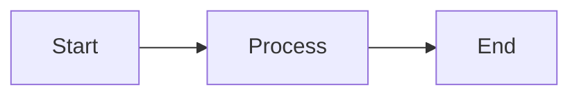
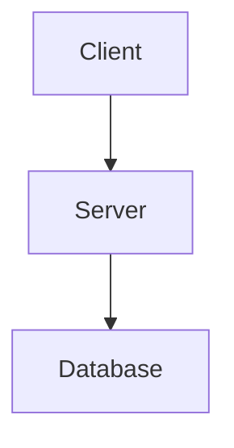

This is a test fixture for validating mermaid diagram rendering.

## Flow Diagram

```mermaid
graph LR
    A[Start] --> B[Process]
    B --> C[End]
```

## Sequence Diagram

```mermaid
graph TD
    Client --> Server
    Server --> Database
```

Some text after the diagrams.
